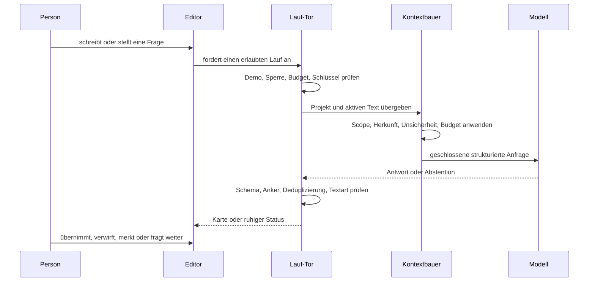

# Onda — Systemhandbuch

**Stand: 05.08.2026 · Zielzustandskatalog 2026-08-05.2**

Dieses Dokument ist die kurze Betriebs- und Architekturkarte des gebauten Systems. Für die
Abnahme ist der Eval-Katalog maßgeblich; historische Spezifikationen erklären nur den Weg.

## 1. Was Onda ist

Onda ist ein lokales Einzelplatz-Schreibwerkzeug mit einem externen Sprachmodell als optionalem
Denkpartner. Ohne Schlüssel oder Netz bleiben Schreiben, Speichern, Lesen und Export nutzbar.
Mit einem Zugang kommen vier Agentenkanäle hinzu:

1. **Verständnis** entwirft Aufgabe, Publikum, Wirkung und Belegmaßstab.
2. **Hinweise** benennen eine konkrete Schwäche am Text.
3. **Erweiterungen** zeigen Weiterführungen, Felder und Verbindungen.
4. **Chat** beantwortet Fragen im vollständigen Arbeitskontext.

Keiner dieser Kanäle darf den Text selbst verändern. Einzige Schreibhandlung des Systems ist
eine von der Person ausdrücklich ausgelöste Übernahme.

## 2. Die Oberfläche

### Bibliothek

Die Bibliothek ordnet Projekte und Texte, einschließlich Papierkorb. Das Beispielprojekt ist
als Demo markiert, benutzt ausschließlich Fixtures und startet keine teuren automatischen Läufe.

### Schreibansicht

Die Mitte gehört dem Text. Die Seitenspalte enthält:

- Struktur ohne Kopie des Prosatextes,
- lokale Hinweise an ihrer Stelle,
- zurückgehaltene Hinweise für einen ruhigeren Moment,
- Erweiterungen als zweiter, nicht verpflichtender Kanal,
- Erkanntes als Rückblick auf übertragbare Prinzipien,
- die Agentenkugel für globale Initiative und Chat.

Lokaler Hinweis, globaler Dialog und Belegfenster sind getrennte Ebenen. Escape schließt die
oberste Ebene, Fokus wird zurückgegeben, und reduzierte Bewegung schaltet nicht notwendige
Animationen ab.

## 3. Der Arbeitsfluss



### Auslöser und Ruhe

Automatische Läufe sind entprellt, gegeneinander gesperrt und durch eine lokale Monatsgrenze
bremsbar. Genau ein automatischer Lauf kann bewusst freigegeben werden. Momentregeln entscheiden,
ob ein Hinweis sofort, beim Innehalten oder erst beim Aufschauen erscheint. Zurückhaltung löscht
nichts; Wartendes bleibt auffindbar.

### Fehler

Netz-, Rate- und Überlastungsfehler erhalten höchstens einen stillen Wiederholungsversuch. Danach
erscheint eine ruhige Statuszeile. Unvollständige, verweigerte, abgeschnittene oder schemawidrige
Antworten erzeugen keine halbfertigen Karten.

## 4. Der gemeinsame Kontext

Alle vier Kanäle werden über `onda-kontext.mjs` ergänzt. Der Kontext besteht aus:

- Textart, Passagefunktion, Publikum, Medium, Ziel und aktivem Stil,
- Textart-Handwerk mit Ziel, Prioritäten, Prüffragen und Fehlformen,
- Quellen, Belegbündeln und ihrem tatsächlichen Belegstand,
- Aussagen und Argumentbeziehungen,
- Sprach-, Wirkungs-, Rhetorik- und Fairnessbefunden,
- sichtbaren Ausschnitten anderer Texte desselben Projekts,
- freigegebenem Projekt- und Personenwissen,
- bereits erkannten Prinzipien.

Jedes Element trägt Scope, Autorität, Unsicherheit, Herkunft und Sensibilität. Fremde,
zurückgezogene, überholte, veraltete oder textfremde Einträge werden ausgeschlossen. Auswahl,
Deduplizierung sowie Zeichen- und Mengenbudget sind deterministisch; das Manifest zählt
Ausschlussgründe, ohne ausgeschlossene Inhalte zu verraten.

Der Dokumenttext und das stabile Projektverständnis liegen im Cache-Präfix. Das häufiger
wechselnde Arbeitswissen bleibt dahinter volatil, damit Aktualität nicht den teuren Präfix
entwertet.

## 5. Hinweise und Erweiterungen

### Hinweise

Es gibt acht fachliche Arten:

- Fakt,
- Quelle,
- Methode,
- Logik,
- Struktur,
- Wirkung,
- Erklärung,
- Sprache.

Jeder Hinweis braucht Kategorie, Beobachtung, wörtlichen Anker, mögliche Folge und das
übertragbare Muster. Ein Formulierungsvorschlag ist optional. Stilmittelvorschläge benutzen
zusätzlich eine kanonische strukturierte ID; unbekannte oder für die Textart unpassende Mittel
werden vor der Oberfläche verworfen.

Integrität hängt von der Textart ab. Wissenschaft schuldet Fakt, Quelle, Methode und Logik;
Marketing schuldet keine Fußnote, aber wahre Tatsachen; Prosa darf erfinden und muss in sich
stimmig bleiben; Lyrik behandelt jeden Hinweis als Angebot. Ein echtes Integritätsrisiko kann
nicht beiläufig weggeklickt werden, sondern verlangt bewusste Risikoannahme.

### Erweiterungen

Eine Erweiterung ist eine Weiterführung, ein Nachbarfeld oder eine Verbindung. Sie ist kein
offener Posten. Jede Karte trägt einen Gedanken und ein Prinzip; ankerpflichtige Arten müssen
wortgetreu auf sichtbaren Text zeigen.

Verbindungen dürfen eine Stelle in einem anderen Text desselben Projekts verwenden. Das Modell
sieht nur begrenzte sichtbare Ausschnitte. Beim Klick wird der benannte Text geöffnet und der
Wortlaut erneut eindeutig aufgelöst; gespeicherte Indizes werden nie geraten. Mehrdeutige,
verborgene oder driftende Ziele werden nicht fokussiert.

## 6. Textart, Stil und rhetorische Mittel

Neun Textarten teilen eine kanonische Handwerkstabelle: Wissenschaft, Essay, Projekttext,
Web/UX, Marketing, Kampagne, Prosa, Lyrik und Sonstiges. Unbekanntes fällt sicher auf eine
allgemeine Prüfung zurück und erhält keine erfundene Stilmittelempfehlung.

Ein Projekt kann mehrere benannte Schreibstile besitzen. Jeder Stil hat ID, Name, Zweck und
Regeln; genau einer ist aktiv. Auswahl und Speichern sind atomar, ältere Profile werden
migriert, und `houseStyle` bleibt die kompatible Spiegelung des aktiven Stils.

Rhetorische Strategien verweisen, wo vorhanden, auf dieselben kanonischen Stilmittel-IDs wie
die Textarttabelle. Eine Empfehlung nennt Funktion, möglichen Gewinn, Risiko einer
Fehlvorstellung und eine direkte Alternative. Die direkte Fassung bleibt immer erlaubt.

## 7. Quellen, Belege und Recherche

Quellen, Zugänglichkeit, Fundstellen und Belegbündel sind getrennte Domänenobjekte. Ein Import
oder Abstract ist Recherchematerial, nicht automatisch Beleg. Für dieselbe Originalreferenz
gewinnt der zugänglichste Kandidat; nur tatsächlich als Evidenz verwendbare Originale dürfen
Stütz-, Gegen- oder Begrenzungsaussagen speisen.

Der Recherche-Orchestrator führt vorab definierte Suchpfade aus. Meldet ein Adapter einen
konkreten Zugriffsfehler, werden ausschließlich erlaubte, vom Adapter unterstützte legale
Alternativwege ergänzt. Zugangssperren werden weder umgangen noch erraten.

## 8. Gedächtnis und persönliche Entwicklung

Der Speicher kennt Text-, Projekt-, Themen- und Personenebene, jeweils mit Provenienz,
Sensibilität und Löschregel. Projektgrenzen sind die Vorgabe. Ein fremder Projekteindruck wird
erst durch einen von der Person bestätigten, zielgebundenen Transfer sichtbar.

Angenommene Hinweise und gemerkte Erweiterungen können ein Prinzip erzeugen. Jede Begegnung
bleibt als eigenes Ereignis erhalten: Dokument, Projekt, Anker, Zeit und Herkunft. Die Anzeige
gruppiert nur exakt normalisierte Sätze; semantisch ähnliche Muster verschmelzen erst nach einer
bestätigten Verbindung.

Ein mögliches Stimmenmerkmal braucht mindestens zwei verschiedene, selbst geschriebene
Textstellen. Vor Zustimmung beeinflusst es keinen Lauf. Danach erscheint es als unverbindliche
persönliche Präferenz und lässt sich vollständig überholen.

Entwicklung wird nicht als Punktestand gemessen. Zulässig sind nur benannte Ereignisse:
Wiederkehr mit Fundstellen, ausdrückliche Selbstkorrektur, eigene Fassung und bestätigte Wirkung.
Ablehnung ist weder Kompetenz noch Wahrheitssignal.

## 9. Rückkopplung

Onda kann über mehrere eigene, nicht gelöschte Texte bilanzieren, welche Arten seiner Hinweise
zu Änderungen führten. Doppelte Finding-IDs zählen nur einmal. Kleine Stichproben, fehlende
Vergleichsdaten und uneindeutige Kategorien führen zu keiner Aussage.

Die Bilanz misst Nützlichkeit, nicht Richtigkeit. Deshalb entsteht zunächst ein versionierter,
wirkungsloser Vorschlag. Nur die Person darf ihn bestätigen. Freigegeben wird ausschließlich
eine vorsichtigere oder knappere Darreichung; Kategorien, Integritätsregeln, Privatsphäre und
Autorschaft bleiben unveränderlich. Ändert sich die Datengrundlage, ist erneut Zustimmung nötig.

## 10. Daten, Schlüssel und Export

Im Browser liegt der Zustand lokal. Die Mac-App speichert über ihre native Brücke und hält den
API-Schlüssel im Schlüsselbund. JavaScript erfährt nur, ob ein Schlüssel vorhanden ist. Export,
Backups, Logs und Brückennachrichten dürfen keinen Schlüsselwert enthalten.

Der Build verwendet eine echte Codesigning-Identität nur, wenn Zertifikat und privater Schlüssel
als verwendbare Identität vorhanden sind. Andernfalls wird nachvollziehbar ad-hoc signiert.
Generierte `.app`-Pakete und Laufprotokolle gehören nicht in Git.

## 11. Wichtige Module

| Verantwortung | Maßgebliche Dateien |
|---|---|
| Editor, Zustand, Persistenz | `app/src/editor.js`, `app/src/data-control.mjs` |
| Oberfläche und Laufanbindung | `app/src/workspace.js` |
| Transport, Aufgaben, Schemas | `app/src/agent-gateway.mjs`, `app/src/agent-tasks.mjs`, `app/src/agent-prompts.mjs` |
| Gemeinsamer Kontext | `app/src/onda-kontext.mjs`, `app/src/arbeitskontext-model.mjs` |
| Hinweise und Anker | `app/src/hinweislauf-model.mjs`, `app/src/agent-findings.mjs`, `app/src/anchor-verify.mjs` |
| Erweiterungen | `app/src/erweiterungslauf-model.mjs`, `app/src/erweiterung-model.mjs` |
| Textart und Stil | `app/src/handwerk-model.mjs`, `app/src/textart-regeln.mjs`, `app/src/stilmittel.mjs`, `app/src/language-profile.mjs` |
| Gedächtnis und Lernen | `app/src/memory-model.mjs`, `app/src/erkanntes-model.mjs`, `app/src/autorentwicklung-model.mjs`, `app/src/rueckkopplung-model.mjs` |
| Belege und Recherche | `app/src/source-model.mjs`, `app/src/evidence-bundle.mjs`, `app/src/research-orchestrator.mjs`, `app/src/research-synthesis.mjs` |
| Argument und Wirkung | `app/src/argument-model.mjs`, `app/src/effect-analysis.mjs`, `app/src/effect-fairness.mjs` |
| Eval-System | `app/evals/v2-fertigzustand.json`, `app/evals/bindungen.json`, `app/evals/run-fertigzustand.mjs`, `app/evals/run-quality-rubric.mjs` |
| Native Hülle | `mac/main.swift`, `mac/build.sh` |

## 12. Bauen und prüfen

Im Ordner `app`:

```bash
npm install
npm run build
npm test
node evals/run-fertigzustand.mjs
```

Im Projektstamm baut `mac/build.sh` das lokale `Onda.app`-Paket. Für Browserprüfungen muss die
App unter `http://127.0.0.1:4173/` erreichbar sein; die bestehenden Test- und Eval-Läufe benutzen
diesen festen lokalen Endpunkt. Der Fertigzustandsrunner startet ihn seit dem 9.8.2026 selbst.

Der Fertigzustandsrunner führt jede gebundene Prüfung in demselben Lauf frisch aus. Am 9.8.2026
bestanden 147 lokale Evals, 5 bleiben ehrliche Live-Gates (Abschnitt 13); die Zahl misst man
frisch mit `node evals/run-fertigzustand.mjs`, statt sie hier nachzuschlagen. Die Rubrik wird
unabhängig von der Abdeckung aus Gold-, Kontrast- und Vollausgabe-Fixtures berechnet.

**Eine Prüfung, die nicht laufen konnte, ist kein Mangel an der App.** Toter Server, fehlender
Browser, volle Platte: Der Lauf meldet das als NICHT GEMESSEN, getrennt von „nicht belegt".
Beides hält den Lauf rot — ungemessen darf nie grün sein —, aber nur eines ist eine Aussage über
Onda. Vor dieser Trennung meldete derselbe Lauf einmal 25 Mängel, von denen keiner existierte
(`app/src/messbarkeit.mjs`).

## 13. Ehrlich verbleibende Live-Abnahme

Vier Nachweise können nicht lokal simuliert werden, ohne mehr zu behaupten als gemessen ist:

- Offline-Verhalten der gebauten Mac-App bei echtem Providerzustand (`INV-06`),
- Leserwirkung mit echten Personen (`EFFECT-06`),
- Keychain-/Prozessinspektion mit echtem Schlüssel (`SYSTEM-03`),
- Browser-/Mac-Parität desselben echten Providerlaufs (`SYSTEM-09`).

Alles andere ist ein automatisierbares Gate und darf nur mit frischer Laufzeitevidenz als
bestanden gelten.
