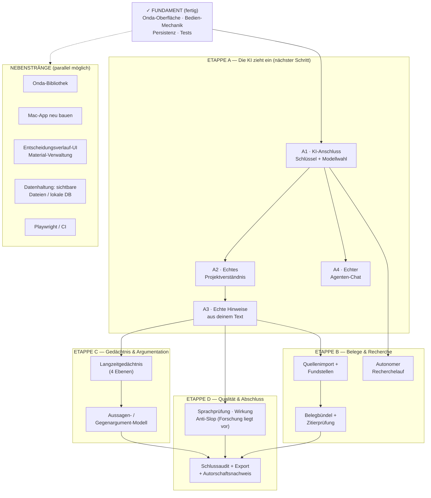

# Standort-Bericht — 26. Juli 2026

> Zusammenfassung aus drei parallelen Analysen: Konzept-Dokumente (V2-Spezifikation), Code-Realität (app/), Begleitmaterial. Erstellt nach Abschluss der Onda-Transformation (22.07.2026).

**Kurzfassung:** Das Haus ist gebaut und eingerichtet — aber der Mitbewohner, für den es gebaut wurde (die KI), ist noch nicht eingezogen. Alles, was der Agent heute scheinbar tut, ist Kulisse mit Beispieldaten.

Zur Ordnung: `MISSION.md`, `NOTES.md`, `RESOURCES.md` sowie `lessons/`, `reference/`, `evaluation/`, `assets/` gehören **nicht** zur Schreib-App (separater Lernkurs „Codex professionell beherrschen"). Zur App gehören `CONTEXT.md`, `docs/` und `app/`.

---

## ✅ Fertig und wirklich funktionsfähig

- **Onda-Arbeitsoberfläche** (main, 22.07.): Seitenleiste (Projektverständnis, Struktur, Material), Aura-Orb, Randhinweis-Karten, Agenten-Panel, Belegfenster, hell/dunkel + 6 Akzentfarben, responsiv.
- **Bedien-Mechanik komplett echt**: stabile Textbausteine mit Rollen; Hinweise annehmen (ändert wirklich den Text), eigene Fassung, verwerfen; bei Integritätsthemen erzwungenes „Risiko bewusst annehmen" mit Begründung.
- **Bibliothek**: Projekte, Suche, Sortierung, Papierkorb (30-Tage-Löschung), Duplizieren.
- **Persistenz**: Browser-Speicher bzw. Mac-App-Datei, überlebt Reload; Markdown-Export; Drucken.
- **Qualität**: 46 Unit-Tests grün; Playwright-Smoke auf den Onda-Rahmen umgeschrieben (Ausführung siehe Lücken).

## 🎭 Nur Kulisse (Beispieldaten)

- **Keine einzige Verbindung zu einem KI-Dienst im Code** — kein Anschluss, keine Schlüsselverwaltung.
- Alle Hinweise, Quellen, das Projektverständnis und die Agenten-Nachricht stammen aus dem Seed-Projekt „Calm Technology"; jede Chat-Eingabe erhält dieselbe fest einprogrammierte Beispielantwort; die „Initiative" ist ein 3-Sekunden-Timer.
- **Ein neues, leeres Projekt bleibt komplett stumm** — nichts erzeugt Verständnis, Hinweise oder Quellen.

Das entspricht der damaligen Vorgabe des ersten Bauabschnitts (Beispieldaten erlaubt, Interaktionen echt). Bauabschnitt 1 von 7 der V2-Spezifikation ist damit abgeschlossen.

## 🔧 Kleinere Lücken im Bestehenden

1. **Entscheidungsverlauf ohne Anzeige** — Entscheidungen werden gespeichert, aber nirgends angezeigt.
2. **Material nur Anzeige** — Quellen lassen sich nicht hinzufügen/entfernen.
3. **Mac-App veraltet** — gebaut am 10.07. (vor Onda); `mac/build.sh` würde den aktuellen Stand einbetten.
4. **Playwright nicht installiert** — der große Browser-Smoke ist bis dahin nicht ausführbar.
5. **Tote Alt-Dateien** (`panels.js`, `structure.js`) — Aufräum-Task bereits gestartet.
6. **Bibliothek noch im Alt-Layout** — erbt nur Onda-Farben/Schrift; Umbau bewusst verschoben.

## 🏗️ Etappen bis zur voll funktionstüchtigen App

**Etappe A — Die KI zieht ein** *(macht aus der Kulisse ein Produkt)*: Anschluss an KI-Dienst(e) inkl. Schlüsselverwaltung; echtes Projektverständnis aus Nutzertext/Gespräch; echte Hinweise (8 Hinweisarten der Spec) mit der fertigen Annehmen/Verwerfen/Risiko-Mechanik; echter Chat. Vorgabe aus dem Projektgedächtnis: „Production quality, no mocks".

**Etappe B — Belege & Recherche** *(Bauabschnitte 2–3)*: Quellenimport, Fundstellenleser, Belegbündel pro Behauptung, Zitierprüfung; autonomer Recherche-/Analyselauf mit Werkzeugprotokoll.

**Etappe C — Gedächtnis & Argumentation** *(Bauabschnitte 4–5)*: lokaler Ereignis-/Belegspeicher, 4 Gedächtnisebenen; Aussagen-/Gegenargument-Modell mit Auswirkungsanalyse.

**Etappe D — Qualität & Abschluss** *(Bauabschnitte 6–7)*: deutsche Sprachprüfung, Kommunikationswirkung/Rhetorik, Anti-Slop (Forschungsnotizen in `docs/research/` fertig, im Code unverbaut); Schlussaudit, Export über Markdown hinaus, Autorschaftsnachweis.

**Nebenstrang Datenhaltung**: heute ein Browser-Speicher-Schlüssel bzw. eine `data.json` der Mac-App; sichtbare Textdateien / lokale Datenbank laut Spec „sobald die Interaktionssprache stabil ist" — sie ist jetzt stabil.

## Empfehlung

Etappe A als schmaler Durchstich: **ein neues Projekt anlegen → die KI baut das Projektverständnis wirklich auf → erste echte Hinweise zum echten Text.** Damit füllt sich jede bereits gebaute Oberfläche zum ersten Mal mit echtem Leben; Recherche, Gedächtnis und Audit bauen darauf auf.
