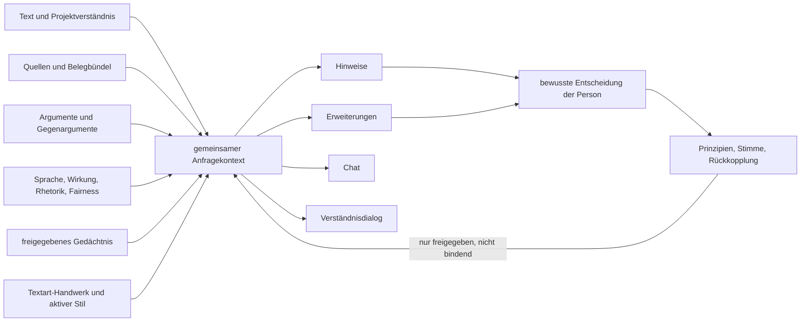
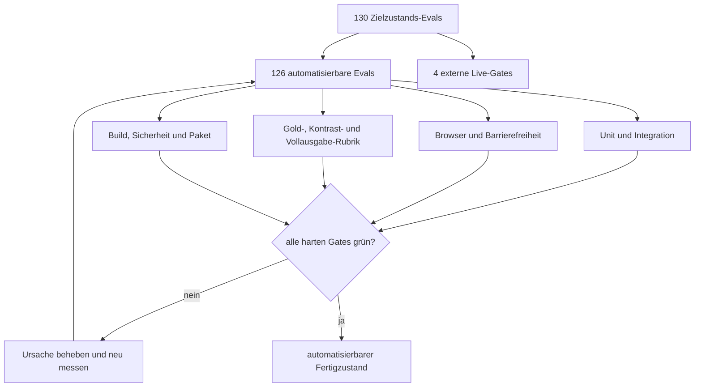

# Der Abstract gegen das Gebaute

**Stand: 05.08.2026 · Katalog 2026-08-05.2**

Dieses Dokument beschreibt den überprüfbaren Zielzustand, nicht den Weg dorthin. Maßgeblich
sind der Eval-Katalog in `app/evals/v2-fertigzustand.json`, seine Bindungen und der jeweils
frische Bericht in `app/evals/results/fertigzustand-latest.json`. Historische Pläne erklären
Entscheidungen, dürfen diesen Stand aber nicht überschreiben.

## Ergebnis

Onda ist nicht mehr nur ein Korrektor. Es ist ein lokaler Schreibraum mit zwei getrennten
Rückmeldungskanälen:

- **Hinweise** zeigen, wo ein Text noch nicht trägt.
- **Erweiterungen** zeigen, wo ein Gedanke weiterführen oder sich mit einem anderen Text
  verbinden kann.

Beide Kanäle sehen dasselbe kompakte Arbeitsdossier, müssen ihre Herkunft und Anker belegen,
ändern niemals selbst den Text und hinterlassen übertragbare Prinzipien nur nach einer
bewussten Handlung der schreibenden Person.

## Anspruch für Anspruch

| # | Anspruch | Gebauter und messbarer Zustand |
|---:|---|---|
| 1 | Läuft auf dem eigenen Rechner | Editor, Zustand, Export und Schlüsselverwaltung sind lokal; Offline-Schreiben bleibt funktionsfähig. Die reale Offline-Mac-Abnahme ist ein externes Live-Gate. |
| 2 | Texte jeder Art | Neun Textarten einschließlich Prosa und Lyrik besitzen eigene Ziele, Prioritäten, Prüffragen, Fehlformen und Integritätsgrenzen. |
| 3 | Gedanken präzisieren und schärfen | Acht Hinweisarten werden verankert, dedupliziert, priorisiert und gegen Textart sowie frühere Entscheidungen geprüft. |
| 4 | Gedanken erweitern | Drei Erweiterungsarten liefern Gedanke, Muster und überprüfbare Stellen; ein Lauf ohne tragenden Fund ist ein gültiger Erfolg. |
| 5 | Das System hinter Feedback zeigen | `muster` ist in beiden Kanälen Teil des geschlossenen Schemas und in der Oberfläche sichtbar. |
| 6 | Persönlichen Erkenntnishorizont erweitern | Prinzipien behalten Dimension, jede Begegnung und Herkunft. Wiederkehr, eigene Fassung und Selbstkorrektur werden als beobachtbare Ereignisse projiziert. |
| 7 | Gesamten Arbeitskontext verstehen | Quellen, Belegbündel, Argumentbeziehungen, Sprache, Wirkung, Rhetorik und Fairness erreichen alle vier Agentenkanäle gemeinsam. |
| 8 | Ideen kreuzbestäuben | Sichtbarer Nachbartext kann wortgetreu verankert und angesprungen werden; fremde Projekte bleiben ohne ausdrücklichen Transfer unsichtbar. |
| 9 | Naheliegendes meiden | Systemauftrag, Erweiterungsschema und Abstention-Fixtures belohnen begründete neue Verbindungen und bestrafen plausible Erfindung. |
| 10 | Nie das Ruder übernehmen | Kein Agentenlauf verändert den Text; nur eine ausdrückliche Übernahme darf schreiben. Entscheidungen bleiben bindend. |
| 11 | Schreibstil und Stilmittel entwickeln | Benannte Projektstile sind atomar speicherbar. Stilmittel haben kanonische IDs, Textart-Gates, Gewinn, Risiko und direkte Alternative. |
| 12 | Über längere Zeit lernen | Muster, Stimmenvorschläge und Rückkopplung sind versioniert, herkunftssicher, zustimmungspflichtig und vollständig rücknehmbar. |
| 13 | Sich selbst verbessern | Die Rückkopplung misst nur Nützlichkeit und Zustellhandwerk. Sie darf nach Zustimmung die Darreichung schärfen, nie Wahrheit, Integrität oder Kategorien abschalten. |
| 14 | Mühelos und ruhig bleiben | Momentregeln, Fokusprüfungen, reduzierte Bewegung, schmale Viewports und leise Seitenkanäle sind automatisiert. Erlebte Ruhe bleibt bewusst unter einer perfekten Bewertung. |

## Die tragenden Verbindungen

Die wichtige strukturelle Entscheidung ist der eine Kontextanschluss. Kein Kanal besitzt eine
eigene, abweichende Kopie des Arbeitswissens. Auswahl, Scope, Unsicherheit, Provenienz,
Deduplizierung und Budget liegen in reinen Modulen und werden mit Canary-Strings über den
tatsächlichen Anfragekörper geprüft.

## Grenzen, die das System absichtlich schützt

### Keine erfundene Gewissheit

Recherchematerial ist noch kein Beleg. Metadaten, Abstract und Original bleiben getrennt;
nur zugängliche Originale dürfen Aussagen stützen. Scheitert ein Zugriff ausdrücklich, darf
der Orchestrator nur die kanonischen legalen Alternativwege nutzen. Ein fehlender Fund ist
besser bewertet als eine plausible Vermutung.

### Keine Deutungshoheit über die Person

Onda berechnet keine Aufmerksamkeit, Eigenständigkeit, KI-Wahrscheinlichkeit oder persönliche
Leistung. Es zeigt konkrete Begegnungen: ein Prinzip kam in zwei eigenen Textstellen vor, eine
Fassung wurde selbst geschrieben, eine Wirkung wurde ausdrücklich bestätigt. Ähnliche Muster
verschmelzen und mögliche Stimmenmerkmale wirken erst nach Zustimmung.

### Keine Goodhart-Schleife

Annahme und Verwerfen sagen etwas über Nützlichkeit, nicht über Wahrheit. Darum darf eine
Rückkopplung höchstens Form und Priorität der Darreichung beeinflussen. Neue Daten erzeugen eine
neue offene Version; eine alte Zustimmung wird nie übertragen. Integritätsfragen, Hinweisarten,
Datenschutz und Autorschaft sind außerhalb dieses Regelkreises.

### Keine heimliche Projektvermischung

Rohtext bleibt an Projekt und Dokument gebunden. Projektübergreifend ist nur ein ausdrücklich
freigegebener, zielgebundener Wissenseintrag sichtbar. Ablehnung, Rücknahme, Überholung oder
Löschung entfernen ihn wieder aus dem Kontext.

## Wie „fertig“ gemessen wird

Der Katalog umfasst **18 Suiten und 130 Evals**:

- **122 harte Gates** müssen für alle automatisierbaren Fälle bestehen.
- **8 bewertete Gates** brauchen einen reproduzierbaren Score; 7 davon sind lokal durch Gold-,
  Kontrast- und Vollausgabe-Fixtures messbar, die Leserwirkung braucht echte Menschen.
- Die Rubrik verlangt mindestens **4,5/5 gesamt** und **4,0/5 je Dimension**.
- Abdeckung und Qualität bleiben getrennt. Viele grüne Tests erzeugen keinen Qualitätsscore.
- Ein Eval ohne in demselben Lauf ausgeführten Beleg gilt als fehlgeschlagen.

## Die vier ehrlichen externen Gates

Diese Gates sind nicht durch fehlenden Programmcode offen. Sie brauchen einen Zustand, den eine
lokale Fixture nicht wahrheitsgemäß ersetzen kann:

| Eval | Noch nötiger Beleg |
|---|---|
| `INV-06` | Gebaute Mac-App mit echtem Providerzugang vom Netz trennen; Schreiben, Speichern, Lesen, Export und ruhige Agentenfehlermeldung beobachten. |
| `EFFECT-06` | Verblindete Leserprüfung mit echten Personen und vorab festgelegtem Protokoll. |
| `SYSTEM-03` | Signierte Mac-App mit echtem Schlüssel auf Keychain-, Prozess-, Log-, Export- und Brückenspuren untersuchen. |
| `SYSTEM-09` | Denselben echten Providerlauf im Browser- und Mac-Brückenpfad ausführen und die Domänenergebnisse vergleichen. |

Diese vier bleiben `external-open`, bis der jeweilige Beleg tatsächlich vorliegt. Kein lokaler
Teiltest und keine alte Ergebnisdatei darf sie schließen.

## Maßgebliche Artefakte

- Zielzustand: `app/evals/v2-fertigzustand.json`
- Belegbindungen: `app/evals/bindungen.json`
- Gesamtläufer: `app/evals/run-fertigzustand.mjs`
- Qualitätsrubrik: `app/evals/run-quality-rubric.mjs`
- Frischer Maschinenbericht: `app/evals/results/fertigzustand-latest.json`
- Umsetzungs- und Abnahmeplan: `docs/superpowers/plans/2026-08-05-fertigzustand-vollenden.md`

Der Zielzustand ist damit nicht „alles fühlt sich fertig an“, sondern: Jeder lokal beweisbare
Anspruch hat ein Gate, jedes Gate einen frischen Beleg, jedes Qualitätsurteil eine eigene
Rubrik, und jede nicht lokal beweisbare Behauptung bleibt sichtbar offen.
