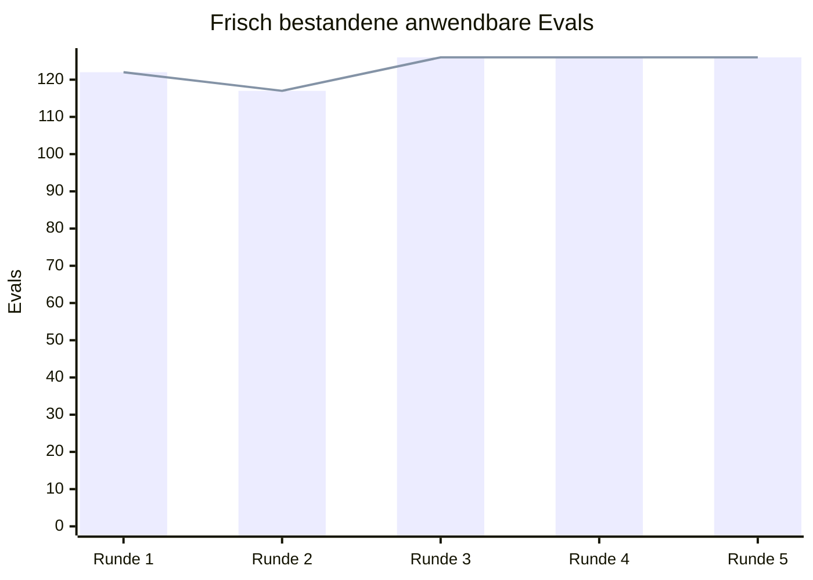
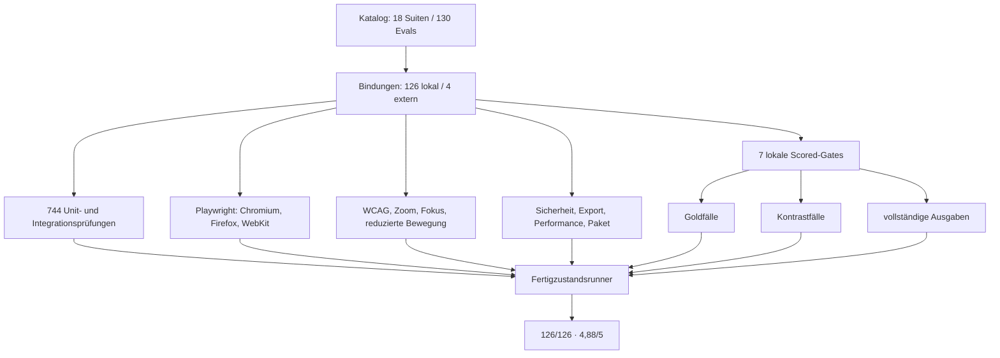

# Fertigzustandsbericht — 05.08.2026

## Ergebnis

Der Katalog `2026-08-05.2` umfasst 130 Evals. Im fünften und letzten vollständigen Lauf bestanden alle
126 automatisierbaren Evals mit frischen Belegen. Vier echte Live-Gates bleiben offen.

| Messgröße | Ergebnis | Schwelle |
|---|---:|---:|
| Anwendbare Evals | 126/126 | alle |
| Externe Live-Gates | 4 | ausdrücklich offen |
| Gewichtete Qualität | 4,88/5 | ≥ 4,5 |
| Wahrheit und Evidenz | 5,0 | ≥ 4,0 |
| Autorschaft und Bedeutungstreue | 5,0 | ≥ 4,0 |
| Nützlichkeit und Priorisierung | 5,0 | ≥ 4,0 |
| Ruhe und Interaktionsqualität | 4,5 | ≥ 4,0 |
| Zuverlässigkeit und Nachvollziehbarkeit | 5,0 | ≥ 4,0 |
| Barrierefreiheit und Privatsphäre | 4,5 | ≥ 4,0 |

Ruhe und Barrierefreiheit sind bewusst auf 4,5 gedeckelt. Automatisierte Browser-, Fokus-,
Zoom-, WCAG-, Daten- und Geheimnisprüfungen können eine menschliche Langzeiterfahrung und reale
assistive Nutzung vorbereiten, aber nicht wahrheitsgemäß als perfekte Erfahrung ausgeben.

## Fünf Schleifen



| Runde | Bestanden | Fehlgeschlagen | Befund und Änderung |
|---:|---:|---:|---|
| 1 | 122 | 4 | Die statische Personen-Speicherprüfung erkannte den jetzt mehrzeiligen Accept-Guard nicht. Der Beleg prüft nun den umgebenden Guard statt eine einzelne Quelltextzeile. |
| 2 | 117 | 9 | Ein Playwright-Prozess schloss unerwartet Browser und Seite; der identische Stand bestand direkt danach vollständig. Der Runner wiederholt ausschließlich diesen klar erkennbaren Infrastrukturabsturz einmal in einem frischen Prozess. Assertions und Timeouts bleiben harte Fehler. |
| 3 | 126 | 0 | Alle 77 eindeutigen Prüfprogramme und damit alle 126 anwendbaren Evals bestanden frisch. |
| 4 | 126 | 0 | Nach dem Abschlussreview wurden Stimmen-Wiederfreigabe, Fixture-Verträge und die beim kalten Mac-Start gedrosselte Probe korrigiert. Der exakte Commit `a6f85f9` bestand erneut vollständig. |
| 5 | 126 | 0 | Die Abschlusskontrolle fand noch eine unklare Shell-Variablengrenze im signierten Mac-Bau. Nach Regressionstest und Reparatur bestand der exakte Produkt- und Build-Commit `ef07a01` erneut ohne Eval-Fehler. |

Vor dem Gesamtrunner fanden die normalen Tests zwei veraltete Fixtures: Gateway- und
Etappe-A-Antworten enthielten die neuen strukturierten Felder `vorschlagsart` und
`stilmittelId` noch nicht. Die Fixtures wurden auf den geschlossenen Produktionsvertrag
angehoben; nach den abschließenden Regressionen bestanden 744 Unit-/Integrationstests.

## Abhängigkeitsgraph der Belege



## Frische Befehle

```bash
cd app
npm run test:unit
npm run test:smoke
npm run build
ITERATION=5 node evals/run-fertigzustand.mjs
```

Zusätzlich gehören zur Abschlussprüfung:

```bash
git diff --check
bash -n mac/build.sh
./mac/build.sh
./Onda.app/Contents/MacOS/Onda --selftest
```

Die gebaute App bestand außerdem die Startprobe aus einem frischen Datenverzeichnis beim ersten
kalten Lauf: Dokument, aktiver Editor, Bild-Bridge und echte Speicherquittung waren jeweils `true`.
Die Probe startet nach abgeschlossenem `boot()` ohne einen drosselbaren WebView-Starttimer und wartet
parallel, aber begrenzt, auf die beiden nativen Rückkanäle.

Der maschinenlesbare Einzelstatus mit jedem Belegpfad steht in
`app/evals/results/fertigzustand-latest.json`; Laufprotokolle werden bewusst neu erzeugt und
nicht versioniert.

## Externe Live-Gates

| Eval | Warum nicht automatisiert geschlossen | Nächster echter Beleg |
|---|---|---|
| `INV-06` | Eine Fixture beweist keinen realen Netzverlust der gebauten Mac-App. | Providerzugang hinterlegen, Netz trennen, Schreiben/Speichern/Lesen/Export und ruhige Fehlermeldung protokollieren. |
| `EFFECT-06` | Leserwirkung ist eine menschliche Wirkung, kein Codevertrag. | Verblindete Studie nach `docs/evals/EFFECT-06-studienprotokoll.md`. |
| `SYSTEM-03` | Ein Canary ersetzt keine reale Keychain- und Prozessinspektion. | Signierte App mit echtem Schlüssel untersuchen; Schlüssel darf in keinem Artefakt erscheinen. |
| `SYSTEM-09` | Lokale Adapter-Fixtures ersetzen nicht denselben echten Providerlauf in zwei Laufwegen. | Browser- und Mac-Brückenlauf mit identischer Anfrage vergleichen. |

Keines dieser Gates ist eine versteckte Implementierungsaufgabe. Sie bleiben sichtbar
`external-open`, bis die jeweilige Außenwelt tatsächlich geprüft wurde.
