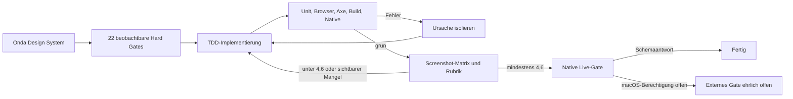

# Onda-UI-Neubau – Abschluss-Eval

Stand: 6. August 2026

Qualitätsschwelle: 4,6 von 5

Maximale Iterationen: 5

Ausgeführt: 2 visuelle Iterationen

## Fertigzustand

Der Zielzustand besteht aus 22 stabilen Hard Gates. Er umfasst nicht nur die Optik, sondern auch den passenden Anmerkungstyp je Fall, reversible Entscheidungen, Responsive-Verhalten, Barrierefreiheit, Datenbestand, Native-Transport und Regressionen.

| Gate | Erwarteter fertiger Zustand | Ergebnis |
|---|---|---|
| ONDA-UI-01 | Eine systemweite Onda-Gestalt mit ABC Diatype, Sky-Akzent, Aura nur für KI und den festgelegten Radien | Bestanden |
| ONDA-UI-02 | Alle 24 Text-Anmerkungsarten besitzen eine definierte, fallgerechte Form | Bestanden |
| ONDA-UI-03 | Der Notizmodus korrigiert keine Rechtschreibung oder Grammatik, sondern formuliert aus, bündelt, fragt nach, ordnet oder greift auf | Bestanden |
| ONDA-UI-04 | Eindeutige Wortkorrekturen verändern nur den exakten Bereich und bleiben rückgängig machbar | Bestanden |
| ONDA-UI-05 | Umschreibungen zeigen Original und Vorschlag; das Original kann ausdrücklich behalten werden | Bestanden |
| ONDA-UI-06 | Einfügungen ergänzen Text am Anker, ohne vorhandenen Inhalt zu verdecken | Bestanden |
| ONDA-UI-07 | Strukturänderungen zeigen Ursprung und Ziel, bevor etwas verschoben wird | Bestanden |
| ONDA-UI-08 | Mehrfachänderungen sind atomar: entweder alle gültigen Stellen ändern sich oder keine | Bestanden |
| ONDA-UI-09 | Quellen- und Faktenkarten zeigen Fundstelle, Ausschnitt und Grenzen ohne erfundene Sicherheit | Bestanden |
| ONDA-UI-10 | Widersprüche werden verglichen; Meinungen und offene Fragen erscheinen als Dialog | Bestanden |
| ONDA-UI-11 | Fehler, Empfehlungen und Geschmack bleiben unterscheidbar und navigierbar | Bestanden |
| ONDA-UI-12 | Eine Sammelannahme erfasst ausschließlich sichere Korrekturen | Bestanden |
| ONDA-UI-13 | Verwerfen erklärt die Reichweite und kann zurückgenommen werden | Bestanden |
| ONDA-UI-14 | „Ruhig“ blendet Rückmeldungen aus, ohne sie zu löschen | Bestanden |
| ONDA-UI-15 | Bestehende Dokumente und alte Findings werden verlustfrei normalisiert | Bestanden |
| ONDA-UI-16 | 1440, 1024, 720 und 320 Pixel funktionieren ohne horizontalen Überlauf | Bestanden |
| ONDA-UI-17 | WCAG 2.1 A/AA, Tastatur, Fokus, 44-Pixel-Ziele und reduzierte Bewegung | Bestanden |
| ONDA-UI-18 | Ein echter nativer Minimallauf liefert genau eine schema-gültige Anmerkung, ohne Schlüsselmaterial zu persistieren | Extern offen: macOS-Berechtigungsdialog |
| ONDA-UI-19 | Bestehende Unit-, Browser-, Performance-, Build- und Native-Selbsttests bleiben grün | Bestanden |
| ONDA-UI-20 | Die qualitative Designrubrik erreicht mindestens 4,6 von 5 | Bestanden: 4,89 |
| ONDA-UI-21 | KI-Fehler bleiben ruhig; der normale Gateway wiederholt höchstens einmal, die Live-Probe nie | Bestanden |
| ONDA-UI-22 | Speichern, Wiederherstellen und native Brücken bleiben intakt | Bestanden |

Die maschinenlesbare Definition steht in `app/evals/v2-fertigzustand.json`; Bindungen und reproduzierbare Belege stehen in `app/evals/bindungen.json` und `app/evals/results/onda-ui-automated-latest.json`. Der einmalige echte Versuch bleibt davon getrennt erhalten.

## Eval- und Verbesserungsloop

### Iteration 1

Die strukturellen Onda-Verträge, alle Anmerkungsformen, der neue App-Rahmen und die Kerninteraktionen waren umgesetzt. Die Bildprüfung zeigte jedoch zwei konkrete Schwächen: mobile Screenshots erwischten noch den laufenden Sidebar-Übergang, und die Pfeile für vorherige und nächste Anmerkung trennten sich bei 320 Pixeln. Außerdem nutzten ältere Smokes eine falsche Annahme: Playwright bezeichnet auch ein links außerhalb des Viewports liegendes Element als „sichtbar“.

Die Korrektur war strukturell: Alle betroffenen Smokes verwenden nun denselben animationsbewussten Sidebar-Pfad. Screenshots warten auf den visuellen Ruhezustand. Vorherige und nächste Anmerkung bilden ein gemeinsames Bedienpaar. Zwischenstand: 4,63 von 5.

### Iteration 2

Die Matrix wurde für Editor und Bibliothek bei 1440, 1024, 720 und 320 Pixeln erneut aufgenommen. Zusätzlich wurden alle 29 Text- und Notiz-Anmerkungsarten in Hell und Dunkel gerendert. Es blieb kein neuer reproduzierbarer visueller Mangel. Der qualitative Wert stieg auf 4,89 von 5; deshalb endete der visuelle Loop nach zwei statt nach fünf möglichen Runden.

Die vollständige Rubrik mit Begründungen je Dimension steht in `app/evals/onda-ui-rubric.json`.

## Native Live-Gate und Schlüsselgrenze

Der Live-Adapter fragt zuerst ausschließlich den booleschen Schlüsselstatus ab. Danach darf er genau eine kurze `hinweise`-Anfrage mit dem Modell `claude-opus-5` senden. Die Antwort wird lokal noch einmal vollständig gegen das geschlossene JSON-Schema geprüft: Pflichtfelder, Typen, erlaubte Werte, Verschachtelung und verbotene Zusatzfelder. Der persistierbare Beleg besitzt eine feste Whitelist: Bestanden, Schlüssel vorhanden, Request-Zahl, Task, Modell, Laufzeit, vier Tokenzähler, Anmerkungsart, Schemaergebnis und ein begrenzter Fehlertyp. Anfrage, Antwort, Header und Schlüsselwert können nicht in den Beleg gelangen.

Die bisherigen ausdrücklich freigegebenen Live-Versuche erreichten keine Schemaantwort. Auch nach einer einfachen Freigabe protokollierte macOS am 6. August erneut den Schlüsselbunddialog. Jeder Lauf wurde nach seiner festen Grenze beendet; es gab innerhalb der Live-Probe keinen Retry und keine Geheimnisausgabe. Das beweist, dass der bereits früher angelegte Eintrag noch an seiner alten App-ACL hing und eine bloß temporäre Erlaubnis nicht genügte.

Der dauerhafte Korrekturpfad verwendet deshalb keine veraltete ACL-API. Nach genau einer erlaubten Leseoperation kopiert die signierte App den Schlüssel unter den neuen Service `Onda.signiert.v1`, liest die Kopie zur Verifikation zurück und entfernt erst danach den alten Eintrag. macOS erzeugt die neue ACL aus der stabilen Designated Requirement der mit `Onda Dev` signierten App. Zusätzlich bricht der Release-Bau hart ab, falls diese Signieridentität fehlt; ein stiller Rückfall auf eine wechselnde ad-hoc-Signatur ist ausgeschlossen. ONDA-UI-18 bleibt bis zur einmaligen Migration und einer anschließenden Schemaantwort offen.

## Belege

- Qualitative Rubrik: `app/evals/onda-ui-rubric.json`
- Reproduzierbarer Maschinenbericht: `app/evals/results/onda-ui-automated-latest.json`
- Maschinenberichte der freigegebenen Live-Läufe: `app/evals/results/onda-ui-latest.json` und `app/evals/results/onda-ui-live-latest.json`
- Sicher redigiertes Live-Protokoll: `app/evals/results/onda-ui-runs/native-live.log`
- Editor-Matrix: `app/evals/results/screenshots/onda-editor-{1440,1024,720,320}.png`
- Bibliothek: `app/evals/results/screenshots/onda-library-{1280,320}.png`
- Anmerkungsgalerie: `app/evals/results/screenshots/annotation-lab-{light,dark}-{1280,1024,720,320}.png`
