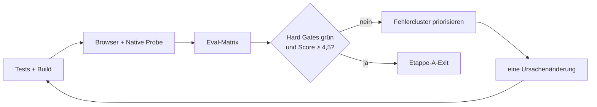

# Etappe A Eval-Gated Completion Implementation Plan

> **For agentic workers:** REQUIRED SUB-SKILL: Use `executing-plans` task by task, `test-driven-development` before every implementation, `agentic-eval` for the iteration loop, and `verification-before-completion` before claiming the stage exit.

**Goal:** Die bereits weit entwickelte Etappe A vollständig schließen: echter sicherer KI-Arbeitsloop, echter lokaler Dialog, sichtbarer Entscheidungsverlauf, reproduzierbare Browser-Evidenz, aktuelle native Hülle und maschinenlesbarer Eval-Bericht.

**Architecture:** Reine Ablauf- und Kontextlogik bleibt in kleinen `.mjs`-Modulen und wird mit dem Node Test Runner geprüft. `workspace.js` orchestriert UI und Gateway, ohne einen zweiten Chatpfad zu erfinden. Ein expliziter Testtransport ersetzt im Browser nur das Netz; Requestbau, Streaming, Verifikation, Zustand und Rendering bleiben Produktcode. Die App-weite Chatsperre schützt globale und lokale Gespräche gemeinsam.

**Tech Stack:** JavaScript ESM, Tiptap, Node Test Runner, esbuild, Playwright/Chromium, Swift/WebKit.

**Global Constraints:**

- Vorhandene Nutzeränderungen und unversionierte Forschungsdateien bleiben unangetastet.
- Keine Beispielreaktion, kein simuliertes Erfolgssignal und kein stiller Fallback darf den echten Pfad ersetzen.
- Automatische Textänderungen bleiben verboten; nur eine explizite Nutzerentscheidung darf Editorinhalt ändern.
- Externe Anbieter- und Nutzer-Live-Gates werden nicht mit dem Browser-Mock als bestanden markiert.
- Nach jeder Aufgabe fokussierte Tests; nach jedem Cluster vollständige Regression und Build.

## Aufgabe 1 — Eval-Katalog ausführbar und selbstprüfend machen

**Files:**

- Create: `app/src/eval-catalog.mjs`
- Create: `app/test/eval-catalog.test.mjs`
- Create: `app/evals/run-v2-evals.mjs`
- Create: `app/evals/results/.gitkeep`

**RED**

1. Tests definieren für: 77 eindeutige IDs, 10 Suiten, 69 Hard Gates, acht Scored/Live Gates, vollständige Pflichtfelder, gültige Evidenztypen, Rubrikgewicht 1,0 und bekannte externe IDs.
2. Ausführen: `cd app && node --test test/eval-catalog.test.mjs`.
3. Erwartung: Importfehler, weil `eval-catalog.mjs` noch fehlt.

**GREEN**

1. `ladeEvalKatalog`, `validiereEvalKatalog`, `flattenEvals` und `summarisiereEvalKatalog` als reine Funktionen implementieren.
2. CLI implementieren, die Katalog plus Ergebnisdatei prüft und einen kompakten JSON-Bericht ausgibt.
3. Fokussierten Test erneut ausführen; dann `npm test`.

**Exit Evidence:** Die Katalogprüfung meldet exakt 77/69/8/10 und keine Strukturfehler.

## Aufgabe 2 — Lokalen Randkarten-Chat vollständig über den echten Pfad führen

**Files:**

- Modify: `app/src/chat-kontext.mjs`
- Modify: `app/test/chat-kontext.test.mjs`
- Modify: `app/src/workspace.js`
- Modify: `app/test/v2-smoke.mjs`

**RED**

1. Pure Tests für `baueFindingZusatzAnweisung` schreiben: Kategorie, Beobachtung, wörtlicher Anker, Relevanz, fehlende optionale Felder und ruhiger Onda-Ton.
2. Integrationstest schreiben, der diese Marker zusammen mit der aktuellen Nutzerfrage bis in `baueAnfrage('chat')` verfolgt.
3. Fokussierten Test ausführen und den fehlenden Export als RED-Beleg sichern.

**GREEN**

1. `baueFindingZusatzAnweisung(finding)` minimal implementieren.
2. `renderLocalDialogue` auf denselben `fuehreChatVorgangAus`-/`fuehreChatLauf`-Pfad wie den globalen Chat umstellen.
3. Vor jedem `await` dieselbe app-weite Chatsperre setzen; Submit sichtbar deaktivieren.
4. Kontext aus Projektverständnis, Dokumenttext, offenen Hinweisen, Entscheidungen, lokalem Verlauf ohne aktuellen Turn, aktueller Frage und Finding-Zusatzanweisung bauen.
5. Canned-Antwort entfernen.

**Verification**

- `cd app && node --test test/chat-kontext.test.mjs`
- `cd app && npm test`
- `cd app && npm run build`
- `rg -n "Beispielreaktion|Beispielantwort" src` muss ohne Treffer enden.

**Exit Evidence:** Fokussierte Kontexttests, vollständige Regression, Build und Null-Treffer-Beleg.

## Aufgabe 3 — Entscheidungsverlauf sichtbar und zugänglich machen

**Files:**

- Modify: `app/src/workspace-model.mjs`
- Modify: `app/test/workspace-model.test.mjs`
- Modify: `app/src/workspace.js`
- Modify: `app/src/style.css`
- Modify: `app/test/v2-smoke.mjs`

**RED**

1. Modeltest: `decisionsOpen` wird additiv mit `false` ergänzt und ein gespeichertes `true` erhalten.
2. Browsertest: Nach Annahme oder Verwerfen eines Findings existiert `#agentDecisionsToggle`; Aufklappen zeigt `.agent-decision` mit Label, Kurztext und Datum.

**GREEN**

1. `workspace.agent.decisionsOpen` tolerant ergänzen.
2. `entscheidungsEintraege` in `workspace.js` konsumieren.
3. Ruhigen, zusammenklappbaren Abschnitt vor dem frühen „keine Nachricht“-Return rendern, damit Entscheidungen unabhängig vom Chat sichtbar bleiben.
4. Semantische Elemente, `aria-expanded`, `aria-controls`, Tastaturfokus und bestehende Onda-Tokens verwenden.

**Verification**

- `cd app && node --test test/workspace-model.test.mjs test/chat-kontext.test.mjs`
- `cd app && npm test`
- `cd app && npm run build`
- Browser-Smoke der Entscheidung.

**Exit Evidence:** Persistenztest und Browsernachweis für angenommen, verworfen und bewusstes Risiko.

## Aufgabe 4 — Browser-Testtransport und bestehende Smoke-Basis stabilisieren

**Files:**

- Modify: `app/src/agent-gateway.mjs`
- Modify: `app/test/agent-gateway.test.mjs`
- Modify: `app/src/editor.js`
- Modify: `app/package.json`
- Modify: `app/package-lock.json`
- Modify: `app/test/v2-smoke.mjs`

**RED**

1. Gatewaytest schreiben: `setzeTransportFuerTests(mock)` ersetzt den aktiven Transport; `null` stellt die normale Auswahl wieder her.
2. Browser-Smoke zunächst unverändert laufen lassen und den bekannten Strict-Locator-Fehler bei doppelt vorkommenden `data-block-id` dokumentieren.

**GREEN**

1. Kleinen Transport-Injektionspunkt im Gateway ergänzen und über `window.AIWT` exportieren.
2. Playwright als lokale Dev-Abhängigkeit installieren und Chromium bereitstellen.
3. Block-Locators auf den echten Editorbereich `#editor .ProseMirror > [data-block-id="…"]` begrenzen.
4. Bestehende Smoke-Erwartungen von Canned-Antworten auf den deterministischen Testtransport umstellen.

**Verification**

- `cd app && node --test test/agent-gateway.test.mjs`
- `cd app && npm test`
- `cd app && npm run build`
- lokalen Server starten und `node test/v2-smoke.mjs` ausführen.

**Exit Evidence:** Gatewaytest, grüner Bundle-Export und kompletter bestehender Browser-Smoke.

## Aufgabe 5 — Etappe-A-End-to-End-Evals im Browser

**Files:**

- Modify: `app/test/v2-smoke.mjs`
- Create: `app/evals/fixtures/etappe-a-transport.mjs`

**Scenarios:**

1. Projektverständnis: strukturierte Antwort erreicht das echte Model und die UI.
2. Hinweis: gültiger wörtlicher Anker erscheint; erfundener Anker wird verworfen.
3. Übernahme: Editor ändert sich nur nach Nutzeraktion; Entscheidung wird protokolliert.
4. Globaler Chat: Deltas streamen, Status und Nutzungswerte werden aktualisiert.
5. Lokaler Chat: Request enthält Finding-Marker; Antwort landet ausschließlich im lokalen Thread.
6. Doppel-Submit: exakt ein Transportaufruf.
7. Offline/kein Schlüssel/Rate Limit/Schemafehler: ruhige Meldung, Text unverändert, Wiederholung möglich.
8. Demo/Live-Trennung: Browser-Mock belegt nur die lokale Orchestrierung, keinen echten Provider-Erfolg.

**RED**

Jedes Szenario einzeln registrieren und vor der nötigen Produktänderung laufen lassen.

**GREEN**

Nur die kleinste Produktkorrektur implementieren, die das aktuelle Szenario erfüllt; danach fokussierten und vollständigen Smoke ausführen.

**Exit Evidence:** Acht benannte Szenarien grün; Requestmarker, Aufrufzahlen, Dokumenttext vor/nach und Nutzungszähler werden explizit geprüft.

## Aufgabe 6 — Native Hülle ohne Warnung bauen und tatsächlich starten

**Files:**

- Modify: `mac/main.swift`
- Rebuild: `Schreibwerkzeug.app`

**RED**

1. `swiftc -warnings-as-errors` mit den bestehenden Frameworkflags ausführen.
2. Erwartung: bestehende Main-Actor-Isolation-Warnung bei der Fehlerbehandlung schlägt als Fehler an.

**GREEN**

1. UI-bezogene Fehlerbehandlung korrekt auf den Main Actor begrenzen.
2. Mit `-warnings-as-errors` erneut kompilieren.
3. Native Selftests ausführen.
4. App neu bauen, starten und über die vorhandene Startprobe prüfen.

**Exit Evidence:** Warnungsfreier Compile, grüne Selftests, frischer App-Build und erfolgreiche Startprobe.

## Aufgabe 7 — Eval-Ergebnis, Kontext und Etappen-Score aktualisieren

**Files:**

- Create: `app/evals/results/etappe-a-latest.json`
- Modify: `CONTEXT.md`
- Modify: `docs/superpowers/plans/2026-07-30-etappe-a-abschluss-eval-plan.md`

**Process:**

1. Für jede auf Etappe A anwendbare Eval-ID Status, Beleg, Commit und Zeitstempel erfassen.
2. Nicht anwendbare spätere V2-Evals als „future-stage“ statt als bestanden markieren.
3. Externe Anbieter- und Nutzer-Live-Gates als „external-open“ führen, solange kein echter Beleg vorliegt.
4. Rubrikdimensionen bewerten und Begründung auf maximal drei Sätze je Dimension beschränken.
5. `CONTEXT.md` nur mit nachgewiesenem Ist-Stand aktualisieren.

**Exit Evidence:** CLI validiert die Ergebnisdatei; keine Hard-Gate-Behauptung ohne Belegpfad.

## Aufgabe 8 — Agentic-Eval-Schleife bis zum Etappen-Exit

Maximal fünf Schleifen:

**Loop Record:**

- Schleifennummer und Git-Stand
- geänderte Eval-IDs
- neue Fehler und regressionsfreie Belege
- Score je Dimension
- nächster Engpass

**Stop Conditions:**

- Exit, sobald alle Etappe-A-Hard-Gates grün und der Score mindestens 4,5 ist.
- Früher Stopp nach zwei Schleifen ohne Verbesserung; Ursache und notwendige externe Entscheidung offen berichten.
- Spätestens nach fünf Schleifen Etappenstand ehrlich übergeben; keine offenen Gates als bestanden markieren.

## Abschließende Verifikation

In einem frischen Lauf:

1. `cd app && npm test`
2. `cd app && npm run build`
3. Browser-Smoke gegen lokalen Server
4. `rg -n "Beispielreaktion|Beispielantwort" app/src`
5. Eval-Katalog- und Ergebnis-CLI
6. Swift-Compile mit `-warnings-as-errors`
7. native Selftests, Neubau und Startprobe
8. `git diff --check`
9. Originale Etappe-A-Kriterien und zugeordnete V2-Evals einzeln gegen Evidenz vergleichen

Erst danach darf Etappe A als abgeschlossen gelten.
