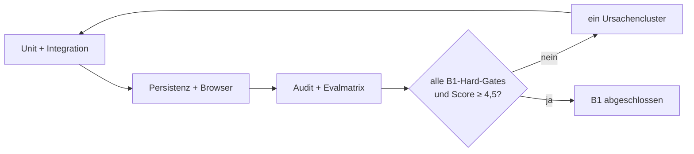

# Etappe B1 Eval-Gated Implementation Plan

> **For agentic workers:** REQUIRED SUB-SKILL: Use `executing-plans` task by task, `test-driven-development` before every behavior change, `agentic-eval` for the quality loop, and `verification-before-completion` before claiming the stage exit.

**Goal:** Die Kriterien AC-B1-1 bis AC-B1-9 aus `2026-07-30-etappe-b1-quellen-evidenz-design.md` vollständig erfüllen und `EVID-01` bis `EVID-08` mit reproduzierbarer Evidenz schließen.

**Architecture:** Drei kleine ESM-Domänenmodule bilden Quelle, Fundstelle und Belegbündel. Prüfdienste für Zitat, bibliografische Identität und Zitierkonsistenz arbeiten deterministisch auf diesen Modellen. `workspace.js` bleibt dünne UI-Orchestrierung; alle Integritätsentscheidungen sind außerhalb des DOM testbar. Projektpersistenz wird additiv erweitert.

**Tech Stack:** JavaScript ESM, Node Test Runner, Tiptap, esbuild, Playwright/Chromium, bestehende lokale Persistenz.

**Global Constraints:**

- Die 77 V2-Evals und AC-B1-1 bis AC-B1-9 bleiben unverändert.
- Bestehendes `project.material` bleibt kompatibel.
- Kein Metadaten- oder Demoobjekt darf als live verifizierter Volltextbeleg erscheinen.
- Kein globaler Wahrheits- oder Quellenscore.
- Nur explizite Nutzeraktionen mutieren Quellenstatus oder Verknüpfungen.
- Externe Live-Gates bleiben offen, sofern keine echte Evidenz vorliegt.

## Aufgabe 1 — Quellenmodell und Import

**Files:**

- Create: `app/src/source-model.mjs`
- Create: `app/test/source-model.test.mjs`
- Modify: `app/src/editor.js`

**RED:** Fixtures für PDF, Web, DOI, Text, Audio und Video schreiben. Fehlende unveränderliche Referenz, Prüfsumme, ungültiger Typ und Projektabweichung müssen scheitern.

**GREEN:** Normalisierung, SHA-256-Abhängigkeit, feldweise Metadatenzustände, getrennte Ableitungen, Historie und additive Projektform implementieren.

**Exit Evidence:** EVID-01-Fixture und Store-Roundtrip bestehen.

## Aufgabe 2 — Fundstellenmodell und Resolver

**Files:**

- Create: `app/src/locator-model.mjs`
- Create: `app/test/locator-model.test.mjs`

**RED:** Seiten-, Abschnitts-, Text- und Zeitlocators samt falschem Ausschnitt, falscher Quelle und Projekt-Canary definieren.

**GREEN:** Typabhängige Validierung, Ausschnitt-Hash und fail-closed Resolver implementieren. Verifiziert wird nur bei nachweisbarer Übereinstimmung mit Original oder Transkript.

**Exit Evidence:** Alle Locator-Fixtures bestehen; falsche Ausschnitte bleiben `unverified`.

## Aufgabe 3 — Belegbündel und Quellenqualität

**Files:**

- Create: `app/src/evidence-bundle.mjs`
- Create: `app/test/evidence-bundle.test.mjs`
- Create: `app/evals/fixtures/evidenzqualitaet.mjs`

**RED:** Vollständiges, gemischtes, unvollständiges und zurückgezogenes Bündel sowie kontrastive Qualitätsfixtures definieren.

**GREEN:** Claim-spezifische Beziehungen, Vollständigkeitsgate, Statusableitung und qualitative Dimensionen implementieren. Verbotene globale Scorefelder werden rekursiv abgewiesen.

**Exit Evidence:** EVID-03 hart grün; EVID-04 Rubrik mindestens 4,5/5.

## Aufgabe 4 — Zitat-, Identitäts- und Verzeichnisprüfung

**Files:**

- Create: `app/src/citation-audit.mjs`
- Create: `app/test/citation-audit.test.mjs`

**RED:** Positive und negative Fixtures für direktes Zitat, Paraphrase, Seite, DOI-/Versionskonflikt sowie fehlende, verwaiste, doppelte und stilabweichende Verzeichniseinträge.

**GREEN:** Drei pure Prüfpfade implementieren; Befunde tragen Code, Schwere, Nachricht und konkreten Locator.

**Exit Evidence:** EVID-05, EVID-06 und EVID-07 bestehen.

## Aufgabe 5 — Rücknahme, Korrektur und Versionen

**Files:**

- Modify: `app/src/source-model.mjs`
- Modify: `app/src/evidence-bundle.mjs`
- Modify: `app/test/source-model.test.mjs`
- Modify: `app/test/evidence-bundle.test.mjs`

**RED:** Erratum-, Retraction-, Supersede- und alternative-Primärquelle-Fixtures schreiben; stille Weiterverwendung muss scheitern.

**GREEN:** Unveränderliche Ereignisse registrieren, Quellenstatus ableiten und betroffene Bündel auf `review-required` propagieren.

**Exit Evidence:** EVID-08 besteht; Historie bleibt nach JSON-Roundtrip vollständig.

## Aufgabe 6 — Quellenbibliothek und Fundstellenreader

**Files:**

- Modify: `app/src/workspace.js`
- Modify: `app/src/style.css`
- Modify: `app/src/example.js`
- Create: `app/test/etappe-b1-smoke.mjs`

**RED:** Browserfluss definieren: Quelle aufnehmen, Status sehen, Fundstelle öffnen, Aussage behalten, Originalausschnitt sehen, Rücknahmehinweis sehen, Dialog per Escape schließen und Fokus zurückerhalten.

**GREEN:** Bestehenden Materialdialog zu einer Projektquellenbibliothek erweitern; typisierten Import, Quellenliste, Detailansicht und Locator-Reader anbinden. Demoquellen bleiben als Demo markiert.

**Exit Evidence:** EVID-02 sowie UI-Anteile von AC-B1-1, AC-B1-8 und AC-B1-9 bestehen.

## Aufgabe 7 — Persistenz, Isolation und Regression

**Files:**

- Modify: `app/test/etappe-b1-smoke.mjs`
- Modify: `app/test/performance-smoke.mjs`
- Modify: `app/src/editor.js`

**RED:** Reload-, Zwei-Projekt-Canary- und Korruptionsfixtures ergänzen.

**GREEN:** Additive Normalisierung und Recovery so weit ergänzen, bis Reload identisch ist, fremde Projekt-IDs abgewiesen und beschädigte neue Listen fail-safe geleert werden.

**Verification:**

1. fokussierte B1-Tests;
2. vollständiges `npm test`;
3. `npm run build`;
4. B1-Browser-Smoke auf isoliertem Port;
5. Performance-Smoke;
6. `git diff --check`.

**Exit Evidence:** INV-02, INV-04, SYSTEM-01 und SYSTEM-07 bleiben beziehungsweise werden grün; SYSTEM-03 bleibt nur in seinem echten externen Anteil offen.

## Aufgabe 8 — Evalbericht und höchstens fünf Qualitätsloops

**Files:**

- Create: `app/evals/results/etappe-b1-latest.json`
- Modify: `CONTEXT.md`
- Modify: this plan

Jede Schleife erfasst:

- Nummer, Commit und Zeit;
- geprüfte Eval-IDs;
- Test-, Build-, Browser- und Persistenzbelege;
- Fehlercluster und Ursachenänderung;
- Rubrikwerte für Integrität, Rückverfolgbarkeit, Bedienbarkeit, Robustheit und Wartbarkeit;
- gewichteten Score und Stop-/Weiter-Entscheidung.

**Stop Conditions:** Exit bei allen B1-Hard-Gates und Score ≥ 4,5 ohne Dimension unter 4. Stop nach zwei Schleifen ohne Verbesserung oder spätestens nach fünf; offene Punkte bleiben ehrlich offen.

## Abschließende Verifikation

In einem frischen Lauf:

1. AC-B1-1 bis AC-B1-9 einzeln gegen Evidenz vergleichen;
2. `node --test` für alle B1-Domänentests;
3. vollständiges `npm test`;
4. Build;
5. B1- und bestehende Browser-Smokes;
6. Performanceprobe;
7. Eval-Katalog plus B1-Ergebnis validieren;
8. rekursive Suche nach verbotenen globalen Scorefeldern und projektfremden Canary-Werten;
9. `git diff --check`.

Erst danach darf Etappe B1 als abgeschlossen gelten.
