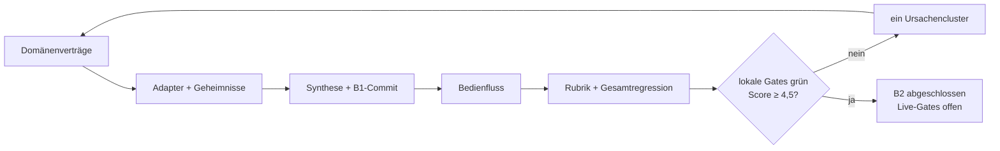
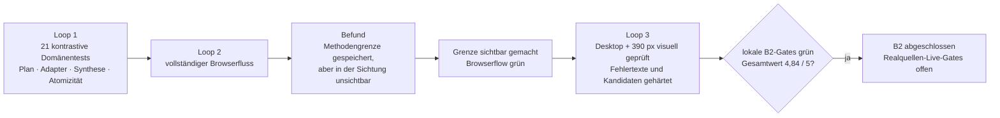

# Etappe B2 Eval-Gated Implementation Plan

> **For agentic workers:** REQUIRED SUB-SKILL: Use `executing-plans` task by task, `test-driven-development` before every behavior change, `agentic-eval` for the quality loop, and `verification-before-completion` before claiming the stage exit.

**Goal:** AC-B2-1 bis AC-B2-9 vollständig erfüllen, `RESEARCH-01`, `RESEARCH-04` bis `RESEARCH-07` reproduzierbar schließen und die echten Live-Anteile von `RESEARCH-02` und `RESEARCH-03` ausdrücklich offen halten.

**Architecture:** Ein pures Laufmodell besitzt Plan, Zustandsautomat, Budgets und Deduplizierung. Ein Adaptervertrag erzeugt bereinigte, unveränderliche Werkzeugereignisse. Eine Verdichtungsschicht prüft Zugangsebene, Gegenbelege und Grenzen und übergibt nur am B1-Original verifizierte Kandidaten an Quelle, Fundstelle und Belegbündel. Die Quellenbibliothek erhält eine ruhige Rechercheansicht; `workspace.js` bleibt dünn.

**Tech Stack:** JavaScript ESM, Node Test Runner, bestehende B1-Domänenmodule, esbuild, Playwright/Chromium, lokale Persistenz.

**Global Constraints:**

- Die 77 V2-Evals und AC-B2-1 bis AC-B2-9 bleiben unverändert.
- Ein Lauf darf vor einem vollständigen Plan kein Werkzeug aufrufen.
- Kein Adapterergebnis ist allein wegen plausibler Modell- oder Metadatenausgabe verifiziert.
- Geheimnisse werden rekursiv vor Protokollierung entfernt.
- Externe Live-Gates werden nicht durch Fixtures geschlossen.

## Aufgabe 1 — Laufmodell und Zustandsautomat

**Files:**

- Create: `app/src/research-run.mjs`
- Create: `app/test/research-run.test.mjs`
- Modify: `app/src/editor.js`

**RED:** Planpflicht, ungültige Werkzeuge, fehlende Stopbedingungen, illegale Zustandswechsel, Projektabweichung und beschädigte Persistenz definieren.

**GREEN:** Planerzeugung, additive Projektform, Statusübergänge, Budget und unveränderliche Historie implementieren.

**Exit Evidence:** RESEARCH-01 sowie Persistenzanteile von AC-B2-6 und AC-B2-9.

## Aufgabe 2 — Adaptervertrag, Werkzeugprotokoll und Geheimnisschutz

**Files:**

- Create: `app/src/research-adapter.mjs`
- Create: `app/test/research-adapter.test.mjs`

**RED:** Start-, Erfolg-, Fehler- und Abbruchereignisse über Suche, Metadaten, Reader und Import; verschachtelte Secret-Canaries.

**GREEN:** Eingaben stabil normalisieren, Geheimnisse bereinigen, Ergebnisreferenzen und Adapterversion protokollieren.

**Exit Evidence:** RESEARCH-07.

## Aufgabe 3 — Fehlwegdeduplizierung und legale Alternativen

**Files:**

- Modify: `app/src/research-run.mjs`
- Create: `app/test/research-legal-paths.test.mjs`

**RED:** Identischer Fehlweg, geänderter Quellenzustand, Paywall, Preprint und Repositorium; verbotene Bypass-/Credential-Wege.

**GREEN:** stabilen Wegschlüssel, Zustands-Canary und legale Alternativplanung implementieren.

**Exit Evidence:** RESEARCH-04; lokaler Vertragsanteil von RESEARCH-03.

## Aufgabe 4 — Kandidatenprüfung und atomare B1-Übernahme

**Files:**

- Create: `app/src/research-synthesis.mjs`
- Create: `app/test/research-synthesis.test.mjs`

**RED:** Metadaten-only, Abstract, falscher Ausschnitt, Volltext, Widerspruch, Abbruch und doppelter Import.

**GREEN:** Zugangsebene begrenzen, Kandidaten deduplizieren, Widersprüche erhalten und ausschließlich verifizierte Originalfundstellen atomar in B1-Quellen und Belegbündel überführen.

**Exit Evidence:** lokale Vertragsanteile von RESEARCH-02 und RESEARCH-06 sowie erneute EVID-03/EVID-08-Regression.

## Aufgabe 5 — Gegenbeleg- und Grenzqualität

**Files:**

- Create: `app/evals/fixtures/recherchequalitaet.mjs`
- Create: `app/evals/run-b2-quality.mjs`
- Modify: `app/package.json`

**RED:** Kontrastive Gold-Fixtures mit fehlender Gegenbelegsuche, geglättetem Widerspruch, fehlender Methodengrenze und ehrlichem Nullbefund.

**GREEN:** Rechercheverdichtung und feste Rubrik auf Suchbreite, Widerspruchstreue, Methodengrenzen, Ehrlichkeit und Priorisierung anwenden.

**Exit Evidence:** RESEARCH-05 mindestens 4,5/5, keine Dimension unter 4.

## Aufgabe 6 — Rechercheansicht in den Projektquellen

**Files:**

- Create: `app/src/research-ui.mjs`
- Modify: `app/src/source-library-ui.mjs`
- Modify: `app/src/style.css`
- Create: `app/test/etappe-b2-smoke.mjs`

**RED:** Browserfluss für Plan, ehrlichen Adapterstatus, Start, Pause, Fortsetzung, Ergebnisgruppen, Protokolldetail, Reload, Escape, Fokus und 390-Pixel-Overflow.

**GREEN:** Kompakte Plan- und Laufansicht anbinden. Ein injizierter Adapter nutzt denselben Produktvertrag wie ein späterer Live-Provider; ohne Provider wird kein Ergebnis simuliert.

**Exit Evidence:** AC-B2-8 und Browseranteile von RESEARCH-06.

## Aufgabe 7 — Regression, Evalbericht und höchstens fünf Loops

**Files:**

- Create: `app/evals/results/etappe-b2-latest.json`
- Modify: `CONTEXT.md`
- Modify: this plan

Jede Schleife erfasst RED-Ursache, fokussierte Tests, Build, Browser, Persistenz, Rubrikwerte und Stopentscheidung.

**Stop Conditions:** Exit bei allen lokalen B2-Hard-Gates und Score ≥ 4,5. Stop nach zwei Schleifen ohne Verbesserung oder spätestens nach fünf. RESEARCH-02 und RESEARCH-03 bleiben ohne echte Realquellenprüfung `external-open`.

## Abschließende Verifikation

1. AC-B2-1 bis AC-B2-9 einzeln gegen frische Evidenz vergleichen;
2. alle B2-Domänentests;
3. vollständiges `npm test`;
4. Build;
5. B2- und bestehende Browser-Smokes;
6. Performanceprobe;
7. B2-Qualitätsfixture;
8. Eval-Katalog und B2-Ergebnis;
9. rekursive Secret- und Projekt-Canary-Suche;
10. native Build-/Startprobe und `git diff --check`.

## Ausfuehrungsstand — 30. Juli 2026

Alle sieben Aufgaben wurden in drei begrenzten Qualitaetsschleifen abgeschlossen. Die neun Abnahmekriterien und der Eval-Katalog blieben unveraendert.

### Frische Exit-Evidenz

- 293 Unit- und Integrationstests bestanden, 0 fehlgeschlagen.
- Produktionsbuild erfolgreich; Bundle 517,6 KB.
- Etappen-A-, B1-, B2-, Entscheidungsverlauf- und vollständiger V2-Browser-Smoke bestanden.
- RESEARCH-05 erreicht in allen fünf Dimensionen 5,0 von 5,0.
- INV-08 bewertet ehrliche Enthaltung mit 5 und plausible Erfindung ohne Originalfundstelle mit 0.
- 15 Performanceeingaben: p95 bis zum nächsten Frame 9,9 ms, kein Long Task.
- Native Mac-App: Build erfolgreich, 17 Selbsttests bestanden und Start-/Persistenzprobe grün.
- Evalkatalog und B2-Ergebnis validiert: 77 vollständig erfasste Evals, davon 35 bestanden, 36 späteren Etappen zugeordnet und 6 echte externe Live-Gates offen.
- Desktop- und Mobile-Screenshots zeigen Widerspruch und Grenzen vor Stützung sowie keinen horizontalen Überlauf.
- `git diff --check` ohne Befund.

Damit sind `INV-08`, `RESEARCH-01` und `RESEARCH-04` bis `RESEARCH-07` reproduzierbar geschlossen. `RESEARCH-02` und `RESEARCH-03` besitzen grüne lokale Verträge, bleiben für reale Provider, Originalquellen und Rechtsprüfung aber ausdrücklich `external-open`.
