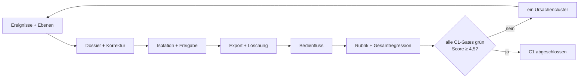
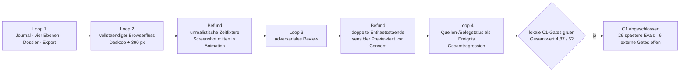

# Etappe C1 Eval-Gated Implementation Plan

> **For agentic workers:** REQUIRED SUB-SKILL: Use `executing-plans` task by task, `test-driven-development` before every behavior change, `agentic-eval` for the quality loop, and `verification-before-completion` before claiming the stage exit.

**Goal:** AC-C1-1 bis AC-C1-9 erfüllen und `MEMORY-01` bis `MEMORY-06` sowie `INV-05` reproduzierbar schließen.

**Architecture:** Ein pures Memory-Modell besitzt Ereignisse, vier Ebenen, Geltungsbereiche und Freigaben. Ein Dossier-Builder liest Projektprimärzustände ohne Mutation und verweist ausschließlich auf stabile Ereignis-IDs. Retrieval, Stilkontext, Export und Löschung sind eigene pure Dienste. Eine kleine UI hängt am Projektverständnis; Persistenz bleibt additiv.

**Global Constraints:**

- Der Eval-Katalog und AC-C1-1 bis AC-C1-9 bleiben unverändert.
- Dossiers und Indizes ersetzen keine Quelle, Entscheidung oder Provenienz.
- Projektübergreifende Übernahme benötigt eine explizite Nutzerfreigabe.
- Löschen darf Nutzertext, Quellen oder fremde Projekte nicht verändern.
- Keine Schlüssel, Cookies oder Autorisierungsdaten in Einträgen oder Exporten.

## Aufgabe 1 — Ereignisjournal und vier Ebenen

**Files:**

- Create: `app/src/memory-model.mjs`
- Create: `app/test/memory-model.test.mjs`
- Modify: `app/src/editor.js`

**RED:** Alle vier Ebenen, falsche Scopes, fehlende Provenienz/Sensitivität/Löschregel, doppelte Ereignisse, Korruption und Projektabweichung.

**GREEN:** Additiven Store, typisierte Einträge, immutable Append und Schema-9-Migration implementieren.

**Exit Evidence:** MEMORY-01 und MEMORY-02.

## Aufgabe 2 — Ereigniserfassung und Dossier-Rebuild

**Files:**

- Create: `app/src/memory-dossier.mjs`
- Create: `app/test/memory-dossier.test.mjs`
- Modify: `app/src/editor.js`

**RED:** Verständnis, Begriff, Quelle, Entscheidung, Risiko und Recherchelauf; Bytegleichheit der Primärzustände und Rebuild nach Korrektur.

**GREEN:** Stabile Ereignisse ableiten, Projekt-Dossier aufbauen, Korrekturen als neue Ereignisse überlagern und Herkunft referenzieren.

**Exit Evidence:** MEMORY-01 und MEMORY-03-Domänenanteil.

## Aufgabe 3 — Projektgrenzen, Freigabe und Stimmen

**Files:**

- Create: `app/src/memory-retrieval.mjs`
- Create: `app/test/memory-retrieval.test.mjs`

**RED:** Zwei Projekte mit Canary, sensible Freigabe, Ablehnung, Themen-/Persönlichkeitseintrag und kollidierende Projekt-/Autorenstimme.

**GREEN:** Begründetes Retrieval, Transferanfrage, Consent-Ableitung und getrennten Stilkontext implementieren.

**Exit Evidence:** MEMORY-04, MEMORY-05 und INV-05.

## Aufgabe 4 — Export und Löschung

**Files:**

- Create: `app/src/memory-portability.mjs`
- Create: `app/test/memory-portability.test.mjs`

**RED:** Ebenen-, Projekt- und Gesamtexport, Secret-Canary, gezielte Löschung, offene Indizes und unveränderte fremde Primärdaten.

**GREEN:** Versioniertes lesbares Paket, Referenzprüfung und fail-closed Delete-Plan implementieren.

**Exit Evidence:** MEMORY-06 und lokaler SYSTEM-03-Anteil.

## Aufgabe 5 — Projektgedächtnis-Ansicht

**Files:**

- Create: `app/src/memory-ui.mjs`
- Modify: `app/src/workspace.js`
- Modify: `app/src/style.css`
- Create: `app/test/etappe-c1-smoke.mjs`

**RED:** Automatisches Dossier, Korrektur, Reload, Projektwechsel, Vorschlag, Freigabe/Ablehnung, Export, zweistufiges Löschen, Escape/Fokus und 390-Pixel-Geometrie.

**GREEN:** Ruhige Dossieransicht an das Projektverständnis anbinden. Primärzustände bleiben read-only; Korrekturen und Freigaben sind bewusste Aktionen.

**Exit Evidence:** MEMORY-03, MEMORY-04, MEMORY-06 und AC-C1-9.

## Aufgabe 6 — Qualitätsloops und Exit

**Files:**

- Create: `app/evals/results/etappe-c1-latest.json`
- Modify: `CONTEXT.md`
- Modify: this plan

**Stop Conditions:** Exit bei allen C1-Hard-Gates und Score ≥ 4,5. Stop nach zwei Schleifen ohne Verbesserung oder spätestens nach fünf.

## Abschließende Verifikation

1. AC-C1-1 bis AC-C1-9 gegen frische Evidenz;
2. alle Memory-Domänentests;
3. vollständiges `npm test`;
4. Build;
5. C1- und bestehende Browser-Smokes;
6. Performanceprobe;
7. Projekt-/Secret-Canary;
8. Eval-Katalog und C1-Ergebnis;
9. native Build-/Startprobe;
10. `git diff --check`.

## Ausfuehrungsstand — 30. Juli 2026

Alle sechs Aufgaben wurden in vier begrenzten Qualitaetsschleifen abgeschlossen. Die neun Abnahmekriterien und der Eval-Katalog blieben unveraendert.

### Frische Exit-Evidenz

- 327 Unit- und Integrationstests bestanden, 0 fehlgeschlagen.
- 18 fokussierte Memory-Domaenentests decken Ereignisimmutabilitaet, vier Ebenen, Dossier-Rebuild, Statuswechsel, Projektgrenzen, Consent, Stimmen, Export und Loeschung ab.
- Produktionsbuild erfolgreich; Bundle 542,9 KB.
- Etappen-A-, B1-, B2-, C1-, Entscheidungsverlauf- und vollstaendiger V2-Browser-Smoke bestanden.
- B1 und B2 wurden nach Behebung ihrer Animations-Testflanken jeweils dreimal hintereinander gruen ausgefuehrt.
- 14 Performanceeingaben: p95 bis zum naechsten Frame 8,2 ms, kein Long Task.
- Native Mac-App: warnungsfreier Compile, 17 Selbsttests, Neubau und Start-/Persistenzprobe bestanden.
- Evalkatalog und C1-Ergebnis validiert: 77 vollstaendig erfasste Evals, davon 42 bestanden, 29 spaeteren Etappen zugeordnet und 6 echte externe Live-Gates offen.
- Desktop- und Mobile-Screenshots zeigen ein opakes, ruhiges Dossier ohne horizontalen Ueberlauf.
- `git diff --check` ohne Befund.

Damit sind `INV-05` und `MEMORY-01` bis `MEMORY-06` reproduzierbar geschlossen. Die sechs unveraenderten externen Live-Gates bleiben ausdruecklich offen.
