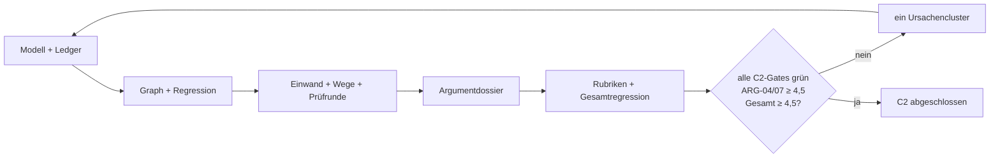

# Etappe C2 Eval-Gated Implementation Plan

> **For agentic workers:** REQUIRED SUB-SKILL: Use `executing-plans` task by task, `test-driven-development` before every behavior change, `agentic-eval` for the quality loop, `systematic-debugging` for every unexpected failure, and `verification-before-completion` before claiming the stage exit.

**Goal:** AC-C2-1 bis AC-C2-10 erfüllen und `ARG-01` bis `ARG-07` reproduzierbar schließen.

**Architecture:** Ein pures Argumentmodell besitzt projektgebundene Claims, explizite Relationen, Befunde, Wege, Prüfrunden und Ereignisse. Ein konservatives Claim-Ledger synchronisiert stabile Textblöcke und Belegbündel. Ein Graphdienst berechnet Lücken, Zyklen, Grundursachen, begrenzte Auswirkungen und Regressionen. Ein Deliberationsdienst wählt belegte Gegenargumente und erzeugt nur substanziell verschiedene Argumentwege. Die UI projiziert das Modell als ruhiges Textdossier hinter dem Projektverständnis.

**Global Constraints:**

- Eval-Katalog und AC-C2-1 bis AC-C2-10 bleiben unverändert.
- Kein Analyse-, Korrektur-, Gegenargument- oder Wegefluss verändert Nutzertext.
- Projektfremde Claims, Relationen und Evidenz scheitern geschlossen.
- Automatische Ableitungen sind Agenteneinordnung; Nutzerkorrekturen sind bindend.
- Keine geratenen Anker, Schlussbrücken, Gegenargumente oder Synonymvarianten.
- Höchstens fünf Eval-Schleifen; Exit nur bei allen Hard-Gates, `ARG-04` und `ARG-07` jeweils mindestens 4,5/5 und C2-Gesamtscore mindestens 4,5.

## Aufgabe 1 — Projektgebundenes Argumentmodell

**Files:**

- Create: `app/src/argument-model.mjs`
- Create: `app/test/argument-model.test.mjs`
- Modify: `app/src/editor.js`

**RED:**

- gültige und ungültige Claim-Arten, Zustände, Evidenzlagen und Unsicherheiten;
- exakte Projekt-/Text-/Blockanker;
- fünf Relationstypen mit Schlussbrücke und Sicherheitsgrad;
- projektfremde Kanten, doppelte IDs und kaputte Persistenz;
- bindende Korrektur als neues Ereignis ohne Mutation des Ursprungseintrags.

**GREEN:** Schema-10-Migration, normalisierte Claims/Relationen, append-only Ereignisse und additive Projektreparatur implementieren.

**Exit Evidence:** Fundament für ARG-01, ARG-02 und INV-05.

## Aufgabe 2 — Atomisierung und Claim-Ledger

**Files:**

- Create: `app/src/claim-ledger.mjs`
- Create: `app/test/claim-ledger.test.mjs`

**RED:**

- gemischter deutscher Satz mit zwei unterschiedlich belegten Tatsachenclaims;
- Semikolon, koordinierte Teilsätze, Frage, Liste und rhetorisches Fragment;
- exakte nicht überlappende Zeichenbereiche;
- semantische Blockrollen;
- Belegbündelzuordnung und eigener Evidenzstatus;
- idempotenter Rebuild, Textänderung, verschwundener Block und bindende manuelle Korrektur.

**GREEN:** konservativen Clause-Splitter, stabile Fingerprints, Quellenprojektion und idempotente Synchronisation implementieren.

**Exit Evidence:** ARG-01 und AC-C2-1.

## Aufgabe 3 — Graph, Grundursache, Zyklen und Auswirkung

**Files:**

- Create: `app/src/argument-graph.mjs`
- Create: `app/test/argument-graph.test.mjs`

**RED:**

- stützende, widersprechende, qualifizierende, erklärende und voraussetzende Kanten;
- fehlende Schlussbrücke und unbelegter Zentralclaim;
- ein Zyklus mit vollständigem Pfad;
- gemeinsame Annahme als Grundursache, abhängige Befunde geparkt;
- Änderung an Claim, Definition, Quelle und Autorentscheidung;
- betroffener und bytegleich unabhängiger Teilgraph;
- geschlossener Befund ohne/mit neuem Grundlagenfingerprint.

**GREEN:** gerichteten Index, Zyklensuche, Ursachenprojektion, begrenzte BFS-Auswirkung und fingerprint-gebundene Regression implementieren.

**Exit Evidence:** ARG-03, ARG-05, ARG-06 und AC-C2-3/5/6.

## Aufgabe 4 — Faire Einwände, Wege und Prüfrunden

**Files:**

- Create: `app/src/argument-deliberation.mjs`
- Create: `app/test/argument-deliberation.test.mjs`
- Create: `app/evals/fixtures/argumentqualitaet.mjs`
- Create: `app/evals/run-c2-quality.mjs`
- Modify: `app/package.json`

**RED:**

- stärkster direkter Einwand schlägt schwachen oder unbelegten Einwand;
- Originalclaim, Evidenz, Grenze und Auswirkung bleiben getrennt;
- ohne Gegenmaterial ehrliche Enthaltung;
- mindestens zwei Wege mit verschiedener Prämisse/Brücke/Perspektive/Evidenzstrategie;
- Synonymvarianten und Wege ohne Risiko werden verworfen;
- Kritik, Autorenantwort und Revision bleiben getrennt, chronologisch und projektgebunden;
- feste Goldrubriken für ARG-04 und ARG-07 erreichen zunächst nicht die Schwelle.

**GREEN:** deterministische Auswahl, abstention-first Gegenprüfung, substantielle Strategiebildung, Prüfrunden und kontrastive 5-Punkt-Rubrik implementieren.

**Exit Evidence:** ARG-04, ARG-07 und AC-C2-4/7/8.

## Aufgabe 5 — Argumentdossier in der Oberfläche

**Files:**

- Create: `app/src/argument-ui.mjs`
- Modify: `app/src/workspace.js`
- Modify: `app/src/style.css`
- Create: `app/test/etappe-c2-smoke.mjs`

**RED:**

- zwei Projekte mit Canary-Claims;
- automatische Claim-Aktualisierung aus stabilen Blöcken und Belegen;
- sichtbare Evidenzlage, Unsicherheit und Textanker;
- Relationstyp, Schlussbrücke und Sicherheit korrigieren, Reload;
- Grundursache, geparkter Befund und Zyklus;
- stärkster Einwand oder Enthaltung;
- zwei substanzielle Wege mit Auswirkung und Risiko;
- Prüfrunde;
- Editor vor/nach allen Aktionen bytegleich;
- 390-Pixel-Geometrie, Tastatur, Fokus und Escape.

**GREEN:** Einstieg neben Projektgedächtnis, progressive Textprojektion, Korrekturform, Wege-/Einwandkarten, Prüfrunden und ruhige Leer-/Fehlerzustände implementieren.

**Exit Evidence:** ARG-02, ARG-04, ARG-07, INV-05 und AC-C2-9/10.

## Aufgabe 6 — Persistenz- und Integrationshärtung

**Files:**

- Modify: `app/src/editor.js`
- Modify: `app/test/etappe-b1-smoke.mjs`
- Modify: `app/test/etappe-b2-smoke.mjs`
- Modify: `app/test/etappe-c1-smoke.mjs`

**RED:**

- Schema-10-Roundtrip;
- beschädigtes Argumentmodell;
- Quellenrücknahme und Belegstatusänderung markieren nur abhängige Claims;
- Beispielprojekt bleibt Demo;
- Projektwechsel enthält keinen fremden Canary;
- vorhandene A–C1-Smokes erwarten die neue additive Version.

**GREEN:** persistente additive Migration und begrenzte Synchronisationspunkte integrieren; keine automatische Vollanalyse bei jedem Tastendruck.

**Exit Evidence:** C2-Regression und Systemzuverlässigkeit.

## Aufgabe 7 — Qualitätsloops und Exit

**Files:**

- Create: `app/evals/results/etappe-c2-latest.json`
- Modify: `CONTEXT.md`
- Modify: this plan

Jeder Loop protokolliert:

- Schleifennummer und Git-Stand;
- geänderte Eval-IDs;
- neue Fehler und regressionsfreie Belege;
- Score je Dimension;
- nächsten Engpass.

**Stop Conditions:** Exit bei allen C2-Hard-Gates und den Scoreschwellen. Früher Stopp nach zwei Schleifen ohne Verbesserung; spätestens nach fünf Schleifen.

## Abschließende Verifikation

1. AC-C2-1 bis AC-C2-10 gegen frische Evidenz;
2. alle Argument-Domänentests;
3. `npm run eval:c2-quality`;
4. vollständiges `npm test`;
5. Produktionsbuild;
6. Etappen-A-, B1-, B2-, C1-, C2-, Entscheidungs- und V2-Browser-Smokes;
7. Performanceprobe;
8. Projekt-/Text-/Secret-Canaries;
9. Eval-Katalog und C2-Ergebnis;
10. warnungsfreier Swift-Compile, 17 native Selbsttests, Neubau und Startprobe;
11. `git diff --check`.
