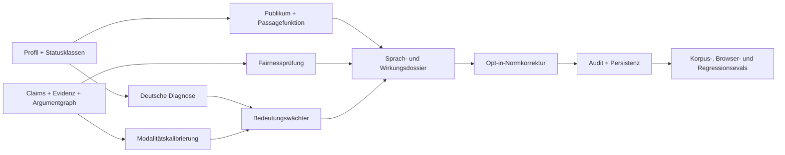

# Etappe D1 · Umsetzungs- und Evalplan

> **Ausführungsregeln:** testgetrieben arbeiten, pro Schleife frische Evidenz sichern, höchstens fünf Iterationen, keine Ziel-Evals verändern.

**Ziel:** Die in `2026-07-30-etappe-d1-sprache-wirkung-design.md` beschriebene deutsche Sprach-, Anti-Slop- und Wirkungsdiagnostik als ruhigen, projektisolierten Nutzerfluss bauen und `LANG-01`–`LANG-08` sowie `EFFECT-01`–`EFFECT-05` schließen.

**Qualitätsschwelle:** gewichteter Score ≥ 4,5/5; keine Dimension < 4; jedes Hard Gate grün.

## Liefergraph

## Schleife 1 · Profil, Verträge und Statusklassen

### RED

Neue Tests:

- `app/test/language-profile.test.mjs`
- `app/test/language-diagnostics.test.mjs`

Fehlende Verhaltensbelege:

- Profil bleibt ohne Angaben unvollständig;
- Zielgruppe und Wirkung werden aus dem Projektverständnis übernommen, aber nicht erfunden;
- D-A-CH- und Hausstilvarianten bleiben legitim;
- nur `norm-error` trägt Fehlerstatus;
- Projektfremde Profile und Diagnosen scheitern geschlossen.

### GREEN

Neue Module:

- `app/src/language-profile.mjs`
- `app/src/language-diagnostics.mjs`

Integration:

- `ensureProjectShape` migriert `languageProfile` additiv;
- Schema wird auf 11 erhöht;
- append-only Profilereignisse.

### Evidenz

`LANG-01`, `LANG-02`, `LANG-03`, Teile von `INV-05`.

## Schleife 2 · Modalität, Anti-Slop und Bedeutungswächter

### RED

Neue Tests:

- `app/test/language-modality.test.mjs`
- `app/test/language-patterns.test.mjs`
- `app/test/language-variant.test.mjs`
- `app/test/orthography.test.mjs`

Kontraste:

- derselbe Gedankenstrich, Passivsatz oder Dreierbau mit tragender Funktion versus leere Häufung;
- `beweist` bei unzureichender Evidenz versus passende Qualifikation;
- driftende Varianten verändern Negation, Zahl, Referent oder Claim-Reichweite;
- eindeutiger Tippfehler versus Eigenname, URL, Zitat oder mehrdeutiger Fall;
- Automatik aus versus bewusst aktiviert.

### GREEN

Neue Module:

- `app/src/language-modality.mjs`
- `app/src/language-patterns.mjs`
- `app/src/language-variant.mjs`
- `app/src/orthography.mjs`

Editoradapter:

- textnahe Ersetzung mit ProseMirror-`insertText`, stabilen Blockankern und Markenerhalt;
- Anwendungen vom Dokumentende nach vorn;
- Auditereignis je Änderung.

### Evidenz

`LANG-04`–`LANG-08`.

## Schleife 3 · Wirkung, Rhetorik, Fairness und feste Korpora

### RED

Neue Tests:

- `app/test/effect-analysis.test.mjs`
- `app/test/effect-fairness.test.mjs`
- `app/test/d1-quality.test.mjs`

Feste Korpora:

- wissenschaftlicher Text mit gemischter Evidenz;
- Essay mit tragender und irreführender Bildlichkeit;
- Projekttext mit Informationsdichte und Orientierung;
- Marketing-/Kampagnentext mit Gegeninformation und ausnutzender Personalisierung;
- D-A-CH- und Hausstilkontraste.

### GREEN

Neue Module:

- `app/src/effect-analysis.mjs`
- `app/src/effect-fairness.mjs`

Neue Eval-Artefakte:

- `app/evals/fixtures/d1-qualitaet.mjs`
- `app/evals/run-d1-quality.mjs`
- Paketbefehl `eval:d1-quality`.

Rubrikdimensionen:

- Kontexttreue;
- Status- und Evidenzkalibrierung;
- Bedeutungsschutz;
- Funktions- und Rhetorikpassung;
- Fairness und ehrliche Unsicherheit.

### Evidenz

`EFFECT-01`–`EFFECT-05`; `EFFECT-06` wird nicht simuliert.

## Schleife 4 · Vollständiger Nutzerfluss

### RED

Neuer Browsertest:

- `app/test/etappe-d1-smoke.mjs`

Szenario:

1. zwei Texte in Projekt Alpha und ein Projekt Beta;
2. unvollständiges Profil zeigt Lücken;
3. Nutzer ergänzt Genre, Region, Medium und Fach;
4. Sprachprüfung zeigt getrennte Norm-, Grammatik-, Register-, Modalitäts- und Wirkungsklassen;
5. Öffnen und Prüfen lassen den Editor bytegleich;
6. Normautomatik ist aus und kann nichts anwenden;
7. Nutzer schaltet sie bewusst ein und wendet eindeutige Fälle an;
8. Link, Überschrift, Liste, Eigennamen und mehrdeutige Stelle bleiben erhalten;
9. Ereignis, Reload, Undo und Projekt-/Textisolation bestehen;
10. Fairnessrisiko steht vor Stilhinweisen;
11. Desktop, 390 Pixel, 200 Prozent Zoom, Tastatur, Fokus und Escape bestehen.

### GREEN

Neue UI:

- `app/src/language-ui.mjs`
- `app/src/style.css`
- Einstieg „Sprache und Wirkung prüfen“ im Projektverständnis.

Integration:

- `workspace.js` stellt Profil-, Analyse- und Korrekturadapter bereit;
- `editor.js` migriert Projektzustand;
- Browser-Smokes früherer Etappen erwarten Schema 11.

### Evidenz

Alle D1-Hard-Gates, Persistenz, Autorschaft, Isolation und Barrierefreiheit.

## Schleife 5 · Review, Regression und Etappenexit

### Prüfung

1. unabhängige Code- und Designprüfung gegen AC-D1-01–12;
2. `npm test`;
3. `npm run build`;
4. `npm run eval:d1-quality`;
5. D1-Smoke in Chromium, Firefox und WebKit;
6. A-, B1-, B2-, C1-, C2-, Entscheidungs- und vollständiger V2-Smoke;
7. Performanceprobe;
8. warnungsfreier Swift-Compile;
9. 17 native Selbsttests;
10. frischer App-Build und Start-/Speicherprobe;
11. `git diff --check`;
12. visueller Desktop-/Mobilvergleich.

### Exit-Artefakte

- `app/evals/results/etappe-d1-latest.json`
- aktualisiertes `CONTEXT.md`
- aktualisierter Status im gemeinsamen 77-Eval-Katalog
- dokumentiertes externes Studienprotokoll für `EFFECT-06`

## Studienprotokoll für EFFECT-06

Das Produkt simuliert keine Teilnehmer. D1 liefert stattdessen eine reproduzierbare Vorlage:

- Textfassung und klar definierte Leseraufgabe;
- Zielgruppe und Rekrutierungskriterien;
- primäres Maß: Verstehen, Finden, Erinnern oder Handeln;
- getrennte sekundäre Maße für Lesbarkeit und subjektive Präferenz;
- Vergleichsfassung, Reihenfolgekontrolle und Abbruchkriterien;
- anonymisierte Ergebnisstruktur ohne vertrauliche Projektinhalte.

Ohne echte Durchführung bleibt `EFFECT-06` `external-open`.
