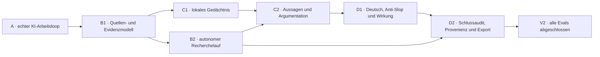
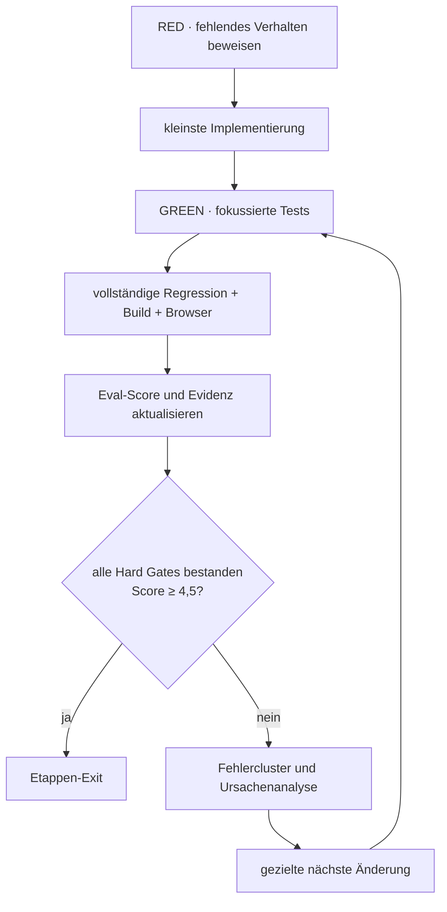

# V2 Eval-Gated Delivery Roadmap

> **For agentic workers:** REQUIRED SUB-SKILL: Use `executing-plans` for every stage, `test-driven-development` for every behavior change, `agentic-eval` for every quality loop, and `verification-before-completion` before an exit gate is claimed.

**Goal:** Den in `app/evals/v2-fertigzustand.json` beschriebenen V2-Fertigzustand in vertikalen, nutzbaren Etappen erreichen, bis alle 69 automatisierbaren Hard Gates bestanden sind und die acht externen Live Gates mit reproduzierbarer Evidenz bewertet wurden.

**Architecture:** Die bestehende Vanilla-/Tiptap-Anwendung bleibt die Produktbasis. Neue Fähigkeiten werden als kleine, testbare Domänenmodule mit klaren Adaptern ergänzt. Jede Etappe liefert einen vollständigen Nutzerfluss, erweitert das gemeinsame Evidenzmodell und schaltet nur die zugehörigen Evals von „offen“ auf „bestanden“. Promptlogik allein gilt nicht als Architektur; Invarianten, Datenmodelle und Verifikation werden im Client beziehungsweise in expliziten Services erzwungen.

**Tech Stack:** JavaScript ESM, Tiptap, Node Test Runner, esbuild, Playwright/Chromium, lokale Persistenz, bestehender LLM-Gateway, Swift-WebView-Hülle.

**Authoritative Sources:**

- `docs/superpowers/specs/2026-07-19-agentisches-schreibsystem-v2.md`
- `docs/superpowers/specs/2026-07-19-v2-arbeitsoberflaeche-design.md`
- `docs/superpowers/specs/2026-07-26-etappe-a-ki-anschluss-design.md`
- `docs/superpowers/specs/2026-07-30-v2-fertigzustand-eval-design.md`
- `app/evals/v2-fertigzustand.json`

## Unveränderliche Abnahmeregeln

1. Die 77 Eval-Definitionen bleiben während der Umsetzung stabil. Änderungen daran benötigen eine explizite Zieländerung durch den Nutzer.
2. Ein Hard Gate gilt nur mit frischem, reproduzierbarem Beleg als bestanden.
3. Produktwerte werden nie still verändert: Vorschläge, Annahmen und automatische Aktionen bleiben sichtbar, reversibel und zurechenbar.
4. Die Qualitätsschwelle je Etappe ist mindestens 4,5/5; keine Rubrikdimension darf unter 4 liegen.
5. Pro Etappe sind höchstens fünf Eval-Schleifen erlaubt. Bei zwei Schleifen ohne Verbesserung wird gestoppt und die Ursache dokumentiert.
6. Externe Live Gates werden nicht simuliert. Ohne echten Dienst oder echte Nutzerprüfung bleiben sie ausdrücklich „extern offen“.

## Liefergraph

## Etappen und Exit Gates

### Etappe A — Echter KI-Arbeitsloop

**Nutzerwert:** Projektverständnis, Hinweise und globale wie lokale Gespräche laufen über den echten Gateway; der Text bleibt bei Fehlern unangetastet.

**Primäre Evals:** `INV-01`–`INV-09`, `WORK-01`–`WORK-08`, `SYSTEM-01`, `SYSTEM-02`, `SYSTEM-04`, `SYSTEM-05`, `SYSTEM-07`, `SYSTEM-08`, `SYSTEM-09`.

**Lieferumfang:**

- echter Gateway mit Schlüssel-, Fehler-, Retry-, Streaming- und Nutzungslogik
- verifiziertes Projektverständnis und sichere Hinweisübernahme
- globaler und randkartengebundener Chat mit gemeinsamer Sperre
- sichtbarer Entscheidungsverlauf
- reproduzierbarer Browser-Smoke mit injizierbarem Transport
- aktuelle native Hülle und Startprobe

**Exit:** Der Detailplan `2026-07-30-etappe-a-abschluss-eval-plan.md` ist vollständig grün; keine Canned-Antwort bleibt; der Browser-Smoke und die native Startprobe bestehen. Echte Anbieter-Calls bleiben als externes Gate separat belegt.

### Etappe B1 — Quellen, Fundstellen und Belegbündel

**Nutzerwert:** Aussagen können auf reale Quellen, konkrete Fundstellen und belastbare Belege zurückgeführt werden.

**Primäre Evals:** `EVID-01`–`EVID-08`, dazu `INV-02`, `INV-04`, `SYSTEM-01`, `SYSTEM-03`, `SYSTEM-07`.

**Domänenmodule:**

- `source-model.mjs`: Quelle, Version, Abrufzeit, Autorität, Rückzug/Ersetzung
- `locator-model.mjs`: Seite, Abschnitt, Absatz, URL-Fragment und Zitatspanne
- `evidence-bundle.mjs`: Claim-zu-Beleg-Beziehung, Stützung, Widerspruch, Unsicherheit
- UI für Quellenliste, Beleginspektor und Konflikte

**Exit:** Jede sichtbare Tatsachenbehauptung lässt sich auf eine reale Fundstelle zurückverfolgen; nicht belegte oder zurückgezogene Quellen sind sichtbar markiert; Import, Persistenz und Wiederherstellung sind getestet.

### Etappe B2 — Autonomer Recherchelauf

**Nutzerwert:** Das System kann eine begrenzte Recherche planen, durchführen, Quellen gegeneinander prüfen und dem Nutzer ein nachvollziehbares Ergebnis vorlegen.

**Primäre Evals:** `RESEARCH-01`–`RESEARCH-07`, erneut `EVID-03`–`EVID-08`, `SYSTEM-02`, `SYSTEM-05`, `SYSTEM-08`.

**Domänenmodule:**

- Rechercheplan und Suchfragen
- Tool-/Provider-Adapter mit Provenienz
- Deduplizierung, Quellenrang und Gegenbelegsuche
- Budget-, Abbruch- und Wiederaufnahmezustände

**Exit:** Ein Recherchelauf kann geplant, pausiert, fortgesetzt und auditiert werden; jede Quelle und jede Toolaktion besitzt Provenienz; widersprüchliche Evidenz wird nicht geglättet.

### Etappe C1 — Lokales Gedächtnis

**Nutzerwert:** Das System erinnert Projektziele, Begriffe, Entscheidungen und bewusste Risiken, ohne Inhalte anderer Projekte zu vermischen.

**Primäre Evals:** `MEMORY-01`–`MEMORY-06`, dazu `INV-03`, `INV-04`, `SYSTEM-03`, `SYSTEM-06`, `SYSTEM-07`.

**Domänenmodule:**

- typisierte Gedächtniseinträge mit Ursprung, Gültigkeit und Projektgrenze
- Aufnahme-, Aktualisierungs-, Widerspruchs- und Vergessensregeln
- Retrieval mit begründeter Auswahl statt vollständigem Prompt-Dump
- UI zum Prüfen, Korrigieren und Löschen

**Exit:** Gedächtnis ist projektisoliert, nachvollziehbar und reversibel; Widersprüche werden sichtbar; exportierte und wieder importierte Projekte behalten dieselbe Bedeutung.

### Etappe C2 — Aussagen und Argumentation

**Nutzerwert:** Das System erkennt Claims, ordnet Belege zu, zeigt Lücken und bietet alternative Argumentationspfade an.

**Primäre Evals:** `ARG-01`–`ARG-07`, dazu `EVID-05`, `MEMORY-03`, `INV-05`, `INV-07`.

**Domänenmodule:**

- Claim- und Argumentgraph
- Prämissen, Schlussregeln, Einwände und Gegenpositionen
- alternative Pfade mit Trade-offs
- editornahe Ansicht ohne automatische Textänderung

**Exit:** Jeder zentrale Claim hat Status, Beleglage und Argumentbeziehung; Zirkelschlüsse, Lücken und Gegenargumente sind sichtbar; Alternativen bleiben Vorschläge.

### Etappe D1 — Deutsche Sprache, Anti-Slop und Wirkung

**Nutzerwert:** Überarbeitung verbessert Klarheit und Wirkung, ohne Stimme, Fairness oder faktische Integrität zu opfern.

**Primäre Evals:** `LANG-01`–`LANG-08`, `EFFECT-01`–`EFFECT-06`, dazu `INV-06`, `INV-08`, `INV-09`.

**Domänenmodule:**

- messbare deutsche Sprachsignale und Anti-Slop-Heuristiken
- Zielgruppen-, Zweck- und Tonprüfung
- Fairness-/Manipulationswarnungen
- Vergleichsansicht mit Begründung und Opt-in für Rechtschreibautomation

**Exit:** Qualitätsverbesserungen werden anhand einer festen Corpus-Suite und blinden Paarvergleichen belegt; die Nutzerstimme bleibt erhalten; automatische Rechtschreibänderungen erfolgen nur nach Opt-in.

### Etappe D2 — Schlussaudit, Provenienz und Export

**Nutzerwert:** Vor Veröffentlichung prüft ein Schlussaudit Text, Belege, Entscheidungen und Risiken; der Export bleibt vollständig nachvollziehbar.

**Primäre Evals:** `AUDIT-01`–`AUDIT-07`, sämtliche noch offenen `SYSTEM-01`–`SYSTEM-11`.

**Domänenmodule:**

- Audit-Orchestrator mit harten und weichen Befunden
- Provenienzgraph über Quellen, Claims, Vorschläge und Entscheidungen
- Exportpaket mit Text, Quellen, Auditbericht und maschinenlesbarer Historie
- Barrierefreiheits-, Leistungs-, Datenschutz- und Recovery-Abschluss

**Exit:** Vollständiger Export lässt sich neu laden und bis zur Quelle zurückverfolgen; alle automatisierbaren Hard Gates bestehen; externe Live Gates besitzen echte Evidenz oder sind als einzig verbleibende externe Abnahme klar ausgewiesen.

## Eval- und Verbesserungsloop je Etappe

Jede Schleife speichert:

- Git-Stand und Zeitstempel
- ausgeführte Eval-IDs
- Erwartung, Ergebnis und Belegpfad
- Fehlercluster und Ursache
- Rubrikscore je Dimension
- Entscheidung: weiter, Exit oder externer Blocker

## Reihenfolge der Detailpläne

Vor Beginn jeder Etappe wird aus dieser Roadmap ein ausführbarer TDD-Plan abgeleitet. Etappe A besitzt ihn bereits. Die Pläne B1, B2, C1, C2, D1 und D2 werden erst erstellt, wenn die vorherigen Abhängigkeiten grün sind; damit bleiben Dateinamen, Schnittstellen und Tests an der tatsächlich gewachsenen Architektur ausgerichtet.

