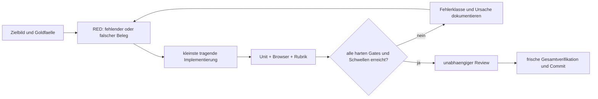

# Plan: Den vollstaendigen Onda-Zielzustand schliessen

**Erstellt am 05.08.2026. Status: abgeschlossen und frisch verifiziert.**

## Ziel und unverrueckbare Abnahme

Dieser Plan ersetzt den 77-Eval-Zwischenstand als Arbeitsgrundlage. Ausgangspunkt ist
der Katalog `app/evals/v2-fertigzustand.json` in Fassung `2026-08-05.2` mit 130 Evals
und der darueberliegende Arbeitsstand. Fertig bedeutet nicht, dass jede Zeile gruen
eingefaerbt wurde, sondern:

1. Jeder programmatisch pruefbare Anspruch des Produktzielbilds besitzt ein beobachtbares
   Eval und einen frisch ausgefuehrten Beleg aus dem lebenden Code.
2. Alle anwendbaren harten Gates bestehen. Ein nicht gebundenes oder nur durch Textsuche
   belegtes Verhalten gilt nicht als bestanden, wenn ein Funktions- oder Browsertest
   moeglich ist.
3. Bewertete Gates erhalten eine begruendete 1-bis-5-Bewertung aus festen Gold- und
   Kontrastfaellen. Der Gesamtwert liegt bei mindestens 4,5; jede Rubrikdimension bei
   mindestens 4,0. Testabdeckung darf nicht als Qualitaetsurteil ausgegeben werden.
4. Ausschliesslich echte Anbieter-, Keychain-, Langzeit- oder Nutzerstudien-Gates duerfen
   `external-open` bleiben. Ihr fehlender Nachweis, die genaue Durchfuehrung und das
   erwartete Belegartefakt sind dokumentiert.
5. Die Anwendung baut reproduzierbar, besteht Unit-, Integrations-, Browser-, Sicherheits-,
   Barrierefreiheits- und native Paketpruefungen und hinterlaesst weder tote Module noch
   unerklaerte generierte Dateien.
6. Alle in diesem Auftrag liegenden Aenderungen und Belege sind in einem sauberen Commit
   enthalten; keine relevante Arbeit bleibt nur lokal oder in einem unerfassten Scratchpad.

## Akzeptanzkriterien

| ID | Gegeben / Wenn / Dann | Frischer Beleg |
|---|---|---|
| AC-01 | Gegeben Zielbild und Soll/Ist-Audit; wenn der Katalog validiert wird; dann ist jeder programmatisch schliessbare Anspruch genau einem Eval oder einer bewusst geteilten Evalgruppe zugeordnet. | Katalogtest plus Anspruch-Eval-Matrix |
| AC-02 | Gegeben alle Wissensquellen eines Projekts; wenn Hinweis, Erweiterung, Chat oder Verstaendnisdialog startet; dann erhaelt jeder Kanal einen kompakten, herkunftssicheren Kontext ohne Doppelung, fremde Projekte oder Cache-Verschmutzung. | Unit- und Kanal-Integrationsfixtures |
| AC-03 | Gegeben Essay, Wissenschaft, Journalismus, Rede, Copy, Web/UX, Prosa und Lyrik; wenn Onda prueft oder erweitert; dann unterscheiden sich Fokus, Handwerksfragen, Risiken und erlaubte Mittel nachvollziehbar nach Textart. | vollstaendige Textarttabelle und Kontrastfixtures |
| AC-04 | Gegeben angenommene Muster ueber mehrere Texte; wenn der Personenspeicher angezeigt oder abgefragt wird; dann sind Prinzipien nach stabilen Dimensionen strukturiert, belegt, ruecknehmbar und nicht als Projektfreigabe fehlbeschriftet. | Speicher-, Dossier- und Migrationsfixtures |
| AC-05 | Gegeben mehrere benannte Schreibstile; wenn ein Stil gewaehlt, veraendert oder fuer eine Passage genutzt wird; dann bleiben Regeln, Zweck, Verlauf und aktive Auswahl konsistent, ruecknehmbar und projektbegrenzt. | Profil-, UI- und Promptfixtures |
| AC-06 | Gegeben ein rhetorisches Mittel; wenn Onda es empfiehlt; dann nennt es Funktion, erwarteten Gewinn, moegliche Fehlvorstellung und eine direkte Alternative und bevorzugt notfalls die direkte Fassung. | Stilmittel-Gold- und Kontrastfixtures |
| AC-07 | Gegeben Ideen aus anderen Texten; wenn Onda eine Verbindung vorschlaegt; dann sind beide Anker wortgetreu pruefbar. Projektuebergreifend gelangen nur ausdruecklich freigegebene, abstrahierte Eintraege hinein. | Anker-, Transfer- und Isolationsfixtures |
| AC-08 | Gegeben angenommene, verworfene und unbeachtete Rueckmeldung; wenn die Rueckkopplung genug Daten hat; dann veraendert sie hoechstens Darreichung oder Prioritaet, nie Wahrheits-, Integritaets- oder Datenschutzregeln, und macht Grund, Datenbasis, Wirkung sowie Ruecknahme sichtbar. | Schwellen-, Fail-closed- und UI-Fixtures |
| AC-09 | Gegeben Ankerdrift, schmale Viewports, reduzierte Bewegung und globale Dialoge; wenn die reale Oberflaeche bedient wird; dann bleiben Herkunft, Sprungziel, Fokus, Ueberlappung und Ruhe beobachtbar korrekt. | dedizierte Playwright-Pruefung bei mehreren Breiten |
| AC-10 | Gegeben Gold- und Kontrastfaelle fuer Abstention, Quellenqualitaet, Gegenbelege, Gegenargumente, Alternativwege und Wirkung; wenn der Qualitaetslauf bewertet; dann entstehen deterministische Einzelwerte mit Begruendung und Beleg statt einer Abdeckungszahl. | versioniertes Qualitaetsurteil und Runner-Schema |
| AC-11 | Gegeben ein echter externer Nachweis fehlt; wenn der Gesamtstatus erzeugt wird; dann bleibt das Gate offen und kann weder durch einen lokalen Teiltest noch durch eine alte Ergebnisdatei bestanden werden. | Runner-Regressionstest |
| AC-12 | Gegeben der fertige Stand; wenn Volltest, Build, Eval-Lauf und Mac-Paketbau frisch laufen; dann bestehen alle automatisierbaren Gates, das Diff ist sauber und der Commit enthaelt genau die freigegebene Arbeit. | Abschlussprotokoll, Graph, Git-Commit |

## Umsetzungsfolge

### Aufgabe 1: Arbeitsstand sichern und Widersprueche entfernen

**Dateien:** bestehende Aenderungen unter `app/src`, `app/test`, `app/evals`, `docs`,
`mac`; neue Tests bei den jeweils betroffenen Modulen.

1. Die drei unabhaengigen Audits fuer Eval-Luecken, Soll/Ist-Luecken und Dirty-Code
   zusammenfuehren; jeden Befund am Code selbst bestaetigen.
2. Fuer jeden bestaetigten Defekt zuerst einen fokussierten, fehlschlagenden Test
   schreiben und den roten Lauf protokollieren.
3. Kontext-Doppelung, Stilprofil-Migration, Nachbartext-Anker, Rueckkopplung und die
   Entfernung von `panels.js`/`structure.js` minimal reparieren.
4. `npm run test:unit`, `npm run build` und die betroffenen Einzeltests ausfuehren.

### Aufgabe 2: Vollstaendigen, sparsamen Onda-Kontext bauen

**Dateien:** `app/src/onda-kontext.mjs`, neue reine Kontextprojektionen neben den
jeweiligen Domaenenmodulen, `app/test/onda-kontext.test.mjs`.

1. Rote Fixtures fuer Quellen/Belege, Argumentgraph, Wirkungsanalyse und Sprachbefunde
   anlegen: relevante aktive Daten kommen hinein; geloeschte, ueberholte, fremde oder
   leere Daten nicht; jeder Block besitzt eine harte Grenze und Herkunft.
2. Kleine Projektionen implementieren, die keine UI- oder Speichermodelle duplizieren.
3. Die Bloecke in `baueOndaBloecke` genau einmal und im volatilen Teil aller vier Kanaele
   einhaengen.
4. Kanal- und Cache-Regressionen laufen lassen.

### Aufgabe 3: Textart-Handwerk und Stilentwicklung vervollstaendigen

**Dateien:** `app/src/textart-regeln.mjs`, `app/src/stilmittel.mjs`,
`app/src/language-profile.mjs`, `app/src/language-ui.mjs`, `app/src/agent-prompts.mjs`
und zugehoerige Tests.

1. Aus den vorhandenen Forschungsdestillaten eine vollstaendige, kompakte und
   exhaustive Textarttabelle als einzige Quelle der Wahrheit testen.
2. Pro Textart Handwerksfokus, typische Fehlleistung, passende Mittel und Vorsicht
   implementieren; unbekannte Arten fallen sicher auf die allgemeine Pruefung zurueck.
3. Mehrere benannte Stile mit stabiler Kennung, Zweck, Regeln und Ereignisverlauf
   migrierbar machen; Auswahl und Bearbeitung in der realen UI pruefen.
4. Stilmittel nur als begruendete Option ausgeben; direkte Fassung und Risiko bleiben
   sichtbar. Promptgroesse und Schema geschlossen halten.

### Aufgabe 4: Persoenlichen Horizont und sichere Kreuzbestaeubung strukturieren

**Dateien:** `app/src/erkanntes-model.mjs`, `app/src/memory-retrieval.mjs`,
`app/src/memory-ui.mjs`, `app/src/erweiterungslauf-model.mjs` und Tests.

1. Rote Fixtures fuer Themen-/Faehigkeitsdimension, Staerke/Entwicklungsfeld,
   Herkunft, Wiederholung, Ruecknahme und Migration alter flacher Eintraege schreiben.
2. Die flachen Ereignisse unveraendert als Quelle behalten und daraus ein
   deterministisches, korrigierbares Personendossier projizieren.
3. Projektuebergreifende Verbindung nur aus bereits explizit transferiertem oder
   bewusst persoenlichem, abstrahiertem Wissen erzeugen; nie aus fremdem Rohtext.
4. UI und Prompts zeigen die Herkunft und erlauben Ruecknahme, ohne eine Rangliste ueber
   die Person zu behaupten.

### Aufgabe 5: Rueckkopplung ohne Goodhart-Effekt fertigstellen

**Dateien:** `app/src/rueckkopplung-model.mjs`, `app/src/hinweislauf-model.mjs`,
`app/src/hinweis-kontext.mjs`, `app/src/workspace.js`, `app/src/style.css` und Tests.

1. Rote Fixtures fuer kleine Stichprobe, verzerrte Annahmequote, Integritaetsarten,
   Ruecknahme und fehlende Daten anlegen.
2. Nur die Darreichung konservativ anpassen: keine Kategorie abschalten, keinen
   Wahrheitsschwellenwert senken, keine automatische Textaenderung.
3. In der Oberflaeche Datenbasis, aktive Anpassung und Zuruecksetzen ruhig sichtbar
   machen; keinerlei neuer Zaehler im Schreibfluss.
4. Verhalten mit Browserfixture auf Fokus und Nicht-Stoerung pruefen.

### Aufgabe 6: Alle ungebundenen und bewerteten Gates ehrlich schliessen

**Dateien:** `app/evals/bindungen.json`, `app/evals/run-fertigzustand.mjs`, neue
Pruefungen unter `app/evals/pruefungen`, Katalog- und Runner-Tests.

1. `INV-08`, `WORK-05`, `WORK-07`, `EVID-02`, `SYSTEM-05`, `SYSTEM-06` und
   `ERWEITERUNG-04` mit lebenden Funktions-/Browsertests binden.
2. Fuer die sieben lokal bewertbaren Gates feste Gold- und Kontrastfaelle samt
   dimensionsspezifischer 1-bis-5-Rubrik erzeugen. Eine Bewertung muss Begruendung und
   konkrete Fixture-Belege tragen.
3. Den Runner so aendern, dass er Einzelurteile einliest, Rubrikdimensionen gewichtet,
   harte Gates separat prueft und bei fehlendem Urteil fehlschlaegt.
4. `SYSTEM-03` darf der lokale Canary-Test nur teilweise belegen; der Keychain-Live-Anteil
   bleibt `external-open`. Dasselbe gilt fuer alle anderen echten Live-Gates.

### Aufgabe 7: Katalog um die jetzt gebauten Zielbild-Gates erweitern

**Dateien:** `app/evals/v2-fertigzustand.json`, `app/test/eval-catalog.test.mjs`,
`docs/VISION-GEGEN-GEBAUTES.md`, neue Anspruch-Eval-Matrix.

1. Fuer Kontextvollstaendigkeit, Textart-Handwerk, strukturiertes Personenwissen,
   Stilentwicklung, sichere Kreuzbestaeubung und Rueckkopplung Given/When/Then-Evals
   ergaenzen.
2. Menschlich zu pruefende Nicht-Naheliegigkeit, erlebte Muehelosigkeit und reale
   Langzeitwirkung als externe User-Study-Gates mit Protokoll definieren.
3. Katalogvalidierung und Vollstaendigkeitspruefung rot-gruen durchlaufen lassen.

### Aufgabe 8: Eval-Schleife und Abschluss

**Dateien:** `app/evals/results/fertigzustand-latest.json`, Graph-Artefakte unter
`docs/evals`, Abschlussdokumentation.

1. Iteration 1 als ehrliche Basis messen; Fehler nach Auswirkung und Abhaengigkeit
   gruppieren.
2. Hoechstens vier Reparaturrunden laufen: nach jeder Runde Volltest, Eval-Lauf,
   Rubrikurteil und Suite-Graph aktualisieren. Nach zwei Runden ohne Verbesserung
   Ursache neu diagnostizieren statt Grenzwerte zu lockern.
3. Frisch ausfuehren: `npm test`, `npm run build`, Fertigzustandsrunner,
   `git diff --check`, Sicherheits-/Exportpruefung, Browsermatrix und `mac/build.sh`.
4. Unabhaengigen Abschlussreview einholen, bestaetigte Befunde beheben und die
   komplette Pruefung erneut ausfuehren.
5. Generierte App-Pakete und Scratch-Artefakte entweder bewusst ignorieren oder als
   nachvollziehbare Quellen einordnen; keine Build-Ausgabe versehentlich versionieren.
6. Alle in-scope Dateien committen und den finalen Commit samt verbleibender externer
   Gates berichten.

## Eval-Schleife

Die Erfolgskriterien bleiben waehrend der Schleifen stabil. Neue Evals duerfen
Luecken sichtbar machen, aber ein rotes Gate wird nicht durch Umbenennen, Entfernen
oder Lockern geschlossen.
