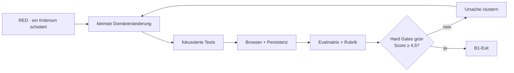

# Etappe B1 — Quellen, Fundstellen und Belegbündel

> **Status:** Aus dem freigegebenen V2-Fertigzustand und dem nachgewiesenen Etappe-A-Stand abgeleitet.
> **Autoritative Grundlagen:** V2 §8–9, Onda §8, Transfer §5, `app/evals/v2-fertigzustand.json`.
> **Zweck:** Jede überprüfbare Aussage kann auf ein reales Original, eine exakte Fundstelle und eine ehrliche, claim-spezifische Beleglage zurückgeführt werden.

## 1. Zielbild

Die Anwendung trennt drei Ebenen strikt:

1. **Quelle:** das importierte Original oder ein unveränderlicher Verweis darauf, samt Typ, Herkunft, Metadaten, Importzeit und Prüfsumme;
2. **Fundstelle:** eine konkrete, überprüfbare Stelle innerhalb genau einer Quelle;
3. **Belegbündel:** die Beziehung zwischen genau einer Aussage und ihren stützenden, widersprechenden oder begrenzenden Fundstellen.

Abgeleitete Zusammenfassungen, Einordnungen und Qualitätsurteile werden nie als Original gespeichert. Ein globaler „Wahrheitsscore“ ist unzulässig. Qualität wird nur im Hinblick auf eine konkrete Aussage begründet.

## 2. Nutzerfluss

### 2.1 Quelle aufnehmen

Im bestehenden Dialog „Quellen im Projekt“ kann der Nutzer eine Quelle als PDF, Web/URL, DOI, freien Text, Audio oder Video aufnehmen. Die UI verlangt nur die für den Typ nötige Herkunft:

- Datei: Dateiname, Größe und unveränderlicher Speicherverweis;
- Web/DOI: sichere Original-URL beziehungsweise DOI;
- Text: der eingefügte Originaltext;
- Audio/Video: unveränderlicher Medienverweis und optionales Transkript.

Beim Import entstehen Typ, Importzeit, Originalreferenz, Prüfsumme und Herkunft `user`. Metadatenfelder tragen einzeln einen Status: `bestätigt`, `angegeben`, `widersprüchlich` oder `unbekannt`.

### 2.2 Fundstelle öffnen

Eine Fundstelle ist typisiert:

- Seite mit optionaler Zitatspanne,
- Abschnitt/Absatz oder URL-Fragment,
- Textspanne,
- Zeitcode mit Start und Ende.

Beim Öffnen bleibt die zu belegende Aussage sichtbar. Der Reader zeigt den exakten gespeicherten Originalausschnitt, Locator, Quellenidentität und Verifikationsstatus. Ein Locator gilt nur als `verifiziert`, wenn der Ausschnitt im gespeicherten Original oder Transkript nachweisbar ist. Reine Metadaten oder ein Abstract dürfen nie als Volltextbeleg erscheinen.

### 2.3 Beleglage prüfen

Das Belegfenster zeigt für eine konkrete Aussage:

- exakten Wortlaut;
- stützende Fundstellen;
- Gegenbelege;
- Grenzen und methodische Unterschiede;
- Reichweite und verbleibende Unsicherheit;
- erlaubte Formulierungsstärke;
- ausdrücklich nicht Belegtes.

Ein unvollständiges Bündel bleibt sichtbar unvollständig und wird nicht zu „belegt“ hochgestuft.

### 2.4 Änderungen an Quellen

Korrektur, Rücknahme, neue Version oder abweichende Primärquelle erzeugen ein Ereignis in der Quellenhistorie. Betroffene Belegbündel werden auf `neu-prüfen` gesetzt. Frühere Fundstellen bleiben historisch sichtbar, gelten aber nicht still weiter als belastbar.

## 3. Domänenmodell

### 3.1 Quelle

```text
Source
├── id, projectId, type
├── origin
│   ├── kind
│   ├── immutableRef
│   └── originalUrl?
├── original
│   ├── text? / transcript?
│   └── mediaType?
├── checksumSha256, importedAt, provenance
├── metadata[field] = { value, status, evidence? }
├── derived = { ... }             # strikt getrennt
├── status = active|corrected|retracted|superseded
├── locators[]
└── history[]
```

Unveränderliche Kernfelder werden nach dem Import nicht überschrieben. Änderungen erzeugen eine neue Quellenversion oder ein Historienereignis.

### 3.2 Fundstelle

```text
Locator
├── id, sourceId
├── kind = page|section|text|time
├── address = typabhängige Koordinaten
├── excerpt
├── excerptChecksum
└── verification = verified|unverified|stale
```

Jede Fundstelle gehört genau zu einer Quelle. Der Resolver gibt nur bei gültiger Quelle, gültiger Adresse und passendem Originalausschnitt einen überprüfbaren Treffer zurück.

### 3.3 Belegbündel

```text
EvidenceBundle
├── id, claimId, claimText
├── support[] / counterEvidence[]
├── limitations[]
├── methodologicalDifferences[]
├── scope
├── uncertainty
├── allowedStrength
├── notSupported[]
├── qualityAssessments[]
├── status = supported|mixed|insufficient|review-required
└── history[]
```

Nur verifizierte, aktive Fundstellen können ein Bündel stützen. Rückgezogene oder veraltete Fundstellen dürfen historisch referenziert werden, zählen aber nicht als aktuelle Stützung.

## 4. Prüfdienste

- **Zitat-/Paraphrase-Prüfung:** Direkte Zitate müssen nach Normalisierung exakt passen. Paraphrasen werden gegen explizit hinterlegte abgedeckte Aussagen geprüft; stärkere oder breitere Aussagen werden fundstellengenau markiert. Direkte Zitate aus paginierten Quellen benötigen eine Seitenfundstelle.
- **Bibliografische Identität:** Jedes Feld wird unabhängig bestätigt. Abweichende DOI-, Jahres-, Autoren- oder Versionsangaben bleiben als Konflikt erhalten.
- **Text-/Literaturverzeichnis-Prüfung:** Fehlende, verwaiste, doppelte und stilabweichende Einträge erhalten konkrete Text- oder Verzeichnis-Locators.
- **Claim-spezifische Quellenqualität:** Relevanz, Methode, Aktualität, Unabhängigkeit, Transparenz, Stichprobe, Interessenkonflikte und Konvergenz werden nur genannt, wenn sie für den Claim relevant sind. Es entsteht kein numerischer oder globaler Wahrheitsscore.

## 5. Persistenz und Migration

`project.sources` und `project.evidenceBundles` werden additiv ergänzt. Alte Projekte erhalten leere Listen. Bestehendes `project.material` bleibt kompatibel und wird nicht still umgedeutet. Das Beispielprojekt erhält echte, aber klar als Demo markierte Quellenobjekte; seine Aussagen gelten weiterhin nicht als live verifiziert.

Alle Datensätze tragen `projectId`. Resolver und Mutationen prüfen diese Grenze. Beim Reload bleiben Originalreferenz, Hash, Metadatenstatus, Locator-Verifikation, Historie und Belegstatus identisch.

## 6. Sicherheit und Fehlerverhalten

- Nur `https:`-Originale werden extern geöffnet.
- Eine fehlende Prüfsumme, Quelle oder Fundstelle führt zu `unvollständig`, nie zu einem erfundenen Ersatz.
- Metadatenbestätigung beweist weder Volltextzugriff noch Claim-Unterstützung.
- Rücknahme und Korrektur werden fail-closed propagiert.
- Quellen anderer Projekte sind weder über Resolver noch Belegbündel erreichbar.
- Fehler beim Import verändern bestehende Quellen nicht.

## 7. Beobachtbare Abnahmekriterien

### AC-B1-1 — Originaltreue

**Given** jeder unterstützte Quellentyp, **when** der Import gelingt, **then** sind Original oder unveränderlicher Verweis, Typ, Metadaten, Importzeit, SHA-256 und Herkunft vorhanden; abgeleitete Inhalte sind getrennt.

**Beweis:** Fixture-Import für PDF, Web, DOI, Text, Audio und Video; Store-Roundtrip.

### AC-B1-2 — Exakte Fundstelle

**Given** Seiten-, Abschnitts-, Text- und Zeitfundstellen, **when** sie geöffnet werden, **then** bleiben Aussage, Originalausschnitt und Locator gemeinsam sichtbar; falsche Ausschnitte werden nicht als verifiziert angezeigt.

**Beweis:** Unit-Resolver plus Browserfluss über alle Locator-Arten.

### AC-B1-3 — Vollständiges, fail-closed Belegbündel

**Given** vollständige und unvollständige Claim-Fixtures, **when** Bündel gebaut werden, **then** sind alle V2-Felder vorhanden und nur das vollständige aktive Bündel kann `supported` werden.

**Beweis:** Integrationsfixture mit Stützung, Gegenbeleg, Grenzen, Unsicherheit und Nicht-Belegtem.

### AC-B1-4 — Begründete Quellenqualität

**Given** kontrastive Quellen, **when** ihre Eignung für einen Claim bewertet wird, **then** nennt die Einordnung die relevanten Stärken und Grenzen, enthält aber keinen globalen Wahrheitswert.

**Beweis:** Gold-Fixtures; Rubrikscore mindestens 4,5/5, keine Dimension unter 4.

### AC-B1-5 — Zitat- und Paraphrasentreue

**Given** korrekte und manipulierte Bezüge, **when** die Prüfung läuft, **then** werden abweichendes Zitat, Überdehnung und fehlende Seite konkret markiert; gültige Bezüge bleiben ohne Befund.

**Beweis:** positive und negative Integrationsfixtures.

### AC-B1-6 — Bibliografische Ehrlichkeit

**Given** bestätigte, unbekannte und widersprüchliche Metadaten, **when** die Identität geprüft wird, **then** wird jedes Feld einzeln eingestuft; Konflikte und Versionen bleiben sichtbar.

**Beweis:** DOI-/Versionsfixtures.

### AC-B1-7 — Zitierkonsistenz

**Given** Textzitate und Literaturverzeichnis, **when** die Prüfung läuft, **then** werden fehlende, verwaiste, doppelte und stilabweichende Einträge mit Locator gemeldet.

**Beweis:** vier kontrastive Fixtures plus gültiger Kontrollfall.

### AC-B1-8 — Statuspropagation und Recovery

**Given** Erratum, Rücknahme oder Versionswechsel, **when** das Ereignis registriert wird, **then** wechseln alle betroffenen Claims auf `neu-prüfen`, die Historie bleibt erhalten und der Zustand überlebt Reload.

**Beweis:** Propagations- und Persistenztests.

### AC-B1-9 — Projektgrenze und Bedienqualität

**Given** zwei Projekte mit Canary-Quellen, **when** Quelle, Fundstelle oder Bündel aufgelöst wird, **then** ist kein projektfremder Inhalt erreichbar. Dialog, Reader und Belegfenster sind per Tastatur bedienbar; Eingaben bleiben responsiv.

**Beweis:** Negativtests, Browser-Tastaturfluss und Performance-Smoke.

## 8. Eval-Zuordnung und harte Gates

| Kriterium | Eval |
|---|---|
| AC-B1-1 | EVID-01, INV-02, SYSTEM-01 |
| AC-B1-2 | EVID-02 |
| AC-B1-3 | EVID-03 |
| AC-B1-4 | EVID-04 |
| AC-B1-5 | EVID-05 |
| AC-B1-6 | EVID-06 |
| AC-B1-7 | EVID-07 |
| AC-B1-8 | EVID-08 |
| AC-B1-9 | INV-04, SYSTEM-03, SYSTEM-07 |

`SYSTEM-03` bleibt ein externes Keychain-/Artefakt-Gate, soweit es nicht durch lokale Canary-Suchen bewiesen werden kann. Es wird nicht simuliert.

## 9. Qualitätsloop

Maximal fünf Schleifen:



Die Kriterien bleiben während der Etappe stabil. Jede Schleife dokumentiert Git-Stand, Eval-IDs, Belegpfade, Fehlerursache, Score und nächste Änderung.
