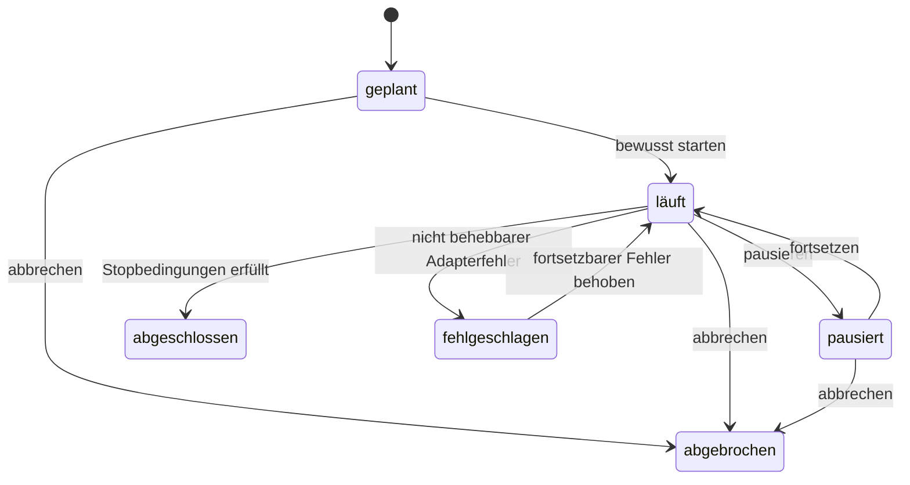

# Etappe B2 — Recherche, Exzerpte und Wissensverdichtung

> **Status:** Aus dem freigegebenen V2-Eval-Katalog abgeleitet.
> **Geltung:** Ergänzt die V2-Produktspezifikation und das B1-Quellenmodell, ohne deren Wahrheits-, Autorschafts- oder Provenienzregeln zu verändern.

## Ziel

Ein begrenzter Recherchelauf beginnt mit einer sichtbaren Frage und einem prüfbaren Plan, nutzt nur ausdrücklich erlaubte Werkzeuge, protokolliert jeden Weg, sucht aktiv nach Gegenbelegen und Grenzen und übernimmt ausschließlich am Original verifizierte Fundstellen in das belegte Projektwissen.

Die Oberfläche zeigt keine rohe Werkzeugkette und keinen globalen Recherche-Score. Sie verdichtet den Lauf zu Frage, Arbeitsstand, geprüften Ergebnissen, Widersprüchen, Grenzen und verbleibenden Lücken. Das vollständige Werkzeugprotokoll bleibt bei Bedarf erreichbar.

## Unveränderliche Abnahmekriterien

### AC-B2-1 — Plan vor Werkzeug

**Gegeben** ist eine Wissenslücke oder ein Belegbedarf.
**Wenn** ein Recherchelauf angelegt wird.
**Dann** speichert er vor dem ersten externen Aufruf die genaue Frage, den Claim-Bezug, erlaubte Werkzeuge, Suchwege, Gegenbelegsuche, Budget und Stopbedingungen.

**Beweis:** Unit-Test und Ereignisreihenfolge für `RESEARCH-01`.

### AC-B2-2 — Originalsichtbarkeit begrenzt die Aussage

**Gegeben** sind Metadaten, Abstracts und sichtbare Originalausschnitte.
**Wenn** Ergebnisse geprüft werden.
**Dann** stützen Metadaten nur Identitätsaussagen, Abstracts nur ihren sichtbaren Inhalt und allein ein am gespeicherten Original bestätigter Ausschnitt darf belegtes Wissen erzeugen.

**Beweis:** kontrastive Adapter- und Commit-Fixture; externer Realquellenweg bleibt `RESEARCH-02` zufolge live offen.

### AC-B2-3 — Legale Alternativen statt Zugriffsumgehung

**Gegeben** ist eine nicht zugängliche Quelle.
**Wenn** der Lauf neu plant.
**Dann** versucht er deduplizierte DOI-, Titel-, Preprint-, Repositoriums-, Katalog-, Autorenmanuskript-, Supplement-, Versions- oder alternative Primärquellenwege, fordert kein Passwort an und umgeht keine Zugriffskontrolle.

**Beweis:** Paywall-/Repository-Adapter-Fixture; echte Rechtmäßigkeit und Erreichbarkeit bleiben für `RESEARCH-03` live offen.

### AC-B2-4 — Fehlwege werden nicht wiederholt

**Gegeben** ist ein fehlgeschlagener Weg mit gleicher normalisierter Eingabe und gleichem Quellenzustand.
**Wenn** der Lauf fortgesetzt oder neu geplant wird.
**Dann** wird dieser Weg übersprungen, bis eine Zustandsänderung oder neue Evidenz vorliegt.

**Beweis:** kontrastiver Deduplizierungs-Test für `RESEARCH-04`.

### AC-B2-5 — Gegenbelege und Grenzen sind Pflichtpfade

**Gegeben** ist mindestens eine stützende Quelle.
**Wenn** die Evidenzlage verdichtet wird.
**Dann** enthält der Plan aktive Suchwege für Widerspruch und methodische Grenzen; Erfolg oder erfolgloses Suchen bleiben sichtbar und Widersprüche werden nicht geglättet.

**Beweis:** Gold-Fixture und feste Rubrik für `RESEARCH-05`, mindestens 4,5/5.

### AC-B2-6 — Pause, Abbruch und Fehler sind atomar

**Gegeben** ist ein laufender oder fehlgeschlagener Werkzeugweg.
**Wenn** pausiert, abgebrochen oder später fortgesetzt wird.
**Dann** bleibt der letzte gültige Zustand erhalten, kein Kandidat wird still verifiziert, bereits geprüfte Zwischenergebnisse bleiben als solche sichtbar und Fortsetzung erzeugt keine Duplikate.

**Beweis:** Abbruch-/Fehler-Injection, Persistenzroundtrip und Browserfluss für `RESEARCH-06`.

### AC-B2-7 — Werkzeugprotokoll ist reproduzierbar und geheimnisfrei

**Gegeben** sind Suche, Metadaten-, Reader- und Importaufrufe.
**Wenn** ein Aufruf startet, endet, scheitert oder abgebrochen wird.
**Dann** speichert das Protokoll Werkzeug, normalisierte und bereinigte Eingabe, Ergebnisreferenz, Status, Zeit, Adapterversion und Claim-Bezug, aber weder Schlüssel noch Passwörter, Cookies oder Autorisierungsheader.

**Beweis:** Contract-Test über alle Adapterereignisse und rekursiver Secret-Canary für `RESEARCH-07`.

### AC-B2-8 — Ruhige, kontrollierbare Oberfläche

**Gegeben** ist die Projektquellenbibliothek.
**Wenn** der Nutzer eine Recherche plant, startet, pausiert, fortsetzt oder prüft.
**Dann** bleiben Frage, Status, Budget, geprüfte Ergebnisse, Gegenbelege, Grenzen und offene Lücken verständlich; ein nicht verbundener Live-Adapter wird ehrlich benannt; Escape und Fokus funktionieren.

**Beweis:** Browser-Smoke auf Desktop und 390 Pixel.

### AC-B2-9 — Projektisolation und Recovery

**Gegeben** sind mehrere Projekte, ältere Daten oder beschädigte neue Listen.
**Wenn** Rechercheläufe geladen und fortgesetzt werden.
**Dann** bleiben sie beim Ursprungsprojekt, ältere Projekte migrieren additiv und beschädigte Listen werden fail-safe geleert, ohne Quellen oder Nutzertext zu verändern.

**Beweis:** Unit-, Reload- und Zwei-Projekt-Canary.

## Daten- und Zustandsmodell

Ein Lauf besitzt:

- stabile ID und Projektgrenze;
- Frage, Claim-ID und optionalen Textanker;
- erlaubte Werkzeuge und adapterunabhängige Suchwege;
- Budget und Stopbedingungen;
- unveränderliche Werkzeugereignisse;
- Kandidaten mit Zugangsebene, Originalreferenz, Prüfergebnis und Provenienz;
- getrennte stützende, widersprechende und begrenzende Befunde;
- sichtbare Lücken;
- Zustands- und Versionshistorie.

Kandidaten bleiben Recherchematerial. Erst der bestehende B1-Weg aus typisierter Quelle, verifizierter Fundstelle und vollständigem Belegbündel erzeugt `verified-knowledge`.

## Bedienfluss

1. In den Projektquellen öffnet `Recherche planen` eine kompakte Planansicht.
2. Der Nutzer benennt Frage und zu prüfende Aussage; Budget und Gegenbelegsuche sind sichtbar voreingestellt.
3. `Plan speichern` erzeugt ausschließlich den Zustand `geplant`.
4. `Recherche starten` ist nur bei verbundenem Adapter aktiv. Ohne Adapter bleibt der Plan nutzbar und der fehlende Live-Zugang ehrlich sichtbar.
5. Während des Laufs sind Pause und Abbruch möglich. Geprüfte Kandidaten erscheinen getrennt von Metadaten-only und unzugänglichen Treffern.
6. Die Ergebnisansicht zeigt zuerst Widersprüche, Grenzen und Lücken, danach stützende Funde. Das Werkzeugprotokoll liegt in einem eingeklappten Detail.

## Nicht Teil von B2

- Umgehung von Paywalls oder Zugriffskontrollen;
- Speicherung von Bibliothekspasswörtern oder Sitzungscookies;
- eine Behauptung, dass lokale Fixtures echte Anbieter- oder Realquellenqualität beweisen;
- ein globaler Quellen-, Wahrheits- oder Recherchescore;
- automatisch erzeugte Volltexte oder synthetische Primärquellen;
- projektübergreifendes Gedächtnis, Argumentgraph und Schlussaudit.

## Qualitäts- und Stopregel

Maximal fünf Schleifen. Exit nur bei allen lokal automatisierbaren B2-Hard-Gates, `RESEARCH-05 ≥ 4,5/5`, keiner Rubrikdimension unter 4, vollständiger Regression und ausdrücklich offenen Realquellen-Live-Gates.
