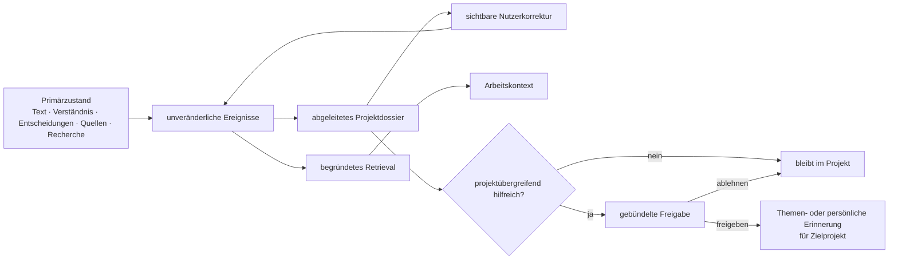

# Etappe C1 — Lokales Gedächtnis und kontrollierte Erinnerung

> **Status:** Aus dem freigegebenen V2-Eval-Katalog abgeleitet.
> **Geltung:** Ergänzt Projektverständnis, Entscheidungen, B1-Evidenz und B2-Recherche. Dossiers dürfen diese Primärzustände verdichten, aber niemals ersetzen.

## Ziel

Das System bildet aus bestätigten Projektzielen, Begriffen, Quellen, Entscheidungen, Risiken und Rechercheläufen ein kleines lesbares Dossier. Die Originalereignisse und Belege bleiben unverändert. Der Nutzer kann abgeleitete Einträge korrigieren, projektübergreifende Übernahme ausdrücklich freigeben oder ablehnen und Gedächtnis vollständig exportieren oder gezielt löschen.

## Unveränderliche Abnahmekriterien

### AC-C1-1 — Ereigniswahrheit vor Dossier

**Gegeben** sind Texte, Verständnis, Entscheidungen, Quellen und Rechercheläufe.
**Wenn** das Projektdossier neu aufgebaut wird.
**Dann** bleiben Originalobjekte bytegleich; jedes abgeleitete Dossierelement verweist auf mindestens ein unveränderliches Ursprungsereignis.

**Beweis:** Roundtrip- und Rebuild-Fixture für `MEMORY-01`.

### AC-C1-2 — Genau vier klar begrenzte Ebenen

**Gegeben** ist ein Gedächtniseintrag.
**Wenn** er normalisiert oder gespeichert wird.
**Dann** besitzt er genau eine Ebene `text`, `project`, `topic` oder `personal`, einen passenden Geltungsbereich, Provenienz, Sensitivität und Löschregel.

**Beweis:** Schema- und Negativtests für `MEMORY-02`.

### AC-C1-3 — Projektgedächtnis entsteht automatisch

**Gegeben** sind bestätigte Ziele, Begriffe, Quellen und Entscheidungen.
**Wenn** der Projektzustand gespeichert oder die Gedächtnisansicht geöffnet wird.
**Dann** erscheinen sie ohne manuelle Ablage im Dossier; eine Korrektur bleibt als Nutzerereignis sichtbar und verändert die Primärquelle nicht.

**Beweis:** Browserfluss mit Entscheidung, Korrektur und Reload für `MEMORY-03`.

### AC-C1-4 — Projektübergreifend nur mit Freigabe

**Gegeben** ist ein projektspezifischer oder sensibler Eintrag aus Projekt A.
**Wenn** er Projekt B helfen könnte.
**Dann** sieht Projekt B eine gebündelte Vorschau mit Herkunft und Sensitivität; erst ausdrückliches Freigeben erzeugt einen Eintrag für B, Ablehnen erzeugt keinen.

**Beweis:** Zwei-Projekt-Browser-Canary für `MEMORY-04` und `INV-05`.

### AC-C1-5 — Autoren- und Projektstimme bleiben getrennt

**Gegeben** sind persönliche Schreibpräferenzen und eine abweichende Projektstimme.
**Wenn** Stilkontext gebaut wird.
**Dann** stehen beide in getrennten Feldern mit unterschiedlicher Verbindlichkeit; keine Seite überschreibt die andere.

**Beweis:** Zwei-Projekt-Integrationsfixture für `MEMORY-05`.

### AC-C1-6 — Retrieval ist begründet und projektisoliert

**Gegeben** sind Erinnerungen aus mehreren Projekten und Ebenen.
**Wenn** ein Arbeitsdossier für einen Text gebaut wird.
**Dann** enthält es nur passende Text-/Projekteinträge und ausdrücklich für dieses Projekt freigegebene Themen-/Persönlichkeitseinträge; jede Auswahl nennt Herkunft und Auswahlgrund.

**Beweis:** Canary-Test über Dossier- und Kontextpfad für `INV-05`.

### AC-C1-7 — Export ist lesbar und vollständig

**Gegeben** sind Ereignisse, Dossiers, Einträge, Freigaben und Ablehnungen.
**Wenn** der Nutzer eine Ebene, ein Projekt oder den gesamten Bestand exportiert.
**Dann** enthält das Paket Schema, Umfang, Einträge, Ereignisse, Dossiers und Provenienzreferenzen, aber keine Schlüssel.

**Beweis:** Export-Roundtrip und Secret-Canary für `MEMORY-06` und `SYSTEM-03`.

### AC-C1-8 — Löschen entfernt Ziel und Ableitungen

**Gegeben** ist lokales Gedächtnis.
**Wenn** eine Ebene oder ein Projektgedächtnis bewusst gelöscht wird.
**Dann** verschwinden Ziel, Indizes und offene Transfers; andere Projekte, Quellen und Nutzertexte bleiben bytegleich. Gelöschtes Projektgedächtnis wird nicht still automatisch neu angelegt.

**Beweis:** Delete-Roundtrip und Browserbestätigung für `MEMORY-06`.

### AC-C1-9 — Ruhige, zugängliche Kontrolle

**Gegeben** ist die Projektverständnis-Ansicht.
**Wenn** das Gedächtnis geöffnet, korrigiert, freigegeben, abgelehnt, exportiert oder gelöscht wird.
**Dann** bleibt die Ansicht lesbar statt dashboardartig, Fokus und Escape funktionieren und 390 Pixel erzeugen keinen horizontalen Überlauf.

**Beweis:** Desktop-/Mobile-Browser-Smoke.

## Datenmodell

### Ereignis

- stabile ID, Projekt-ID, Art und Zeit;
- unveränderlicher Snapshot oder Referenz;
- Provenienz und Sensitivität;
- Referenz auf Text, Entscheidung, Quelle, Recherchelauf oder Korrektur.

### Eintrag

- genau eine Ebene;
- Inhalt und Typ;
- level-spezifischer Geltungsbereich;
- Sensitivität;
- Provenienz mit Ursprungsereignissen;
- explizite Löschregel;
- Status `active`, `superseded` oder `deleted`.

### Dossier

- Projektziel, Zielgruppe und gewünschte Wirkung;
- bestätigte Begriffe;
- aktive Quellen und belegte Claims;
- Autorentscheidungen und bewusst angenommene Risiken;
- abgeschlossene oder offene Recherchelagen;
- Korrekturen und offene Widersprüche;
- ausschließlich Referenzen auf Ursprungsereignisse.

## Sichtbarer Bedienfluss

1. Im Projektverständnis führt `Projektgedächtnis öffnen` in eine eigene ruhige Ansicht.
2. Das Dossier zeigt Ziele, Begriffe, Quellen und Entscheidungen in lesbarer Reihenfolge.
3. `Korrigieren` erzeugt ein neues Nutzerereignis; der Ursprung bleibt darunter nachvollziehbar.
4. `Für anderes Projekt vorschlagen` zeigt Zielprojekt und Sensitivität. Im Zielprojekt erscheint eine gebündelte Freigabekarte.
5. Export und Löschung liegen am Ende der Ansicht. Löschen benötigt eine zweite bewusste Bestätigung.

## Nicht Teil von C1

- Cloud-Synchronisierung oder Multi-User-Memory;
- stilles persönliches Profiling;
- semantische Vektorsuche als Wahrheitsquelle;
- automatisch projektübergreifend geltende sensible Inhalte;
- Argumentgraph, Sprachdiagnostik oder Schlussaudit.

## Qualitäts- und Stopregel

Maximal fünf Schleifen. Exit nur bei allen sechs MEMORY-Hard-Gates, `INV-05`, vollständiger Regression und mindestens 4,5/5 ohne Dimension unter 4.
