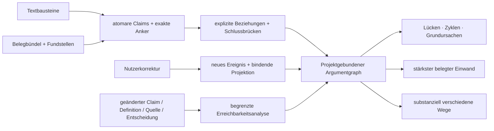

# Etappe C2 — Aussagen und Argumentation

**Status:** freigegeben im Rahmen der autonomen A–D2-Umsetzung
**Ziel:** `ARG-01` bis `ARG-07` schließen, ohne Text automatisch zu verändern oder Nutzer zur Graphpflege zu zwingen.

## Entscheidung

C2 wird als **textuelles Argumentdossier mit internem Graphen** gebaut.

Nicht gewählt:

- Eine primär visuelle Node-Graph-Oberfläche macht Beziehungen zwar direkt sichtbar, verlangt aber zu viel technische Pflege und belastet den Schreibfluss.
- Ein rein dialogischer Argument-Coach ist leicht zugänglich, aber nicht vollständig prüfbar, korrigierbar oder exportierbar.

Das Dossier projiziert den Graphen in verständliche Abschnitte. Aussagen, Beziehungen, Schlussbrücken, Lücken, Gegenargumente und alternative Wege bleiben lesbar; IDs, Kanten, Abhängigkeiten und Fingerprints arbeiten darunter.

## Unverrückbare Regeln

1. Der Text bleibt Primärzustand. Analyse, Korrektur, Kritik und alternative Wege verändern ihn nie automatisch.
2. Jede Aussage besitzt Projekt- und Textgrenze, genaue Textstelle, Herkunft, Gültigkeit, Evidenzstatus und Unsicherheit.
3. Eine Beziehung ist nur gültig, wenn beide Aussagen im selben Projekt existieren und Typ, Schlussbrücke und Sicherheitsgrad explizit sind.
4. Nutzerkorrekturen an Aussagen oder Beziehungen sind bindend und werden nicht durch spätere Ableitung überschrieben.
5. Gegenargumente werden nur aus vorhandenen Aussagen, Fundstellen oder Belegbündeln gebildet. Fehlt Material, ist Enthaltung ein gültiges Ergebnis.
6. Neuberechnung folgt nur erreichbaren Abhängigkeiten. Unabhängige Claims, Hinweise, Belege und Passagen bleiben bytegleich.
7. Ein gelöster Punkt wird ohne neue Grundlage nicht wieder geöffnet.
8. Alternative Wege unterscheiden sich in Prämisse, Schlussbrücke, Perspektive oder Evidenzstrategie; bloße Umformulierungen werden verworfen.
9. Beispielinhalte bleiben Demo. Projektfremde Aussagen oder Quellen dürfen nie in das aktive Dossier gelangen.
10. Tiefeninformation ist vollständig erreichbar, im Normalzustand aber ruhig eingeklappt.

## Domänenmodell

Jedes Projekt erhält additiv `argumentModel` mit Schema 1:

```text
argumentModel
├── claims[]
├── relations[]
├── findings[]
├── paths[]
├── deliberations[]
├── events[]
└── lastAnalysis
```

### Aussage

Eine Aussage enthält:

- stabile ID, Projekt-ID und Text-ID;
- exakten Anker mit Block-ID, Wortlaut und Zeichenbereich;
- atomaren Aussagewortlaut;
- Art: Tatsache, Definition, Wertung oder Schlussfolgerung;
- Zentralität: zentral oder stützend;
- Gültigkeit: behauptet, qualifiziert, bestritten oder zurückgezogen;
- Evidenzstatus: belegt, gemischt, unzureichend, neu zu prüfen oder ungeprüft;
- Unsicherheit: niedrig, mittel oder hoch;
- Referenzen auf Quellen, Fundstellen und Belegbündel;
- Herkunft und Versionsfingerprint;
- optional eine bindende Nutzerkorrektur.

Ein gemischter Satz darf mehrere Aussagen erzeugen. Listen, Fragen und rein rhetorische Fragmente werden nicht als Tatsachenclaims geraten.

### Beziehung

Zulässige Typen sind:

- `supports` — stützt;
- `counters` — widerspricht;
- `qualifies` — schränkt ein;
- `explains` — erklärt;
- `depends-on` — setzt voraus.

Jede Beziehung besitzt Ausgang, Ziel, Schlussbrücke, Sicherheitsgrad, Herkunft und Korrekturgeschichte. Automatisch abgeleitete Beziehungen bleiben als Agenteneinordnung markiert. Eine Nutzerkorrektur erzeugt ein neues Ereignis und wird zur bindenden Projektion.

### Befund

Der Graph erzeugt nur benannte beobachtbare Befunde:

- unbelegte zentrale Aussage;
- fehlende Schlussbrücke;
- Zirkelschluss;
- ungeklärte Annahme;
- fehlendes relevantes Gegenargument;
- veraltete Textstelle oder Evidenz;
- Regression mit neuem Anlass.

Ein Befund kann `open`, `parked`, `resolved` oder `accepted-risk` sein. Geparkte Befunde bleiben auffindbar und verweisen auf ihre Grundursache.

### Alternative Wege

Ein Weg ist kein Textentwurf, sondern eine strukturierte Folge aus:

- Ausgangsprämisse;
- Schlussbrücke;
- zentraler Aussage;
- Evidenzstrategie;
- Umgang mit Gegenargumenten;
- erwarteter Auswirkung;
- Risiko oder Grenze.

Nur aus dem vorhandenen Graphen belegbare Wege werden angeboten. Mindestens zwei substanziell verschiedene Strategien sind nötig; andernfalls zeigt das Dossier die fehlende Grundlage.

## Ableitung und Datenfluss



### Claim-Synchronisation

1. Die Oberfläche liest stabile Block-Snapshots aus dem aktiven Text.
2. Ein konservativer deutscher Clause-Splitter trennt Satzgrenzen, Semikola sowie koordinierte Teilsätze mit eigener Subjekt-Prädikat-Struktur.
3. Semantische Bausteinrollen (`claim`, `evidence`, `counterpoint`) erhöhen die Sicherheit, ersetzen aber keine Herkunft.
4. Belegbündel liefern bereits geprüfte Claim-Texte und Evidenzstatus.
5. Derselbe Quellfingerprint erzeugt keine Duplikate.
6. Eine veränderte oder verschwundene Textstelle wird als neu zu prüfen markiert; das System rät keinen neuen Anker.
7. Manuelle und nutzerkorrigierte Einträge bleiben erhalten.

### Relationen

Sichere Relationen entstehen aus:

- expliziten Belegbündelreferenzen;
- semantischen Beleg- und Gegenpositionsbausteinen mit eindeutigem nächstem Claim;
- bewusster Nutzeranlage oder -korrektur.

Fehlt eine eindeutige Schlussbrücke, entsteht ein Befund statt einer geratenen Kante.

### Auswirkungsanalyse

Änderungen tragen einen Typ und einen stabilen Anlassfingerprint. Die Analyse startet an direkt betroffenen Claims und folgt ausschließlich gerichteten `supports`, `qualifies`, `explains` und `depends-on`-Abhängigkeiten. Sie markiert erreichbare Claims, Beziehungen, Befunde, Belege und Textanker als neu zu prüfen. Andere Knoten werden nicht kopiert oder geändert.

### Regression

Ein geschlossener Befund speichert seinen letzten Grundlagenfingerprint. Ein Folgelauf mit demselben Fingerprint lässt ihn geschlossen. Nur eine neue Quelle, geänderte Aussage, Definition, Beziehung oder Autorentscheidung kann ihn mit sichtbarem `reopenReason` erneut öffnen.

## Gegenargument und Deliberation

Der stärkste Einwand wird nach direkter Relevanz, Evidenzstatus und Nähe zur zentralen Aussage geordnet. Die Ausgabe zeigt:

- den originalen Gegenclaim;
- dessen Belege und Grenzen;
- die explizite `counters`-Beziehung;
- die erwartete Auswirkung auf den zentralen Claim;
- einen Hinweis, falls das Material für eine faire Gegenposition nicht reicht.

Eine Prüfrunde speichert Kritik, Autorenantwort und optionale Revision als drei getrennte Beiträge mit Herkunft. Die Revision bleibt ein Vorschlag oder eine Modellkorrektur; sie wird nie still in den Text geschrieben.

## Oberfläche

Der Einstieg `Argumentation öffnen` liegt im Projektverständnis neben dem Projektgedächtnis.

Das Dialogdossier zeigt in dieser Reihenfolge:

1. Statuszeile: abgeleitet, lokal, korrigierbar, Zeitpunkt;
2. zentrale Aussagen mit Gültigkeit, Evidenzstatus, Unsicherheit und Textanker;
3. stärkster belegter Einwand oder ehrliche Lücke;
4. Beziehungen und Schlussbrücken, jeweils korrigierbar;
5. offene Lücken und geparkte Abhängigkeiten;
6. alternative Wege mit Auswirkung und Risiko;
7. eingeklappte Prüfrunden und Ereignisse;
8. `Aus Text aktualisieren`.

Ein eigener Node-Graph ist für C2 nicht nötig. Die Beziehungen werden als kleine gerichtete Pfade und verständliche Karten gezeigt. Auf 390 Pixel werden Karten vertikal; kein Inhalt darf horizontal scrollen. `Escape` schließt den Dialog und stellt den Fokus am Projektverständnis wieder her.

## Fehler- und Grenzverhalten

- Projektfremde Knoten, Kanten oder Evidenzreferenzen werden abgewiesen.
- Unbekannte Relationstypen, fehlende Schlussbrücken, ungültige Sicherheit und doppelte IDs scheitern geschlossen.
- Mehrdeutige oder veraltete Anker bleiben sichtbar ungeklärt.
- Zirkeln wird keine willkürliche Ursache zugewiesen; der vollständige Zyklus wird benannt.
- Ohne belegtes Gegenargument entsteht keine erfundene Gegenposition.
- Ohne zwei tragfähige Strategien entstehen keine kosmetischen Alternativen.
- Beschädigte persistierte Listen werden additiv repariert; Primärtext und Belege bleiben unverändert.

## Abnahmekriterien

### AC-C2-1 — Atomare Claims

**Given** ein Satz enthält zwei Tatsachenbehauptungen mit unterschiedlicher Beleglage
**When** das Claim-Ledger synchronisiert wird
**Then** entstehen zwei getrennte Claims mit exakten, nicht überlappenden Ankern, eigenem Evidenzstatus und Unsicherheit.

### AC-C2-2 — Explizite korrigierbare Relationen

**Given** zwei Claims stehen in einer stützenden, widersprechenden, qualifizierenden oder erklärenden Beziehung
**When** der Nutzer Typ, Schlussbrücke oder Sicherheitsgrad korrigiert
**Then** bleibt die Korrektur nach Reload bindend und die ursprüngliche Ableitung in der Ereignishistorie erhalten.

### AC-C2-3 — Grundursachen und Zyklen

**Given** mehrere Befunde hängen von derselben Annahme ab oder bilden einen Zirkelschluss
**When** der Graph bewertet wird
**Then** erscheint die Annahme als Grundursache, abhängige Befunde bleiben geparkt und der Zyklus wird vollständig benannt.

### AC-C2-4 — Faires Gegenargument

**Given** vorhandenes Projektmaterial enthält ein relevantes belegtes Gegenargument
**When** die Argumentprüfung läuft
**Then** zeigt sie den stärksten originalen Einwand, Evidenz, Grenze und Auswirkung; ohne Material enthält die Ausgabe keinen erfundenen Einwand.

### AC-C2-5 — Begrenzte Auswirkung

**Given** ein Claim, eine Definition, Quelle oder Autorentscheidung ändert sich
**When** die Auswirkungsanalyse läuft
**Then** werden nur erreichbare abhängige Claims, Kanten, Befunde, Belege und Passagen neu markiert; ein unabhängiger Teilgraph bleibt bytegleich.

### AC-C2-6 — Ehrliche Regression

**Given** ein Befund wurde geschlossen
**When** erst derselbe und danach ein neuer Grundlagenfingerprint geprüft wird
**Then** bleibt der Befund zunächst geschlossen und öffnet nur im zweiten Lauf mit benanntem Anlass.

### AC-C2-7 — Substanzielle alternative Wege

**Given** der Graph trägt mindestens zwei unterschiedliche Strategien
**When** alternative Wege angefordert werden
**Then** unterscheiden sie sich in Prämisse, Schlussbrücke, Perspektive oder Evidenzstrategie und zeigen Auswirkung sowie Risiko; andernfalls enthält die Ausgabe eine Lücke statt Synonymvarianten.

### AC-C2-8 — Dokumentierte Prüfrunde

**Given** ein zentraler Claim wird kritisiert
**When** Autorenantwort und Revision erfasst werden
**Then** bleiben Kritik, Antwort und Revision getrennt, chronologisch, projektgebunden und nach Reload erhalten.

### AC-C2-9 — Autorschaft und Isolation

**Given** zwei Projekte enthalten Canary-Claims und der Editor enthält Nutzertext
**When** Analyse, Korrektur, Gegenargument, Wege und Prüfrunde laufen
**Then** erscheint kein fremder Canary und der Editorinhalt bleibt ohne bewusste Übernahme bytegleich.

### AC-C2-10 — Ruhige zugängliche Bedienung

**Given** Desktop, 390-Pixel-Viewport, Tastatur und reduzierte Bewegung
**When** das Argumentdossier geöffnet, korrigiert und geschlossen wird
**Then** bleiben Hierarchie, Fokus, Beschriftungen, Kontrast und Geometrie verständlich; kein horizontaler Überlauf oder Fokusverlust entsteht.

## Eval- und Teststrategie

- Unit: Modellvalidierung, Atomisierung, Anker, Relation, Korrektur, Projektgrenze.
- Graph: Zyklen, Grundursachen, begrenzte Erreichbarkeit und Regression.
- Fixtures: faire Gegenargumente mehrerer Genres und substanziell verschiedene Wege.
- Browser: Ableitung, Relationkorrektur, Persistenz, Gegenargument, Wege, Prüfrunde, bytegleicher Text, Projekt-Canary, Mobile und Fokus.
- Regression: vollständige A–C1-Suite, V2-Smoke, Performance und native Startprobe.
- Agentic-Eval: höchstens fünf Schleifen, Exit bei allen C2-Hard-Gates, `ARG-04` und `ARG-07` jeweils mindestens 4,5/5 sowie Gesamtscore mindestens 4,5.
