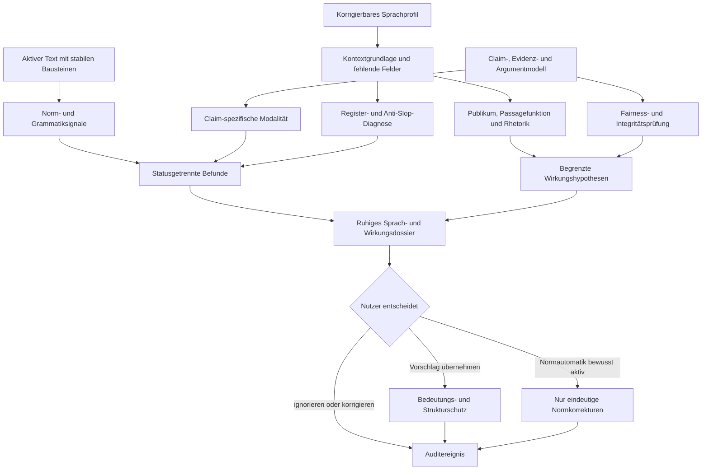

# Etappe D1 · Deutsche Sprache, Anti-Slop und Wirkung

**Status:** freigegebener Arbeitsentwurf  
**Datum:** 2026-07-30  
**Abhängigkeiten:** A, B1, B2, C1 und C2 sind grün  
**Primäre Ziel-Evals:** `LANG-01`–`LANG-08`, `EFFECT-01`–`EFFECT-05`  
**Externes Gate:** `EFFECT-06` bleibt eine echte Leser-/Autorenstudie

## Ziel

D1 ergänzt eine korrigierbare deutsche Sprach- und Wirkungsdiagnostik. Sie verbessert Klarheit und kommunikative Passung, ohne ein universelles Stilideal, ein KI-Herkunftsurteil oder eine automatische Umschreibmaschine einzuführen. Wahrheit, Claim-Evidenz, Nutzerstimme, Textstruktur und Autorschaft bleiben vorrangig.

## Nicht-Ziele

- kein KI-Detektor oder „Humanizer“
- kein pauschales Verbot von Passiv, Nominalisierung, Gedankenstrichen, Dreierfiguren oder Konnektoren
- keine sichere Vorhersage realer Leserreaktionen
- keine vollständige Grammatik- oder Rechtschreibengine
- keine automatische Stilumschreibung
- keine Simulation der externen Nutzerstudie `EFFECT-06`

## Unveränderliche Regeln

1. Nur deterministisch eindeutige Normfälle dürfen nach ausdrücklichem Opt-in automatisch angewendet werden.
2. Grammatik, Register, Wirkung und Anti-Slop bleiben begrenzte Diagnosen, nie „Fehler“, sofern keine eindeutige Normregel vorliegt.
3. Jede Diagnose nennt Fundstelle, Statusklasse, Begründung, Konfidenz und benötigte Kontextgrundlage.
4. Fehlende Profilangaben führen zu sichtbarer Enthaltung oder niedrigerer Konfidenz, nie zu einem erfundenen Standardprofil.
5. Sprachvorschläge bleiben Vorschläge; Bedeutung, Einschränkung, Zahlen, Negation, Eigennamen, Zitate, Links und Struktur werden vor Anzeige geprüft.
6. Fairness- und Integritätsrisiken stehen vor Stiloptimierung.
7. Wirkung bleibt ohne reale Publikumsdaten ausdrücklich eine Hypothese.
8. Jeder Zustand ist projekt- und textgebunden, persistiert und exportierbar.

## Domänenmodell

### Sprachprofil

Jedes Projekt erhält ein `languageProfile` mit:

- `genre`: wissenschaftlich, Essay, Projekttext, Webtext, Marketing, Kampagne oder sonstig;
- `defaultFunction`: erwartete Teiltextfunktion oder leer;
- `domain`: Fach, Markt oder Themenfeld;
- `audience`: korrigierbare Zielgruppenbeschreibung;
- `medium`: Bildschirm, Druck, akademische Abgabe oder sonstig;
- `goal`: beabsichtigte Zielhandlung oder Veränderung;
- `region`: Deutschland, Österreich oder Schweiz;
- `houseStyle`: kleine, explizite Liste institutioneller Konventionen;
- `orthographyAutomation`: standardmäßig `false`;
- `events`: append-only Änderungen und angewendete Normkorrekturen.

Das vorhandene Projektverständnis bleibt Quelle für Zielgruppe und beabsichtigte Wirkung. Das Sprachprofil ergänzt nur D1-spezifische Angaben. Abgeleitete Angaben und Nutzerkorrekturen werden getrennt.

### Diagnose

Eine Diagnose besitzt:

- Projekt-, Text-, Block- und exakten Textanker;
- `class`: `norm-error`, `grammar-observation`, `register-observation`, `effect-hypothesis` oder `integrity-warning`;
- `family`: Norm, Informationsstruktur, Modalität, Register, Anti-Slop, Rhetorik oder Fairness;
- begrenzte Aussage, Begründung und konkrete Prüffrage;
- Konfidenz und benötigte Profilfelder;
- optionalen, durch den Bedeutungswächter freigegebenen Vorschlag;
- Herkunft und stabilen Fingerprint.

Nur `norm-error` wird in der Oberfläche als Fehler bezeichnet.

### Wirkung

Der Wirkungsbericht hält getrennt:

- Ausgangszustand des Publikums: Vorwissen, Annahmen, Widerstände und geteilte Voraussetzungen;
- Zielzustand: verstehen, unterscheiden, erinnern, vertrauen, neu bewerten, fühlen oder handeln;
- Passagefunktion und Diskursbeziehung;
- erkannte Strategie: Direktheit, Beispiel, Kontrast, Analogie, Metapher, Narration oder Frame;
- erwarteten Gewinn, mögliche Fehlvorstellung und Evidenzsicherheit;
- Fairness- und Integritätsrisiken.

Alle Wirkungsaussagen tragen den Status `hypothesis`, solange keine reale Studie verknüpft ist.

## Analysefolge

## Sprachlogik

### Profil und Plurizentrik

Die Diagnose startet nur mit den tatsächlich bekannten Feldern. Deutschland-, Österreich- und Schweiz-Standard werden gleichwertig behandelt. Regionale Lexeme und explizite Hausstilregeln werden nicht als Normfehler markiert. Konsistenz kann unabhängig davon als Beobachtung erscheinen.

### Norm und Grammatik

Die erste Version automatisiert nur eine kleine, transparent geprüfte Menge eindeutiger Tippfehler. Mehrdeutige Groß-/Kleinschreibung, Getrennt-/Zusammenschreibung, Eigennamen und kontextabhängige Kommasetzung bleiben Vorschläge oder Enthaltung.

Grammatische Auffälligkeiten wie doppelte Artikel oder unvollständige Satzklammern tragen die Klasse `grammar-observation`. Sie werden nicht still korrigiert.

### Modalität

Claim-Evidenz steuert zulässige Behauptungsstärke:

- `supported`: direkte Formulierungen möglich, aber keine universelle Reichweite ohne passende Claim-Grenze;
- `mixed`: qualifizierte Formulierung erforderlich;
- `insufficient`, `review-required`, `unverified`: „beweist“, „zweifellos“, „immer“ und gleich starke Marker werden beanstandet;
- unnötig schwache Modalität bei direkt gestütztem Claim wird ebenfalls erkannt, aber nicht automatisch verstärkt.

### Kontextabhängiger Anti-Slop

Ein einzelnes Oberflächenmerkmal erzeugt keinen Befund. Hinweise entstehen nur aus einer Kombination von:

- Häufung oder dokumentweiter Wiederholung;
- fehlender oder unpassender Passagefunktion;
- Registerkonflikt;
- semantischer Wiederholung ohne zusätzlichen Informationswert;
- austauschbarer Autorität, Signifikanzinflation oder leeren Schlussformeln.

Die Diagnose behauptet nie eine KI-Herkunft und erzeugt keine Tarnvarianten.

## Bedeutungs- und Strukturschutz

Vor Anzeige oder Anwendung eines Vorschlags werden mindestens geprüft:

- Negation und Modalität;
- Zahlen, Einheiten und benannte Referenten;
- Claim-Reichweite und Evidenzstatus;
- Zitat- und Quellenmarker;
- Überschriften-, Listen- und Linkstruktur;
- geschützte Projektabsichten und gespeicherte Autorenstimme.

Ein Vorschlag mit Drift wird verworfen. Eine bewusst andere argumentative Richtung wird separat als solche gekennzeichnet und nie als bloße Sprachglättung angeboten.

## Optionale Normautomatik

- Standardzustand: aus.
- Das Einschalten ist eine explizite Nutzerhandlung im Dossier.
- Auch eingeschaltet werden Änderungen erst über „Eindeutige Normfälle anwenden“ ausgeführt.
- Änderungen erfolgen vom Dokumentende nach vorn, damit Anker stabil bleiben.
- Pro Änderung werden Regel, alter und neuer Wortlaut, Block, Text, Projekt und Zeitpunkt protokolliert.
- Links und Inline-Formatierung bleiben erhalten; Überschriften und Listen werden nicht umgebaut.
- Eigennamen, URLs, Zitate und mehrdeutige Fälle bleiben unangetastet.

## D1-Oberfläche

Hinter dem Projektverständnis erscheint „Sprache und Wirkung prüfen“. Das Dossier zeigt in dieser Reihenfolge:

1. Kontextprofil mit sichtbaren Lücken;
2. Fairness-/Integritätsrisiken;
3. eindeutige Normfälle und Opt-in;
4. Modalität und Register;
5. Anti-Slop-Diagnosen;
6. Publikumsmodell und Passagefunktionen;
7. rhetorische Mittel samt Gewinn und Risiko;
8. eingeklappte frühere Ereignisse.

Die Sprache bleibt ruhig: „Beobachtung“, „Hypothese“, „Normfehler“ und „Integritätsrisiko“ werden klar unterschieden. Das Dossier verändert den Text beim Öffnen oder Prüfen nicht.

## Akzeptanzkriterien

### AC-D1-01 · Korrigierbares Kontextprofil

**Gegeben** ein vollständiges oder unvollständiges Projektprofil, **wenn** die Analyse startet, **dann** nutzt sie nur bekannte Angaben, zeigt Lücken und erfindet kein universelles Stilprofil.

### AC-D1-02 · Statusklassen

**Gegeben** Normfehler, grammatische Auffälligkeiten und legitime Stilvarianten, **wenn** geprüft wird, **dann** heißt nur der eindeutige Normfall „Fehler“; alle anderen Befunde bleiben begrenzte Beobachtungen oder Hypothesen.

### AC-D1-03 · D-A-CH und Hausstil

**Gegeben** Deutschland-, Österreich-, Schweiz- oder Hausstilvarianten, **wenn** das Profil passt, **dann** werden legitime Formen nicht als Fehler markiert und Konsistenz bleibt ein eigener Befund.

### AC-D1-04 · Evidenzkalibrierte Modalität

**Gegeben** Claims mit gestützter, gemischter oder unzureichender Beleglage, **wenn** Behauptungsstärke geprüft wird, **dann** werden Über- und Untertreibung claim-spezifisch erkannt und passende Formulierungen erhalten.

### AC-D1-05 · Anti-Slop ohne Verbotslisten

**Gegeben** dieselben Muster mit und ohne kommunikative Funktion, **wenn** geprüft wird, **dann** erzeugt nur die unpassende Häufung einen begrenzten Befund.

### AC-D1-06 · Bedeutung und Struktur

**Gegeben** bedeutungstreue und driftende Varianten, **wenn** sie geprüft werden, **dann** erscheinen nur bedeutungstreue Vorschläge; Zahlen, Negation, Referenten, Zitate, Links, Überschriften und Listen bleiben erhalten.

### AC-D1-07 · Kein Herkunftsurteil

**Gegeben** typische menschliche oder modelltypische Muster, **wenn** diagnostiziert wird, **dann** enthält die Ausgabe weder KI-Wahrscheinlichkeit noch Tarnoptimierung oder künstliche Fehler.

### AC-D1-08 · Opt-in-Normautomatik

**Gegeben** eindeutige Tippfehler und mehrdeutige Stellen, **wenn** die Automatik aus ist, **dann** bleibt der Text bytegleich; **wenn** sie bewusst aktiviert und ausgeführt wird, **dann** ändern sich nur eindeutige Fälle mit Auditereignis.

### AC-D1-09 · Publikumsbewegung

**Gegeben** Zielgruppe und Kommunikationsziel, **wenn** Wirkung analysiert wird, **dann** werden Vorwissen, Annahmen, Widerstände, Common Ground und Zielzustand getrennt statt als statisches Label beschrieben.

### AC-D1-10 · Passagefunktion

**Gegeben** orientierende, definierende, erklärende, belegende und aktivierende Passagen, **wenn** die Funktionsfolge geprüft wird, **dann** besitzt jede Zuordnung eine lokale Begründung und unsichere Fälle bleiben Hypothesen.

### AC-D1-11 · Rhetorik und Fairness

**Gegeben** direkte, bildliche oder persuasive Fassungen, **wenn** geprüft wird, **dann** nennt das System Funktion, Gewinn, mögliche Fehlvorstellung und Sicherheit; falsche Zuspitzung, ausgelassene Gegeninformation und ausnutzende Personalisierung stehen vor Stil.

### AC-D1-12 · Isolation, Autorschaft und Zugang

**Gegeben** mehrere Texte und Projekte, **wenn** Dossier, Korrektur, Reload und Mobilansicht genutzt werden, **dann** bleiben Daten isoliert, der Text ändert sich nur nach expliziter Handlung, Fokus und Escape funktionieren und 200-Prozent-Reflow erzeugt keinen horizontalen Überlauf.

## Eval-Schleifen

Maximal fünf Iterationen:

1. RED/GREEN für Profile, Statusklassen und D-A-CH;
2. Modalität, Anti-Slop und Bedeutungswächter;
3. Wirkung, Rhetorik und Fairness mit genreübergreifendem Korpus;
4. Browserfluss, Norm-Opt-in, Persistenz und Barrierefreiheit;
5. unabhängige Prüfung, vollständige Regression und gezielte Nacharbeit.

Exit: `LANG-01`–`LANG-08` und `EFFECT-01`–`EFFECT-05` bestehen, jede Rubrikdimension liegt mindestens bei 4,0 und der gewichtete D1-Wert mindestens bei 4,5. `EFFECT-06` bleibt mit reproduzierbarem Studienprotokoll als extern offen dokumentiert.
