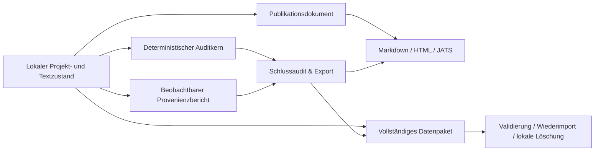

# Etappe D2: Schlussaudit, Publikation und Datenabschluss

## Story Context

D2 schließt die neun nach D1 verbleibenden automatisierbaren Ziel-Evals: `AUDIT-01` bis `AUDIT-07` sowie `SYSTEM-10` und `SYSTEM-11`. Der Nutzer soll einen Text fertigstellen können, ohne dass die App Autorschaft oder Freigabereife behauptet. Offene Integritätsprobleme bleiben sichtbar, Exporte bleiben eine bewusste Nutzerentscheidung, Publikationsformate enthalten nur Text und Referenzen, und der gesamte lokale Bestand lässt sich exportieren und löschen.

Die Freigabe „freigegeben“ gilt für den bereits festgeschriebenen 77-Eval-Katalog und die D2-Etappe der V2-Roadmap. D2 verändert weder frühere Erfolgskriterien noch die sechs externen Live-Gates.

## Designentscheidung

### Erwogene Ansätze

1. **Deterministischer Auditkern mit getrennten Exportadaptern — gewählt.** Ein reines Auditmodell normalisiert bestehende Zustände, ein separater Provenienzbericht beschreibt nur beobachtbare Beiträge, und formatbezogene Adapter erzeugen Markdown, HTML und JATS. Ein dünner Dialog orchestriert Ansicht, Bestätigung, Download und Datenlöschung. Das ist reproduzierbar, testbar und hält Publikationsinhalt frei von UI.
2. **Audit direkt aus dem Dialog-DOM zusammensetzen.** Das wäre kurzfristig kleiner, würde aber Reihenfolge, Persistenz, Dateiformate und Tests an die Darstellung koppeln. Ein DOM-Umbau könnte dann Auditinhalt oder Export unbemerkt verändern.
3. **Nur ein externes Export- oder CLI-Werkzeug.** Das wäre dateiorientiert, verfehlt aber den bewussten In-App-Fluss, Tastaturzugang, Risikobestätigung und lokale Datenkontrolle.

### Architektur

Der Auditkern ist eine reine Funktion. Er erhält Projekt, zugehörige Texte, Argumentmodell, Quellen, Belege, Zitationen, Sprachberichte und Regelsatzversionen. Er erzeugt einen versionierten Snapshot mit strukturellem Fingerprint. Zeitstempel und UI-Zustand gehen nicht in den Fingerprint ein.

Der Dialog zeigt zuerst Integrität, Belege und Zitation, danach angenommene Risiken und erst zuletzt Stil. Er bezeichnet kritische Zustände als `nicht freigabereif`, einen blockerfreien Zustand jedoch nur als `keine harten Auditblocker gefunden`; die App erteilt keine Freigabe.

### Auditstatus und harte Blocker

Jeder Hinweis erhält genau einen erreichbaren Auditstatus:

- `open`: offen und direkt bearbeitbar;
- `parked`: offen, aber von einer ebenfalls offenen Grundursache abhängig;
- `resolved`: gelöst;
- `dismissed`: verworfen, ohne als Risiko übernommen worden zu sein;
- `risk-accepted`: bewusst angenommenes Risiko;
- `superseded`: durch einen neueren Zustand ersetzt.

Für wissenschaftliche Texte blockiert jeder offene kritische Befund der Kategorien `fact`, `source`, `citation`, `method` oder `logic`. Zusätzlich blockieren fehlende Literaturverzeichniseinträge, nicht verifizierte kritische Zitatanker sowie zentrale Claims mit `insufficient`, `review-required` oder `unverified`. Stilbefunde können diese Blocker weder ausgleichen noch verdecken.

Ein Snapshot besitzt `blocked`, `review-required` oder `clear-of-hard-blockers`. `risk-accepted` bleibt sichtbar und verlangt vor einem Export eine gesonderte Bestätigung. Auch nach bestätigtem Export bleibt der gespeicherte Auditstatus unverändert.

### Autorschaft und KI-Nutzung

Der private Autorschaftsnachweis wird ausschließlich aus lokalen Ereignissen gebaut:

- Nutzertext oder eigene Fassung;
- Agentenvorschlag wortgleich übernommen;
- Agentenvorschlag verändert übernommen;
- Agentenvorschlag nicht übernommen;
- Nutzerentscheidung über Analyse oder Wirkungshypothese.

Er enthält keine Aussagen über Aufmerksamkeit, Verstehen, Absichtserkennung, kognitive Leistung oder eine prozentuale Autorschaft. Ein fehlendes Ereignis führt zu `nicht beobachtbar`, nicht zu einer Schätzung.

Die optionale KI-Nutzungserklärung wird nur aus denselben Ereignissen abgeleitet. Ist sie ausgeschaltet, entsteht keine Erklärung und sie erscheint in keinem Publikationsexport. Sie nennt nur nachweisbare Tätigkeitsarten und behauptet nicht, der Agent habe Text verfasst, wenn kein übernommener Agentenbeitrag vorliegt.

### Publikationsformate

Ein gemeinsames, UI-freies Publikationsdokument wird aus dem aktuellen Tiptap-Baum sowie expliziten Fußnoten, Zitaten und Bibliografieeinträgen erzeugt. Drei Adapter rendern:

- Markdown;
- semantisches HTML;
- JATS XML als wissenschaftliches Austauschformat.

Überschriften, Absätze, geordnete und ungeordnete Listen, Blockzitate, Fußnoten, Links, Zitationsanker und Bibliografie bleiben erhalten. Tiptap- oder Agenten-UI-Klassen, Findings, Dialoge, Auditkarten und interne Entscheidungsdaten gelangen nie in den Text. Ungültige oder unbekannte Knoten werden als Klartext erhalten oder fail-closed verworfen; sie werden nicht als ausführbares HTML übernommen.

### Vollständige lokale Datenkontrolle

Der Gesamtexport enthält die lokale Zustandsversion, alle Texte, Projekte, Quellen, Belegbündel, Rechercheläufe, Entscheidungen, Sprachberichte, Auditprotokolle, Provenienz und lesbare Metadaten. Schlüssel-, Token-, Cookie-, Autorisierungs-, Passwort- und Sitzungsfelder werden rekursiv redigiert.

Das Paket besitzt Manifest, Zähler, strukturellen Fingerprint und eine Validierungsfunktion. Ein Wiederimport akzeptiert nur ein gültiges, vollständiges Paket und erzeugt denselben Domänenzustand. Die lokale Löschung ist zweistufig, entfernt Browser- oder Mac-Zustand sowie den gespeicherten API-Schlüssel und startet danach mit einem frischen lokalen Bestand. Ohne vorher erfolgreich erzeugtes und validiertes Paket ist der Löschknopf deaktiviert.

## Akzeptanzkriterien

## Happy Path

### AC-D2-01: Alle Auditstatus sind erreichbar

**Given** ein Projekt enthält offene, geparkte, gelöste, verworfene, risikoakzeptierte und ersetzte Hinweise

**When** der Nutzer `Schlussaudit & Export` öffnet

**Then** zeigt der Dialog jede Statusgruppe mit Anzahl und erreichbaren Einträgen; Integrität, Belege und Zitation stehen vor Stil

### AC-D2-02: Harter wissenschaftlicher Blocker dominiert

**Given** ein wissenschaftlicher Text besitzt einen offenen kritischen Fakten-, Quellen-, Zitations-, Methoden- oder Logikbefund

**When** der Auditstatus berechnet wird

**Then** lautet er `nicht freigabereif`, nennt jeden Blocker und bleibt unabhängig von Stilbefunden blockiert

### AC-D2-03: Blockerfreier Audit erteilt keine Freigabe

**Given** ein Text besitzt keine offenen harten Integritätsblocker

**When** der Audit läuft

**Then** zeigt er `keine harten Auditblocker gefunden` und erklärt ausdrücklich, dass die Publikationsentscheidung beim Nutzer bleibt

### AC-D2-04: Strukturtreue Publikation

**Given** ein Text enthält Überschriften, Listen, Blockzitate, Fußnoten, Links, Zitate und Bibliografie

**When** Markdown, HTML und JATS erzeugt werden

**Then** enthalten alle drei Formate den vollständigen Inhalt und maschinenlesbare Referenzen, aber keine Agenten-UI oder Auditdaten

### AC-D2-05: Beobachtbarer Autorschaftsnachweis

**Given** Nutzer und Agent haben beobachtbare Beiträge und Entscheidungen hinterlassen

**When** der private Autorschaftsnachweis erzeugt wird

**Then** unterscheidet er Original, wortgleich übernommen, verändert übernommen und nicht übernommen und enthält weder kognitive Behauptungen noch Prozentwerte

### AC-D2-06: Optionale KI-Nutzungserklärung

**Given** lokale Provenienz enthält Agentenereignisse

**When** der Nutzer die KI-Nutzungserklärung ein- oder ausschaltet

**Then** entsteht im eingeschalteten Zustand ausschließlich eine belegbare Tätigkeitsliste und im ausgeschalteten Zustand keine Erklärung

## Edge Cases

### AC-D2-07: Bewusster Export trotz Risiko

**Given** der Audit enthält offene Blocker oder angenommene Risiken

**When** der Nutzer ein Publikationsformat auswählt

**Then** erklärt die App die Folgen, verlangt eine explizite Bestätigung und exportiert erst danach, ohne den Auditstatus oder die Formulierung `nicht freigabereif` zu verändern

### AC-D2-08: Reproduzierbarer Audit

**Given** Daten, Auditregeln, Projektmodell und Text sind unverändert

**When** der Audit zweimal ausgeführt wird

**Then** sind struktureller Fingerprint, Gruppen, Blocker und Status bytegleich und Regel-, Modell- und Datenversion sichtbar

### AC-D2-09: Vollständiger Gesamtexport und Wiederimport

**Given** der lokale Bestand enthält mehrere Projekte, Texte, Quellen, Entscheidungen, Provenienz, Gedächtnis und Auditprotokolle

**When** der Nutzer den Gesamtexport erzeugt und validiert wieder importiert

**Then** bleiben alle Domäneninhalte und stabilen IDs erhalten, während Secret-Canaries nirgends im Paket vorkommen

## Error States

### AC-D2-10: Ungültiges Datenpaket wird abgewiesen

**Given** Manifest, Fingerprint, Pflichtsammlung oder Referenz eines Gesamtexports ist beschädigt

**When** ein Wiederimport versucht wird

**Then** wird der Import ohne Teilmutation abgewiesen und nennt die fehlerhafte Kategorie

### AC-D2-11: Löschung ohne gesicherten Export ist gesperrt

**Given** seit der letzten Zustandsänderung wurde kein gültiges Gesamtdatenpaket erzeugt

**When** der Nutzer die lokale Löschung öffnet

**Then** bleibt die endgültige Aktion deaktiviert und verweist auf den erforderlichen Export; Abbrechen verändert nichts

### AC-D2-12: Fehlender Publikationskontext bleibt sichtbar

**Given** Zitations- oder Bibliografiedaten fehlen

**When** ein wissenschaftlicher Export vorbereitet wird

**Then** erscheint ein Auditblocker oder eine sichtbare Lücke; der Export erfindet weder Zitate noch Literaturangaben

## Non-Functional Criteria

### AC-D2-13: Tastatur, Fokus und 200-Prozent-Reflow

**Given** der Nutzer bedient den Auditdialog ohne Zeigegerät bei 390 × 844 Pixel oder 200 Prozent Zoom

**When** er Statusgruppen, Bestätigung, Formate, Provenienz und Datenkontrolle erreicht

**Then** besitzt jede Aktion einen sichtbaren Namen und Fokus, Ziele sind mindestens 44 × 44 Pixel groß, Escape stellt den Auslöserfokus wieder her und es entsteht kein horizontaler Überlauf

### AC-D2-14: Automatisierbare WCAG-2.1-AA-Verstöße sind null

**Given** Bibliothek, Editor, Projektverständnis, Quellenreader, Sprachdossier und Schlussaudit stehen in ihren Kernzuständen

**When** axe diese Zustände prüft

**Then** meldet axe für die aktivierten WCAG-2.1-A/AA-Regelsätze keine Verstöße; manuelle Tastatur-, Fokus- und Zoomprüfungen sind versioniert dokumentiert

### AC-D2-15: Audit blockiert das Schreiben nicht

**Given** ein Audit oder Export wird vorbereitet

**When** der Nutzer parallel tippt

**Then** läuft keine einzelne synchrone Auditaufgabe länger als 50 ms und die vorhandene Performanceprobe bleibt unter ihrem harten Gate

## Eval- und Iterationsvertrag

- Harte Gates: `AUDIT-01` bis `AUDIT-07`, `SYSTEM-10`, `SYSTEM-11`.
- Zielwert der Qualitätsrubrik: mindestens 4,5 von 5,0 insgesamt und mindestens 4,0 in jeder Dimension.
- Maximal fünf Schleifen: Modell, Publikationsformate, UI/Risikoentscheidung, Datenkontrolle/WCAG, unabhängiges Review und Regression.
- Früher Stopp nur, wenn alle neun D2-Gates und alle früheren Regressionen bestehen.
- Keine Verbesserung über zwei aufeinanderfolgende Schleifen beendet die Iteration mit offen dokumentierten Befunden statt mit einer falschen Fertigmeldung.
- Die sechs externen Gates `INV-06`, `RESEARCH-02`, `RESEARCH-03`, `EFFECT-06`, `SYSTEM-03` und `SYSTEM-09` bleiben unverändert extern.

## Abgrenzung

- Keine öffentliche Autorenschaftszertifizierung und kein Erkennungs- oder Wahrscheinlichkeitswert.
- Keine automatische Freigabe, Veröffentlichung oder Übermittlung an Dritte.
- Kein PDF-Layoutsystem; JATS ist das eine wissenschaftliche Austauschformat.
- Kein Cloudkonto, kein Hintergrundupload und keine neue Telemetrie.
- Keine redaktionelle Erfindung fehlender Zitate, Fußnoten oder Bibliografieeinträge.
