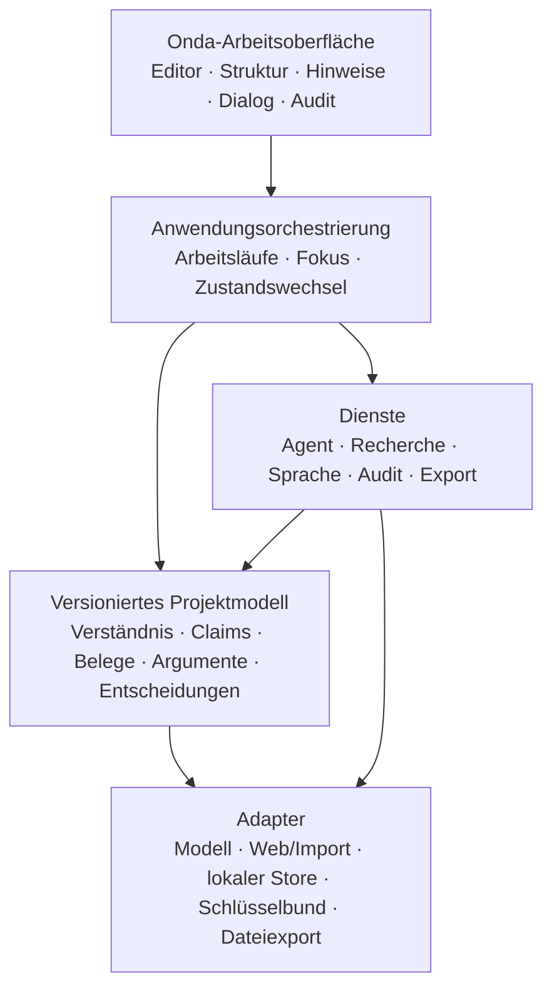
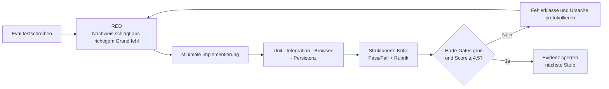
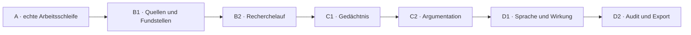

# V2-Fertigzustand — Eval-gesteuertes Produktdesign

> **Status:** Am 30. Juli 2026 vom Nutzer freigegeben.
> **Geltung:** Dieses Dokument übersetzt die Produktspezifikation
> `2026-07-19-agentisches-schreibsystem-v2.md` in einen beobachtbaren
> Fertigzustand. Es ersetzt keine fachliche Produktregel. Bei Widersprüchen gilt
> die V2-Produktspezifikation; für sichtbare Interaktionen gilt zusätzlich die
> Onda-Arbeitsoberflächen-Spec.
> **Maschinenlesbare Quelle:** `app/evals/v2-fertigzustand.json`

## 1. Ziel

Der Fertigzustand ist ein lokal kontrolliertes Schreib- und Denksystem, in dem
Menschen anspruchsvolle Texte selbst entwickeln und der Agent Verständnis,
Recherche, Belege, Argumentation, Sprache, Wirkung und Abschlussprüfung
nachvollziehbar unterstützt.

„Fertig“ bedeutet nicht, dass der Agent jeden Text automatisch gut macht. Es
bedeutet, dass alle sieben vertikalen Funktionsstränge der V2-Spezifikation
benutzbar miteinander verbunden sind, die nicht verhandelbaren Prinzipien durch
harte Evals geschützt werden und Grenzen ehrlich sichtbar bleiben.

## 2. Verbindlicher Umfang

Der vollständige Zustand umfasst:

1. die echte Arbeitsschleife aus Projektverständnis, Hinweisen, Entscheidungen
   und Agentendialog;
2. Quellenimport, Fundstellen, claim-spezifische Belegbündel und
   Zitierprüfung;
3. autonome, legale Recherche mit Werkzeugprotokoll und verifizierten
   Ergebnissen;
4. lokales Gedächtnis mit den Ebenen Text, Projekt, Thema und persönlich;
5. Aussagen, Gegenargumente, Schlussbrücken, Abhängigkeiten und
   Regressionsprüfung;
6. kontextabhängige deutsche Sprach-, Wirkungs- und Anti-Slop-Diagnostik;
7. Schlussaudit, Provenienz, Autorschaftsnachweis und Ausgabeprofile.

Nicht Teil des Fertigzustands sind Mehrbenutzerbetrieb, soziale Veröffentlichung,
ein Grafik-/Layoutprogramm, Paywall-Umgehung, ein KI-Herkunftsdetektor, ein
globaler Wahrheits-, Stil- oder Slop-Score und ein Multi-Agent-Mehrheitsvotum
über Wahrheit.

## 3. Gewählter Bauweg

### Entscheidung

Die bestehende Vanilla-JavaScript-/Tiptap-App bleibt die sichtbare
Experimentier- und Produktoberfläche. Der Ausbau erfolgt in eval-gesteuerten
vertikalen Funktionssträngen. Domänenlogik wird aus der großen
`workspace.js`-Orchestrierung in kleine pure Module mit stabilen Schnittstellen
gezogen. Persistenz, Recherche, Modellanbieter und Export werden hinter
austauschbaren Adaptern gekapselt.

Die lokale Datenhaltung darf während einer Stufe intern noch auf dem bestehenden
JSON-Speicher aufsetzen. Vor dem Gedächtnis- und Quellenvollausbau muss sie über
einen versionierten lokalen Store-Adapter verfügen, der atomare Speicherung,
Migration, Backup, Export und Löschung garantiert. Die beobachtbaren Evals
schreiben kein bestimmtes Datenbankprodukt vor.

### Verworfene Wege

- **Plattformumbau zuerst:** Ein sofortiger Tauri-/SQLite-Neubau schafft
  Infrastruktur, bevor Quellen-, Gedächtnis- und Argumentationsverträge stabil
  getestet sind.
- **Big Bang aller Fähigkeiten:** Eine einzige breite Implementierung macht
  Fehlerursachen und Produktlernen unübersichtlich und verhindert belastbare
  Zwischenabnahmen.
- **Prompt-only:** Produktlogik, Wahrheit, Provenienz und Persistenz dürfen
  nicht nur durch Promptformulierungen abgesichert sein.

## 4. Zielarchitektur

Jede Einheit muss ohne Lesen ihrer Interna über eine kleine Schnittstelle
verständlich sein. UI-Code darf keine Wahrheit aus Modelltext ableiten.
Verifizierte Fundstellen, Entscheidungen und Provenienz entstehen in
Domänenmodulen und werden nur projiziert.

## 5. Unveränderliche harte Gates

Diese Gates gelten für jede Stufe und können nicht durch einen guten
Gesamtscore ausgeglichen werden:

1. Kein Agentenlauf verändert Nutzertext ohne bewusste Übernahme.
2. Kein Recherchematerial wird ohne überprüfte Originalfundstelle als
   „belegtes Wissen“ dargestellt.
3. Keine synthetische Zusammenfassung wird zur Primärquelle.
4. Faktische, methodische, logische und quellenbezogene Risiken verschwinden
   nicht durch einfaches Verwerfen.
5. Projektinhalte gelangen nicht ohne ausdrückliche Freigabe in ein anderes
   Projekt oder eine persönliche Erinnerung.
6. Ein wissenschaftlicher Text mit offenen kritischen Risiken wird nicht als
   freigabereif bezeichnet.
7. Offline bleiben Schreiben, Speichern, Lesen und Export benutzbar.
8. Schlüssel und vertrauliche Daten erscheinen weder im JS-Zustand der Mac-App
   noch in Exporten, Logs oder Eval-Artefakten.
9. Demo-Material wird nie als live recherchiert oder verifiziert ausgegeben.
10. Evals belohnen „nicht ausreichend belegt“ bei schwacher Evidenz stärker als
    eine plausible Erfindung.

## 6. Eval-Suiten

Der maschinenlesbare Katalog enthält die vollständigen Given/When/Then-Szenarien.
Die Suiten sind:

| Suite | Zweck | Primärer Nachweis |
|---|---|---|
| `INV` | Autorschaft, Wahrheit, Herkunft, Datenschutz | Unit + Integration |
| `WORK` | Arbeitsschleife und Agentendialog | Unit + Browser |
| `EVID` | Quellen, Fundstellen, Belegbündel, Zitation | Unit + Fixture-Import |
| `RESEARCH` | autonomer legaler Recherchelauf | Adapter-Integration + Live |
| `MEMORY` | vier Gedächtnisebenen und Löschbarkeit | Unit + Persistenz |
| `ARG` | Claims, Gegenargumente, Abhängigkeiten | Unit + Browser |
| `LANG` | Deutsch, Register, Anti-Slop | Korpus-Fixtures + Judge |
| `EFFECT` | Publikum, Funktion, Wirkung, Fairness | Fixture + Nutzerstudie |
| `AUDIT` | Abschluss, Risiken, Provenienz, Export | Browser + Dateiprüfung |
| `SYSTEM` | Sicherheit, Migration, A11y, Performance | Automation + manuell |

Jede Eval besitzt:

- eine stabile ID;
- `hard` oder `scored` als Gate-Typ;
- genau eine beobachtbare Given/When/Then-Erwartung;
- einen Automatisierungsgrad;
- die konkrete Evidenz, die einen Pass beweist;
- die fachliche Quelle in den bestehenden Spezifikationen.

## 7. Rubrik für qualitätskritische Ausgaben

Harte Gates werden binär bewertet. Zusätzlich werden Agentenantworten,
Hinweisqualität, Belegbündel, Sprachdiagnosen und Audits auf einer Skala von
1 bis 5 bewertet:

| Dimension | Gewicht | 5 bedeutet |
|---|---:|---|
| Wahrheit und Evidenz | 25 % | Jede Tatsachenaussage ist passend belegt oder klar begrenzt |
| Autorschaft und Bedeutungstreue | 20 % | Nutzerabsicht bleibt erhalten, Vorschläge sind eindeutig Agentenbeiträge |
| Nützlichkeit und Priorisierung | 15 % | Der wichtigste nächste Schritt ist konkret und ohne Wiederholung sichtbar |
| Ruhe und Interaktionsqualität | 15 % | Schreiben bleibt dominant, Tiefe ist erreichbar, kein Fokusraub |
| Zuverlässigkeit und Nachvollziehbarkeit | 15 % | Zustand, Herkunft, Entscheidungen und Fehler sind reproduzierbar |
| Barrierefreiheit und Privatsphäre | 10 % | Bedienung und Datenkontrolle funktionieren ohne Sonderwege |

Eine Stufe besteht nur, wenn:

- alle anwendbaren harten Gates bestanden sind;
- der gewichtete Score mindestens `4,5 / 5` beträgt;
- keine Dimension unter `4 / 5` liegt;
- Unit-, Integrations-, Browser- und Persistenztests keine Regression zeigen.

## 8. Iterationsprotokoll

Pro Stufe sind höchstens fünf vollständige Eval-Schleifen erlaubt. Die Schleife
endet früher, sobald alle Gates bestehen. Verbessert sich der Score in zwei
aufeinanderfolgenden Schleifen nicht, wird nicht weiter kosmetisch optimiert:
Der betroffene Schnittstellen- oder Datenvertrag wird überprüft. Jede gefundene
Fehlerklasse wird als Regressionsfall erhalten.

Das Protokoll liegt unter `app/evals/results/` und enthält pro Lauf:

- Commit und Eval-Katalog-Version;
- Umgebung und Zeitpunkt;
- Pass/Fail je Eval;
- Rubrikwerte;
- konkrete Fehlerursache;
- vorgenommene Änderung;
- Links auf Testausgabe, Screenshots oder exportierte Dateien.

## 9. Externe Live-Gates

Bestimmte Aussagen können lokale Mocks und Fixtures nicht beweisen:

- echte Modellqualität und Streaming mit einem vom Nutzer hinterlegten
  Schlüssel;
- Erreichbarkeit und Rechtmäßigkeit realer Quellenwege;
- Schlüsselbund- und Offline-Verhalten in der gebauten Mac-App;
- tatsächliche Ruhe und Verständlichkeit im Schreibfluss;
- kommunikative Wirkung bei realen Lesenden;
- institutionelle Zitier- und Exportanforderungen.

Diese Gates erhalten denselben Pass/Fail-Status, bleiben aber bis zu einem
gemeinsamen Live-Durchlauf ausdrücklich `pending_external`. Sie werden nie durch
einen automatischen Mock-Pass ersetzt.

## 10. Stufen und Abhängigkeiten

Jede Stufe produziert nutzbare Software und die Datenverträge für die nächste:

- A stabilisiert Entscheidungen, Dialoge und Agentenstatus.
- B1 produziert verifizierte Fundstellen und Belegbündel.
- B2 produziert nachvollziehbare Rechercheereignisse.
- C1 speichert Ereignisse und leitet kontrollierte Dossiers ab.
- C2 verbindet Claims, Evidenz, Einwände und Auswirkungen.
- D1 diagnostiziert Bedeutung, Sprache und Wirkung auf diesem Modell.
- D2 prüft alle Dimensionen und erzeugt nachvollziehbare Ausgaben.

## 11. Fehler- und Wiederherstellungsvertrag

- Ein fehlgeschlagener externer Lauf hinterlässt keinen halbfertigen
  verifizierten Zustand.
- Import, Recherche, Analyse und Export sind abbrechbar.
- Wiederholung ist idempotent oder sichtbar versioniert.
- Beschädigte lokale Daten werden aus dem letzten gültigen Backup
  wiederhergestellt; Originalmaterial wird nie überschrieben.
- Unbekannte oder ältere Felder werden tolerant migriert.
- Ein Nutzer kann Quelle, Erinnerung, Projekt und vollständigen lokalen
  Datenbestand exportieren und löschen.

## 12. Design-Selbstprüfung

- Keine Platzhalter oder offenen „später implementieren“-Anforderungen.
- Produktumfang entspricht den sieben Bauabschnitten der V2-Spezifikation.
- Ältere Tauri-/SQLite-Entscheidungen wurden nicht fälschlich zu
  beobachtbaren Produktgates gemacht.
- Wahrheit, Autorschaft, lokale Kontrolle und ruhige Oberfläche sind als harte
  Gates durchgängig.
- Subjektive Wirkung ist als externer Nachweis gekennzeichnet, nicht
  automatisiert vorgetäuscht.
- Der Katalog trennt Ergebnisanforderungen von Implementierungsdetails.

