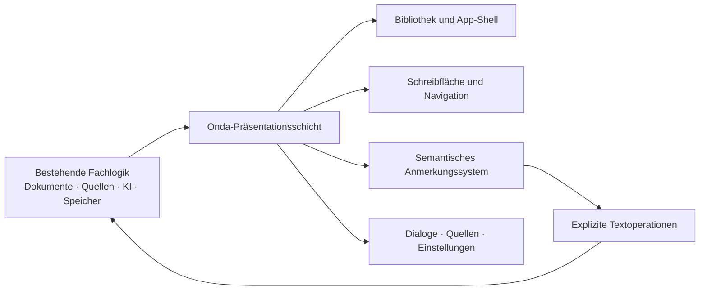

# Onda UI-Neubau – Designspezifikation

**Stand:** 5. August 2026
**Status:** vom Nutzer in der Unterhaltung freigegeben; Ausführung ohne weitere Unterbrechung
**Verbindliche Referenz:** `/Users/jakobschlenker/Downloads/Onda Design System/`

## 1. Ziel

Onda erhält eine vollständig neue Präsentationsschicht, die sich in Gestaltung, Informationsarchitektur und Verhalten wie eine Anwendung aus dem mitgelieferten Onda Design System anfühlt. Die bestehende Fachlogik bleibt erhalten: Dokumente, Projekte, Tiptap-Editor, stabile Block-IDs, Quellen, Argumentationsmodell, Gedächtnis, Entscheidungen, Native-Transport und Schlüsselbund werden weiterverwendet.

Der Neubau ist keine bloße Neulackierung. Insbesondere wird das heutige generische Rückmeldungsformat aus „Beobachtung / Relevanz / Folge“ durch ein semantisches Anmerkungssystem ersetzt. Jede Rückmeldung erhält diejenige Gestalt, die zu ihrer Handlung passt.

## 2. Nicht verhandelbare Leitplanken

1. Das Design System ist der visuelle Vertrag. App-eigene Abweichungen sind nur erlaubt, wenn eine bestehende Produktfunktion sie zwingend erfordert und die Abweichung dokumentiert und geprüft wird.
2. Nutzerdaten bleiben kompatibel. Bestehende Projekte und Findings werden beim Lesen tolerant normalisiert; eine destruktive Einmalmigration ist nicht erforderlich.
3. Der echte API-Schlüssel bleibt im macOS-Schlüsselbund. Tests dürfen Status und Transport verwenden, aber weder Schlüsselwert noch Header protokollieren, lesen oder in Browser-Speicher übertragen.
4. Die Autorin oder der Autor behält die Entscheidung. Keine Textänderung geschieht allein durch Öffnen, Navigieren oder Verwerfen eines Hinweises.
5. Eine Anmerkung folgt der Natur des Problems, nicht einer technischen Ursprungskategorie.
6. Der Schreibfluss bleibt ruhig. Automatische Rückmeldung respektiert die drei bestehenden Momente und den stillen Modus.
7. Bestehende Fach- und Regressionstests sind harte Gates.

## 3. Zielarchitektur

Die Präsentationsschicht wird aus kleinen ES-Modulen aufgebaut und an die bestehende Anwendung angeschlossen. Die React-Beispiele im Design System sind Verhaltens- und Darstellungsreferenz, aber keine Vorgabe für eine zusätzliche Laufzeit. Tiptap bleibt der Editor. DOM-nahe Komponenten erhalten kleine, reine Darstellungsmodelle, damit Zuordnung und Verhalten ohne Browser testbar bleiben.

Die bisher konzentrierte Oberflächenlogik in `workspace.js` wird entlang klarer Verantwortungen extrahiert:

- Onda-Shell und Navigation
- Anmerkungsvertrag und Legacy-Normalisierung
- Präsentationsresolver
- Markierungen und Anmerkungsflächen
- Textoperationen
- Anmerkungsnavigation und Zusammenfassung
- stiller Modus und Verwerfungsfolgen
- fokussierte Dialoge für Quelle, Vergleich und Gespräch

Die Fachmodelle bleiben die Quelle der Wahrheit. UI-Zustände speichern nur Auswahl, Expansion, Modus und Fokus – keine zweite Kopie des Dokuments.

## 4. Semantischer Anmerkungsvertrag

Neue KI-Hinweise tragen neben der bestehenden groben `kategorie` eine exakte `anmerkungsart`. Die grobe Kategorie bleibt für Integritäts-, Moment- und Rückkopplungslogik bestehen; die genaue Art entscheidet Darstellung, Priorität und mögliche Aktion.

### 4.1 Textmodus: 24 Arten

| Anmerkungsart | Kategorie | Priorität | Darstellungsform | Primäre Handlung |
| --- | --- | --- | --- | --- |
| `rechtschreibung` | Korrektur | Fehler | Wortkorrektur | ersetzen |
| `grammatik` | Korrektur | Fehler | Wort-/Satzkorrektur | ersetzen |
| `zeichensetzung` | Korrektur | Fehler | Wortkorrektur | ersetzen |
| `wortwahl` | Stil | Geschmack | Wortkorrektur | ersetzen |
| `satzstil` | Stil | Empfehlung | Rewrite am Rand | Satz ersetzen |
| `absatzstil` | Stil | Geschmack | Rewrite am Rand | Absatz ersetzen |
| `straffen` | Stil | Empfehlung | Rewrite am Rand | Passage ersetzen |
| `wiederholung` | Stil | Geschmack | Bereich + Sammelkarte | ausgewählte Stellen ersetzen |
| `ton` | Stil | Geschmack | Bereich + Sammelkarte | Bereich vereinheitlichen |
| `stilmittel` | Stil | Geschmack | Einfügung im Textfluss | einfügen/ersetzen |
| `anglizismus` | Stil | Geschmack | Wortkorrektur | ersetzen |
| `terminologie` | Stil | Empfehlung | Vergleich mehrerer Stellen | vereinheitlichen |
| `verschieben` | Struktur | Empfehlung | Ursprung + Zielplatz | Block verschieben |
| `uebergang` | Struktur | Empfehlung | Einfügung im Textfluss | Brücke einfügen |
| `gliederung` | Struktur | Empfehlung | Zielplatz | Überschrift einfügen |
| `fluss` | Struktur | Empfehlung | Rewrite am Rand | Passage ersetzen |
| `faden` | Struktur | Empfehlung | textweite Rewrite-/Strukturkarte | prüfen oder Rückbezug einfügen |
| `ueberschrift` | Struktur | Geschmack | Korrektur am Titel | Titel ersetzen |
| `anmerkung` | Inhalt | Geschmack | Dialog | antworten |
| `beleg` | Inhalt | Fehler | Quellenkarte | Beleg einfügen/Quelle wechseln |
| `faktencheck` | Inhalt | Fehler | Quellenkarte | Angabe korrigieren |
| `widerspruch` | Inhalt | Fehler | Gegenüberstellung | Angaben angleichen |
| `luecke` | Inhalt | Empfehlung | Dialog | Gegenargument entwickeln |
| `verstaendlichkeit` | Inhalt | Empfehlung | Einfügung im Textfluss | Erklärung einfügen |

### 4.2 Notizmodus: fünf Arten

| Anmerkungsart | Darstellungsform | Verhalten |
| --- | --- | --- |
| `ausformulieren` | Einfügung/Rewrite | Stichwort zu einer Formulierung entwickeln |
| `buendeln` | Bereich + Zielplatz | zusammengehörige Notizen gruppieren |
| `nachfrage` | Dialog | eine unklare Notiz als Frage spiegeln |
| `ordnen` | Zielplatz | Reihenfolge verändern |
| `aufgreifen` | Dialog/textweite Karte | offenen Gedanken sichtbar halten |

Im Notizmodus sind Rechtschreibung, Grammatik, Zeichensetzung und stilistische Glättung ausgeschlossen. Der Modus ist pro Dokument gespeichert und jederzeit umschaltbar.

### 4.3 Legacy-Normalisierung

Ältere Findings ohne `anmerkungsart` werden deterministisch zugeordnet. Die Zuordnung nutzt, in dieser Reihenfolge:

1. vorhandene genaue Metadaten (`vorschlagsart`, `stilmittelId`, Quellen, Vergleichs- oder Bewegungsdaten),
2. grobe Kategorie und Umfang,
3. sichere Standardform.

Unsichere Fälle werden als `anmerkung` oder passende generische Rewrite-Karte gezeigt. Sie werden niemals als objektiver Fehler ausgegeben. Die Normalisierung verändert gespeicherte Nutzerdaten nicht ungefragt.

## 5. Darstellungsformen

### 5.1 Markierungen

Vier Kategorien sind ohne zusätzliche Statusfarben unterscheidbar:

- Korrektur: feiner Haarlinienrahmen
- Stil: neutrale gesenkte Fläche
- Struktur: leicht angehobener Block
- Inhalt: Sky-Akzenttönung
- Notiz: neutral, ohne Korrekturkonnotation

Aktive Markierungen erhalten Akzenttönung und bei Mehrfachvorkommen eine kleine Anzahl. Markierungen sind per Tastatur erreichbar und besitzen Namen aus Art und Zieltext.

### 5.2 Wortkorrektur

Eine kompakte Fläche sitzt an der betroffenen Stelle und zeigt Alt → Neu, optional einen kurzen Grund, „Übernehmen“ und „Verwerfen“. Eine Wortkorrektur öffnet keine große Analysekarte.

### 5.3 Rewrite

Satz-, Absatz- und textweite Formulierungen erscheinen in der Seitenspur. Sie zeigen Art, knappe Diagnose, neue Fassung, optional Wortzahländerung und die Handlungen „Übernehmen“ sowie „Original behalten“.

### 5.4 Einfügung

Eine schmale Einfügemarke kennzeichnet die genaue Position. Geöffnet schafft sie Platz im Textfluss und überdeckt keinen Text. Das Annehmen fügt exakt an der verifizierten Position ein; mehrdeutige Positionen führen zu einer ruhigen Fehlermeldung ohne Änderung.

### 5.5 Zielplatz und Bereich

Bewegungs- und Gliederungsvorschläge zeigen Ursprung und gestrichelten Zielplatz gleichzeitig. Ton- und Wiederholungsprobleme markieren den gemeinsamen Bereich und fassen mehrere Fundstellen in einer Karte zusammen.

### 5.6 Quelle und Vergleich

Quellenkarten zeigen Titel, URL, Auszug, Metadaten, Fundstelle, Verifikationsstand und Grenzen. Widerspruchs- und Terminologiekarten stellen Fundstellen mit Referenz und Wortlaut gegenüber. Keine Quelle wird allein aufgrund eines Modelltexts als verifiziert bezeichnet.

### 5.7 Dialog

Anmerkungen, Gegenargumentlücken und Nachfragen erscheinen als Gespräch von Onda mit echtem Antwortfeld. Der bestehende gestreamte Chattransport wird verwendet. Das Öffnen des Dialogs verändert den Text nicht.

## 6. App-Shell und Seitenstruktur

### 6.1 Bibliothek

Die Bibliothek nutzt eine ruhige Papierfläche, klare 40/21/15/12-Typografie, pillenförmige Suche und Aktionen sowie 24-Pixel-Flächen. Projekte, Dokumente und Papierkorb bleiben funktional, werden aber nicht durch konkurrierende Kartenstile fragmentiert.

### 6.2 Schreibansicht

Auf großen Fenstern besteht die Schreibansicht aus:

- ruhiger Projektnavigation links,
- dominanter weißer Schreibfläche,
- maximal 640–680 Pixel breitem Text,
- einer 340 Pixel breiten fallabhängigen Anmerkungsspur rechts,
- Aura ausschließlich für tatsächliche KI-Präsenz.

Die Kopfleiste der Schreibfläche enthält die Zusammenfassung „Fehler · Empfehlungen · Geschmack“, die Sammelaktion für sichere Korrekturen und „Beim Schreiben still“. Der Texttitel ist Teil des Anmerkungssystems.

Unter 1040 Pixeln wandert die Anmerkungsspur unter die betroffene Textpassage. Unter 720 Pixeln wird die Projektnavigation zu einer gezielt öffnenden Fläche; Text und Aktionen bleiben ohne horizontales Scrollen nutzbar.

### 6.3 Nebenflächen

Projektverständnis, Quellen, Erkanntes, Argumentation, Erweiterungen, Agentengespräch und Einstellungen verwenden dieselben Oberflächen-, Button-, Fokus- und Typografieregeln. Sie dürfen fachlich reich sein, aber keine zweite visuelle Sprache bilden.

## 7. Design-Tokens und visuelle Regeln

- ausschließlich ABC Diatype für Oberfläche und Text
- exakt vier Größen: 12, 15, 21 und 40 Pixel
- ausschließlich Gewichte 400, 500 und 700
- maximal zwei Größen und zwei Textfarben pro Element
- ein Akzent: Sky `#8db2c9`
- keine Statusfarben; Rot nur für Fehler und destruktive Aktionen
- Aura-Verlauf nur für KI-Präsenz
- Bedienelemente pillenförmig, Flächen mit 24 Pixel Radius
- weicher Fokus-Halo; transparente Outline nur als Forced-Colors-Brücke
- Lucide-Symbolsprache mit Strichstärke 1,75; keine Unicode-Ersatzsymbole
- reduzierte Bewegung respektiert `prefers-reduced-motion`
- Dunkelmodus folgt den bereitgestellten Onda-Tokens

Alte Hanken-, Literata- und JetBrains-Regeln sowie konkurrierende Legacy-Tokens werden entfernt, sobald kein Aufrufer mehr davon abhängt.

## 8. Interaktion und Zustände

1. Es ist immer genau eine Anmerkung aktiv; weitere Fundstellen bleiben ruhig markiert.
2. Navigation „Zurück / Weiter“ folgt Priorität und bestehendem Momentmodell.
3. Mehrere sichere Korrekturen können gesammelt angenommen werden.
4. Jede angenommene Änderung erzeugt eine sichtbare, zeitlich begrenzte Rückgängig-Möglichkeit und einen kurzen Akzentblitz am geänderten Text.
5. Nach Verwerfen werden angeboten: „Nur diesmal“, „Nicht mehr in diesem Text“, „Nie vorschlagen“.
6. „Nicht mehr in diesem Text“ wird dokumentbezogen gespeichert. „Nie vorschlagen“ wird als bewusste persönliche Regel mit Herkunft und Rücknahmemöglichkeit gespeichert.
7. Im stillen Modus sammeln sich Anmerkungen, ohne im Text aufzublenden. Eine neutrale Zusammenfassung nennt, wie viele warten.
8. Integritätsfragen behalten die bestehende bewusste Risikoannahme. Verwerfen ist dort nicht mit „inhaltlich falsch“ gleichgesetzt.
9. Veraltete oder mehrdeutige Anker bleiben offen und werden als verändert bezeichnet; keine Operation rät eine Zielstelle.
10. Aura, Ladeanzeige und Statussprache folgen dem wirklichen Transportzustand. Ein Fehler erhält eine ruhige Erklärung und eine explizite Wiederholung; er erzeugt weder ein leeres Finding noch eine doppelte Anfrage.
11. Speichern bleibt lokal und fehlertolerant. Ein fehlgeschlagener Schreibvorgang wird als echte Warnung angekündigt; die aktuelle Editorfassung bleibt im Speicher, bis erneut gespeichert oder bewusst verworfen wurde.

## 9. Textoperationen

Alle Änderungen laufen über explizite, vorab validierte Operationen:

- `replace-range`
- `insert-at`
- `replace-title`
- `move-block`
- `insert-heading`
- `replace-many`
- `attach-source`

Jede Operation besitzt Zielanker, erwarteten Ausgangstext, neue Fassung und Umkehrdaten. Vor Ausführung wird der Zieltext erneut gegen den aktuellen Editorzustand geprüft. Bei keinem oder mehreren Treffern bricht die Operation ohne Mutation ab. Rückgängig stellt Text, Struktur und zugehörigen Finding-Status gemeinsam wieder her.

## 10. KI-Vertrag

Das Hinweisschema erhält die genaue `anmerkungsart` als geschlossenes Enum. Prompt und Schema erklären die Unterschiede mit positiven Auswahlregeln. Die Darstellung wird nicht vom Modell gewählt; sie folgt deterministisch aus `anmerkungsart`.

Der Textmodus darf die 24 Textarten liefern. Der Notizmodus darf ausschließlich seine fünf Notizarten liefern. Bestehende Qualitätsgates bleiben aktiv: wörtlicher Minimalanker, vollständige Begründung, Muster, sichere Vorschlagsform und Deduplizierung.

Ein minimaler Live-Lauf mit dem bereits eingerichteten echten Schlüssel prüft nach Abschluss nur:

- Native-Transport erreichbar,
- Antwort erfüllt das neue Schema,
- Anmerkungsart wird korrekt gerendert,
- Annahme oder Verwerfen funktioniert,
- kein Geheimnis erscheint in Prozessliste, Log, DOM oder Export.

## 11. Barrierefreiheit und Robustheit

- vollständige Tastaturbedienung von Markierung, Anmerkung, Navigation und Aktionen
- logische Fokusreihenfolge und Rückkehrfokus
- sinnvolle Namen und Zustände über ARIA
- Statusmeldungen für angenommen, verworfen, rückgängig und nicht ausgeführt
- WCAG 2.1 AA für Text, Steuerelemente und Fokus
- 44 × 44 Pixel Zielgröße, wo keine textgebundene Inline-Ausnahme vorliegt
- kein Informationsverlust ohne Farbe
- keine Bewegungspflicht
- kein horizontales Scrollen bei 320 Pixel Breite
- tolerantes Verhalten bei langen deutschen Komposita, langen URLs und 200-Prozent-Zoom

## 12. Abnahmekriterien

Die folgenden Kriterien bleiben während der Umsetzung stabil.

### AC-01 – Systemweite Gestalt

**Gegeben** ist eine beliebige Haupt- oder Nebenansicht, **wenn** sie in Hell- oder Dunkelmodus geöffnet wird, **dann** verwendet sie ausschließlich die freigegebenen Onda-Tokens, Typogrößen, Gewichte, Radien, Akzent- und Fokusregeln.
**Beleg:** Token-Vertragstest, CSS-Audit und Screenshots der Hauptansichten.

### AC-02 – Vollständige Textarten

**Gegeben** ist die Anmerkungsgalerie, **wenn** alle Textmodus-Fixtures gerendert werden, **dann** sind alle 24 Arten vorhanden, korrekt bezeichnet, kategorisiert, priorisiert und ihrer vereinbarten Form zugeordnet.
**Beleg:** Unit-Test der Taxonomie und Browser-Screenshot der Galerie.

### AC-03 – Vollständiger Notizmodus

**Gegeben** ist ein Dokument im Notizmodus, **wenn** ein Hinweislauf verarbeitet wird, **dann** entstehen nur die fünf Notizarten und keine Rechtschreib-, Grammatik-, Zeichensetzungs- oder Stilglättung.
**Beleg:** Schema-, Prompt- und Verarbeitungstests.

### AC-04 – Wortkorrektur

**Gegeben** ist ein eindeutiger Wortfehler, **wenn** die Markierung geöffnet und übernommen wird, **dann** erscheint die kompakte Korrekturform, ersetzt exakt den Zieltext und bietet Rückgängig.
**Beleg:** Browser-E2E inklusive DOM- und Textzustand.

### AC-05 – Rewrite

**Gegeben** ist ein Satz-, Absatz- oder Textvorschlag, **wenn** er geöffnet wird, **dann** stehen Diagnose und neue Fassung in der Seitenspur; „Original behalten“ ändert keinen Text.
**Beleg:** Resolver-Unit-Test und Browser-E2E.

### AC-06 – Einfügung

**Gegeben** ist ein Übergangs-, Stilmittel- oder Verständlichkeitshinweis, **wenn** er geöffnet wird, **dann** schafft die Einfügung im Textfluss Platz und überdeckt keinen Text; nur ein eindeutiger Anker ist anwendbar.
**Beleg:** Layout- und Mutations-E2E sowie Negativtest mit mehrdeutigem Anker.

### AC-07 – Struktur

**Gegeben** ist ein Bewegungs- oder Gliederungshinweis, **wenn** er aktiv ist, **dann** sind Ursprung und Ziel gleichzeitig sichtbar; Übernehmen bewegt bzw. ergänzt genau die vereinbarte Struktur und ist rückgängig.
**Beleg:** Operationstests und Browser-E2E.

### AC-08 – Mehrfachbereich

**Gegeben** ist ein Ton-, Wiederholungs- oder Terminologiehinweis mit mehreren Fundstellen, **wenn** er aktiv ist, **dann** werden der gemeinsame Bereich und die Anzahl sichtbar; Sammeländerungen sind atomar und rückgängig.
**Beleg:** Unit-Test für `replace-many` und Browser-E2E.

### AC-09 – Quellen und Fakten

**Gegeben** ist ein Beleg- oder Faktencheckhinweis, **wenn** er geöffnet wird, **dann** zeigt die Karte Quelle, Auszug, Fundstelle, Status und Grenzen; ungeprüfte Quellen werden nicht als verifiziert bezeichnet.
**Beleg:** Quellen-Fixtures und Browser-E2E.

### AC-10 – Vergleich und Dialog

**Gegeben** ist ein Widerspruch, eine Terminologiefrage, Anmerkung oder Gegenargumentlücke, **wenn** sie geöffnet wird, **dann** erscheint entweder die belegte Gegenüberstellung oder der echte lokale Dialog; bloßes Öffnen mutiert keinen Text.
**Beleg:** DOM-Snapshot, Chattransport-Test und Persistenzprüfung.

### AC-11 – Priorität und Navigation

**Gegeben** sind offene Findings verschiedener Priorität, **wenn** die Schreibansicht geöffnet oder „Weiter“ verwendet wird, **dann** zeigt die Zusammenfassung korrekte Anzahlen und die Navigation folgt Fehler → Empfehlung → Geschmack unter Wahrung der Momentregeln.
**Beleg:** Queue-Unit-Test und Browser-E2E.

### AC-12 – Sammelannahme

**Gegeben** sind mindestens zwei sichere Korrekturen, **wenn** „Alle N Korrekturen übernehmen“ aktiviert wird, **dann** werden nur diese sicheren Korrekturen atomar angewendet und gemeinsam rückgängig gemacht.
**Beleg:** Operationstest und Browser-E2E.

### AC-13 – Verwerfen und Lernen

**Gegeben** ist ein verworfener Hinweis, **wenn** eine der drei Folgen gewählt wird, **dann** gilt sie exakt einmalig, dokumentbezogen oder persönlich-global und ist an der vorgesehenen Stelle widerrufbar.
**Beleg:** Modell- und Persistenztests.

### AC-14 – Stiller Modus

**Gegeben** ist „Beim Schreiben still“ aktiviert, **wenn** neue Hinweise entstehen, **dann** unterbrechen sie den Text nicht, bleiben erhalten und werden mit neutraler Anzahl abrufbar.
**Beleg:** Browser-E2E mit künstlichem Finding-Eingang.

### AC-15 – Bestehende Daten

**Gegeben** sind gespeicherte Projekte und alte Findings ohne `anmerkungsart`, **wenn** die neue App sie lädt, **dann** bleiben Text, Struktur, Quellen, Entscheidungen und Status erhalten und die Findings erhalten eine sichere Darstellungsform.
**Beleg:** Migrationsfixtures und Reload-E2E.

### AC-16 – Responsive Verhalten

**Gegeben** sind Viewports mit 1280, 1024, 720 und 320 Pixel Breite, **wenn** die Schreibansicht benutzt wird, **dann** steht die Spur rechts oder unter dem Text wie spezifiziert, alle Aktionen bleiben erreichbar und es entsteht kein horizontales Scrollen.
**Beleg:** Screenshotmatrix und Größenassertionen.

### AC-17 – Barrierefreiheit

**Gegeben** ist die Anwendung, **wenn** Bibliothek, Schreibansicht, Anmerkungen und Dialoge automatisiert und manuell geprüft werden, **dann** bestehen WCAG-2.1-AA-Kontrast, Tastatur, Fokus, Namen, Zustände und Reduced Motion ohne kritische oder ernste Axe-Verstöße.
**Beleg:** Axe-Bericht und Tastatur-E2E.

### AC-18 – Native-Schlüssel und echter Lauf

**Gegeben** ist der bereits im Schlüsselbund gespeicherte echte Schlüssel, **wenn** ein minimaler nativer Hinweislauf ausgeführt wird, **dann** kommt eine schema-valide Antwort an und Schlüsselwert oder Authorization-Header erscheinen weder in Logs, DOM, Export noch Prozessargumenten.
**Beleg:** Native-Probe, Leak-Prüfung und redigiertes Laufprotokoll.

### AC-19 – Keine Funktionsregression

**Gegeben** ist die vollständige bestehende Testsuite, **wenn** der Neubau abgeschlossen ist, **dann** bestehen alle Unit-, Smoke-, Build-, Native- und Fertigzustand-Evals weiterhin.
**Beleg:** frische vollständige Test- und Eval-Ausgabe.

### AC-20 – Wahrnehmbare Designqualität

**Gegeben** sind Referenz- und App-Screenshots, **wenn** sie gegen eine feste Rubrik bewertet werden, **dann** erreicht jede Hauptansicht mindestens 4,6 von 5 und kein hartes Design-Gate fällt durch.
**Beleg:** drei bis fünf dokumentierte Agentic-Eval-Runden mit Rubrik und Screenshots.

### AC-21 – KI-Fehler und Wiederholung

**Gegeben** ist ein laufender Hinweislauf, **wenn** Netzwerk, Anbieter oder Schema fehlschlägt, **dann** endet die Aura im echten Fehlerzustand, die App erklärt die Ursache ohne Geheimnisdaten, der Text bleibt unverändert und ein bewusster Wiederholungsversuch erzeugt genau eine neue Anfrage.
**Beleg:** Gateway-Fixtures, Browser-E2E und Request-Zählung.

### AC-22 – Speichern und Wiederherstellung

**Gegeben** ist eine bearbeitete Fassung oder eine angenommene Anmerkung, **wenn** gespeichert und neu geladen wird, **dann** stimmen Text, Struktur, Finding-Status und Entscheidung überein; bei simuliertem Speicherfehler bleibt die ungesicherte Fassung erhalten und wird verständlich angekündigt.
**Beleg:** Persistenz-, Fehler- und Reload-E2E.

## 13. Evaluationsrubrik und Schleife

Bewertet werden je 1–5:

1. Designsystemtreue
2. passende Gestalt je Anwendungsfall
3. visuelle Hierarchie und Ruhe
4. Interaktionsklarheit
5. responsive Robustheit
6. Barrierefreiheit
7. funktionale Sicherheit

Harte Gates:

- alle 29 Arten abgedeckt
- keine ungefragte Textmutation
- Rückgängig für jede Mutation
- keine Geheimnisoffenlegung
- keine kritischen/ernsten Axe-Verstöße
- vollständige bestehende Testsuite grün
- Native-Build und Minimalprobe grün

Es werden höchstens fünf Iterationen ausgeführt. Jede Runde erzeugt Screenshots, Messwerte, Kritik, konkrete Änderungen und einen neuen Lauf. Bei mindestens 4,6/5 und bestandenen harten Gates wird beendet. Wenn sich die Wertung in zwei aufeinanderfolgenden Runden nicht verbessert, wird nicht kosmetisch weitergedreht; verbleibende Abweichungen werden offen dokumentiert.

## 14. Bewusste Nicht-Ziele

- keine Neuschreibung der Fachmodelle
- kein Cloud-Sync und keine neue Anmeldung
- kein Austausch von Tiptap
- keine Speicherung des API-Schlüssels im Browser
- keine automatische Behauptung, eine Quelle sei wahr oder verifiziert
- keine visuelle Statusfarbpalette neben Sky und destruktivem Rot

## 15. Rollout

Die Umsetzung erfolgt TDD-basiert in vertikalen Schnitten:

1. Taxonomie, Resolver und Legacy-Normalisierung
2. sichere Textoperationen und Rückgängig
3. Anmerkungskomponenten und Galerie
4. neue Schreibansicht mit Zusammenfassung und Navigation
5. Notizmodus, stiller Modus und Verwerfungsfolgen
6. neue App-Shell und Nebenflächen
7. responsive und barrierefreie Härtung
8. echter nativer Minimal-Lauf
9. vollständige Evals und visuelle Iterationen

Jeder Schnitt wird erst nach rotem Test, minimaler Implementierung, Refaktorierung und frischer Verifikation abgeschlossen.
